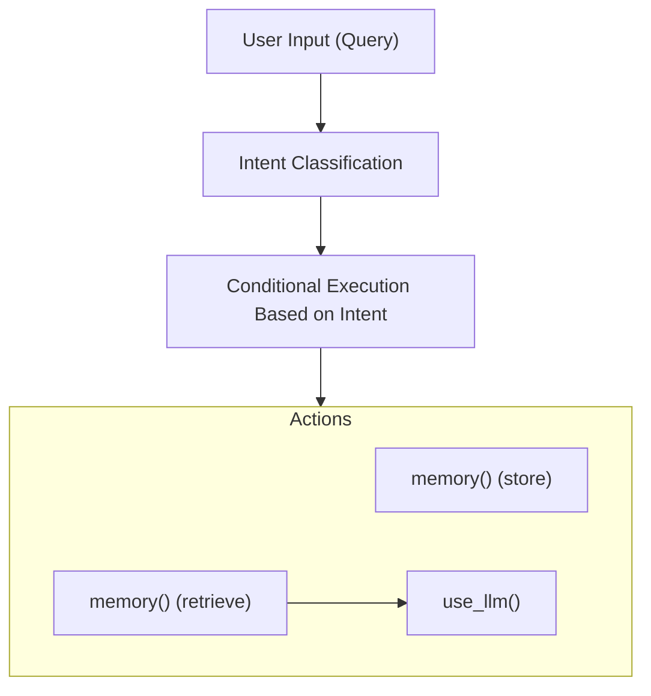
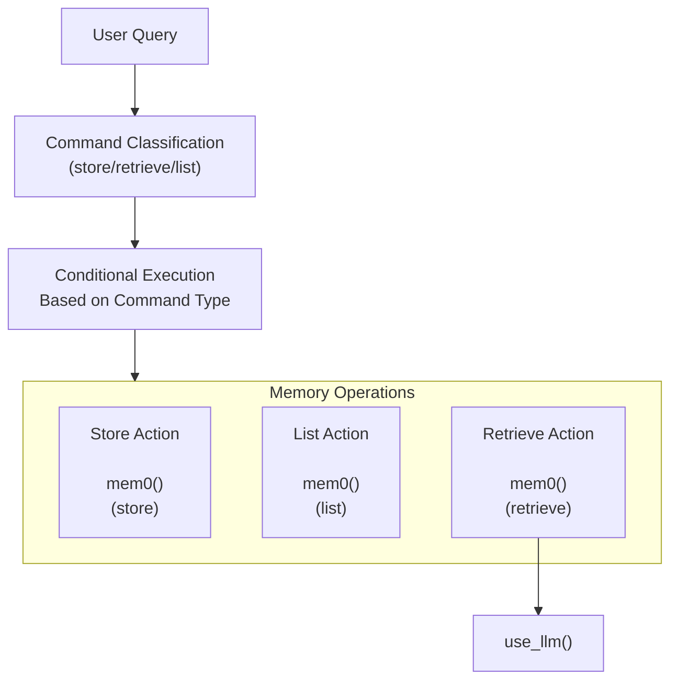
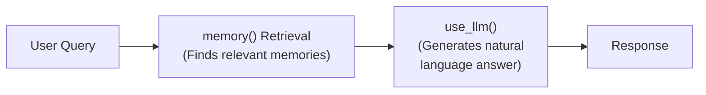
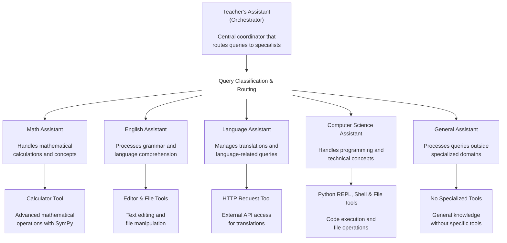
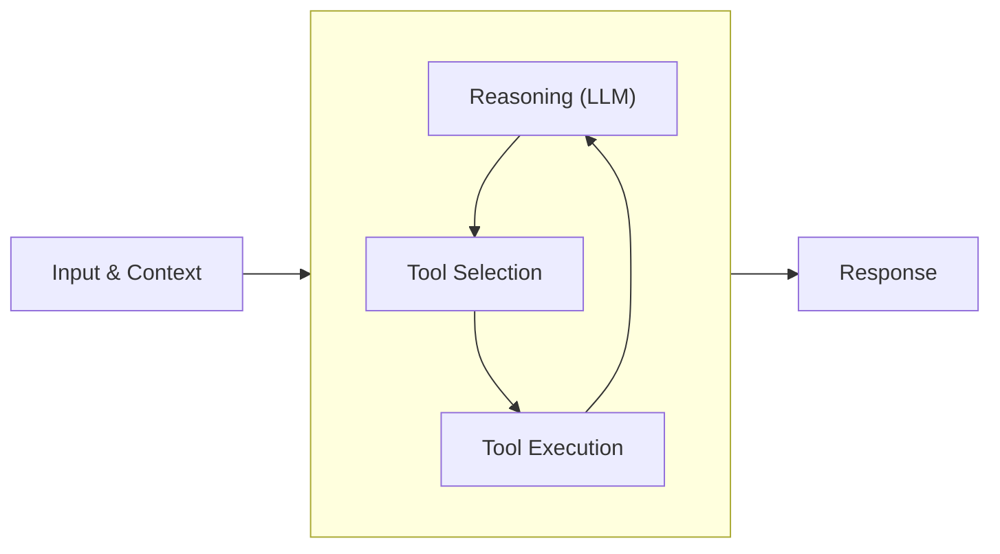
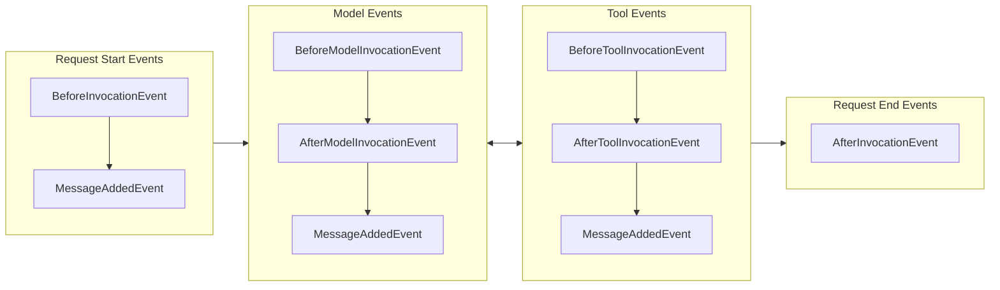

Directory structure:
└── docs/
    ├── README.md
    ├── api-reference/
    │   ├── agent.md
    │   ├── event-loop.md
    │   ├── experimental.md
    │   ├── handlers.md
    │   ├── hooks.md
    │   ├── models.md
    │   ├── multiagent.md
    │   ├── session.md
    │   ├── telemetry.md
    │   ├── tools.md
    │   └── types.md
    ├── examples/
    │   ├── README.md
    │   ├── cdk/
    │   │   ├── deploy_to_ec2/
    │   │   │   ├── README.md
    │   │   │   ├── cdk.json
    │   │   │   ├── package.json
    │   │   │   ├── requirements.txt
    │   │   │   ├── tsconfig.json
    │   │   │   ├── app/
    │   │   │   │   └── app.py
    │   │   │   └── lib/
    │   │   │       └── agent-ec2-stack.ts
    │   │   ├── deploy_to_fargate/
    │   │   │   ├── README.md
    │   │   │   ├── cdk.json
    │   │   │   ├── package.json
    │   │   │   ├── tsconfig.json
    │   │   │   ├── docker/
    │   │   │   │   ├── Dockerfile
    │   │   │   │   ├── requirements.txt
    │   │   │   │   └── app/
    │   │   │   │       └── app.py
    │   │   │   └── lib/
    │   │   │       └── agent-fargate-stack.ts
    │   │   └── deploy_to_lambda/
    │   │       ├── README.md
    │   │       ├── cdk.json
    │   │       ├── package.json
    │   │       ├── requirements.txt
    │   │       ├── tsconfig.json
    │   │       ├── lambda/
    │   │       │   └── agent_handler.py
    │   │       └── lib/
    │   │           └── agent-lambda-stack.ts
    │   ├── deploy_to_eks/
    │   │   ├── README.md
    │   │   ├── chart/
    │   │   │   ├── Chart.yaml
    │   │   │   ├── values.yaml
    │   │   │   ├── .helmignore
    │   │   │   └── templates/
    │   │   │       ├── _helpers.tpl
    │   │   │       ├── deployment.yaml
    │   │   │       ├── ingress.yaml
    │   │   │       ├── NOTES.txt
    │   │   │       ├── poddisruptionbudget.yaml
    │   │   │       ├── service.yaml
    │   │   │       └── serviceaccount.yaml
    │   │   └── docker/
    │   │       ├── Dockerfile
    │   │       ├── requirements.txt
    │   │       └── app/
    │   │           └── app.py
    │   └── python/
    │       ├── agents_workflow.py
    │       ├── agents_workflows.md
    │       ├── cli-reference-agent.md
    │       ├── file_operations.md
    │       ├── file_operations.py
    │       ├── knowledge_base_agent.md
    │       ├── knowledge_base_agent.py
    │       ├── mcp_calculator.md
    │       ├── mcp_calculator.py
    │       ├── memory_agent.md
    │       ├── memory_agent.py
    │       ├── meta_tooling.md
    │       ├── meta_tooling.py
    │       ├── multimodal.md
    │       ├── multimodal.py
    │       ├── structured_output.md
    │       ├── structured_output.py
    │       ├── weather_forecaster.md
    │       ├── weather_forecaster.py
    │       └── multi_agent_example/
    │           ├── computer_science_assistant.py
    │           ├── english_assistant.py
    │           ├── index.md
    │           ├── language_assistant.py
    │           ├── math_assistant.py
    │           ├── multi_agent_example.md
    │           ├── no_expertise.py
    │           └── teachers_assistant.py
    ├── stylesheets/
    │   └── extra.css
    └── user-guide/
        ├── quickstart.md
        ├── concepts/
        │   ├── agents/
        │   │   ├── agent-loop.md
        │   │   ├── conversation-management.md
        │   │   ├── hooks.md
        │   │   ├── prompts.md
        │   │   ├── session-management.md
        │   │   ├── state.md
        │   │   └── structured-output.md
        │   ├── model-providers/
        │   │   ├── amazon-bedrock.md
        │   │   ├── anthropic.md
        │   │   ├── cohere.md
        │   │   ├── custom_model_provider.md
        │   │   ├── litellm.md
        │   │   ├── llamaapi.md
        │   │   ├── mistral.md
        │   │   ├── ollama.md
        │   │   ├── openai.md
        │   │   ├── sagemaker.md
        │   │   └── writer.md
        │   ├── multi-agent/
        │   │   ├── agent-to-agent.md
        │   │   ├── agents-as-tools.md
        │   │   ├── graph.md
        │   │   ├── swarm.md
        │   │   └── workflow.md
        │   ├── streaming/
        │   │   ├── async-iterators.md
        │   │   └── callback-handlers.md
        │   └── tools/
        │       ├── community-tools-package.md
        │       ├── mcp-tools.md
        │       ├── python-tools.md
        │       └── tools_overview.md
        ├── deploy/
        │   ├── deploy_to_amazon_ec2.md
        │   ├── deploy_to_amazon_eks.md
        │   ├── deploy_to_aws_fargate.md
        │   ├── deploy_to_aws_lambda.md
        │   ├── deploy_to_bedrock_agentcore.md
        │   └── operating-agents-in-production.md
        ├── observability-evaluation/
        │   ├── evaluation.md
        │   ├── logs.md
        │   ├── metrics.md
        │   ├── observability.md
        │   └── traces.md
        └── safety-security/
            ├── guardrails.md
            ├── pii-redaction.md
            ├── prompt-engineering.md
            └── responsible-ai.md


Files Content:

(Files content cropped to 300k characters, download full ingest to see more)
================================================
FILE: docs/README.md
================================================
# Strands Agents SDK

[Strands Agents]({{ sdk_repo_home }}) is a simple-to-use, code-first framework for building agents.

First, install the Strands Agents SDK:

```bash
pip install strands-agents
```

Then create your first agent as a Python file, for this example we'll use `agent.py`.

```python
from strands import Agent

# Create an agent with default settings
agent = Agent()

# Ask the agent a question
agent("Tell me about agentic AI")
```

Now run the agent with:

```bash
python -u agent.py
```

That's it!

> **Note**: To run this example hello world agent you will need to set up credentials for our model provider and enable model access. The default model provider is [Amazon Bedrock](user-guide/concepts/model-providers/amazon-bedrock.md) and the default model is Claude 4 Sonnet in the US Oregon (us-west-2) region.

> For the default Amazon Bedrock model provider, see the [Boto3 documentation](https://boto3.amazonaws.com/v1/documentation/api/latest/guide/credentials.html) for setting up AWS credentials. Typically for development, AWS credentials are defined in `AWS_` prefixed environment variables or configured with `aws configure`. You will also need to enable Claude 4 Sonnet model access in Amazon Bedrock, following the [AWS documentation](https://docs.aws.amazon.com/bedrock/latest/userguide/model-access-modify.html) to enable access.

> Different model providers can be configured for agents by following the [quickstart guide](user-guide/quickstart.md#model-providers).

## Features

Strands Agents is lightweight and production-ready, supporting many model providers and deployment targets. 

Key features include:

* **Lightweight and gets out of your way**: A simple agent loop that just works and is fully customizable.
* **Production ready**: Full observability, tracing, and deployment options for running agents at scale.
* **Model, provider, and deployment agnostic**: Strands supports many different models from many different providers.
* **Community-driven tools**: Get started quickly with a powerful set of community-contributed tools for a broad set of capabilities.
* **Multi-agent and autonomous agents**: Apply advanced techniques to your AI systems like agent teams and agents that improve themselves over time.
* **Conversational, non-conversational, streaming, and non-streaming**: Supports all types of agents for various workloads.
* **Safety and security as a priority**: Run agents responsibly while protecting data.

## Next Steps

Ready to learn more? Check out these resources:

- [Quickstart](user-guide/quickstart.md) - A more detailed introduction to Strands Agents
- [Examples](examples/README.md) - Examples for many use cases, types of agents, multi-agent systems, autonomous agents, and more
- [Community Supported Tools](user-guide/concepts/tools/community-tools-package.md) - The {{ link_strands_tools }} package is a community-driven project that provides a powerful set of tools for your agents to use
- [Strands Agent Builder]({{ agent_builder_repo_home }}) - Use the accompanying {{ link_strands_builder }} agent builder to harness the power of LLMs to generate your own tools and agents

!!! tip "Join Our Community"

    [Learn how to contribute]({{ sdk_repo }}/CONTRIBUTING.md) or join our community discussions to shape the future of Strands Agents ❤️.


================================================
FILE: docs/api-reference/agent.md
================================================
::: strands.agent
    options:
      heading_level: 1
      members: false
::: strands.agent.agent
    options:
      heading_level: 2
::: strands.agent.agent_result
    options:
      heading_level: 2
::: strands.agent.conversation_manager
    options:
      heading_level: 2
      members: false
::: strands.agent.conversation_manager.conversation_manager
    options:
      heading_level: 3
::: strands.agent.conversation_manager.null_conversation_manager
    options:
      heading_level: 3
::: strands.agent.conversation_manager.sliding_window_conversation_manager
    options:
      heading_level: 3
::: strands.agent.conversation_manager.summarizing_conversation_manager
    options:
      heading_level: 3
::: strands.agent.state
    options:
      heading_level: 2


================================================
FILE: docs/api-reference/event-loop.md
================================================
::: strands.event_loop
    options:
      heading_level: 1
      members: false
::: strands.event_loop.event_loop
    options:
      heading_level: 2
::: strands.event_loop.streaming
    options:
      heading_level: 2


================================================
FILE: docs/api-reference/experimental.md
================================================
::: strands.experimental
    options:
      heading_level: 1
      members: false
::: strands.experimental.hooks
    options:
      heading_level: 2
      members: false
::: strands.experimental.hooks.events
    options:
      heading_level: 3


================================================
FILE: docs/api-reference/handlers.md
================================================
::: strands.handlers
    options:
      heading_level: 1
      members: false
::: strands.handlers.callback_handler
    options:
      heading_level: 2


================================================
FILE: docs/api-reference/hooks.md
================================================
::: strands.hooks
    options:
      heading_level: 1
      members: false
::: strands.hooks.events
    options:
      heading_level: 2
::: strands.hooks.registry
    options:
      heading_level: 2


================================================
FILE: docs/api-reference/models.md
================================================
::: strands.models
    options:
      heading_level: 1
      members: false
::: strands.models.model
    options:
      heading_level: 2
::: strands.models.bedrock
    options:
      heading_level: 2
::: strands.models.anthropic
    options:
      heading_level: 2
::: strands.models.litellm
    options:
      heading_level: 2
::: strands.models.llamaapi
    options:
      heading_level: 2
::: strands.models.mistral
    options:
      heading_level: 2
::: strands.models.ollama
    options:
      heading_level: 2
::: strands.models.openai
    options:
      heading_level: 2
::: strands.models.writer
    options:
      heading_level: 2


================================================
FILE: docs/api-reference/multiagent.md
================================================
::: strands.multiagent
    options:
      heading_level: 1
      members: false
::: strands.multiagent.base
    options:
      heading_level: 2
::: strands.multiagent.graph
    options:
      heading_level: 2
::: strands.multiagent.swarm
    options:
      heading_level: 2
::: strands.multiagent.a2a
    options:
      heading_level: 2
      members: false
::: strands.multiagent.a2a.executor
    options:
      heading_level: 3
::: strands.multiagent.a2a.server
    options:
      heading_level: 3


================================================
FILE: docs/api-reference/session.md
================================================
::: strands.session
    options:
      heading_level: 1
      members: false
::: strands.session.file_session_manager
    options:
      heading_level: 2
::: strands.session.repository_session_manager
    options:
      heading_level: 2
::: strands.session.s3_session_manager
    options:
      heading_level: 2
::: strands.session.session_manager
    options:
      heading_level: 2
      members: false
::: strands.session.session_repository
    options:
      heading_level: 2


================================================
FILE: docs/api-reference/telemetry.md
================================================
::: strands.telemetry
    options:
      heading_level: 1
      members: false
::: strands.telemetry.config
    options:
      heading_level: 2
::: strands.telemetry.metrics
    options:
      heading_level: 2
::: strands.telemetry.metrics_constants
    options:
      heading_level: 2
::: strands.telemetry.tracer
    options:
      heading_level: 2


================================================
FILE: docs/api-reference/tools.md
================================================
::: strands.tools
    options:
      heading_level: 1
      members: false
::: strands.tools.tools
    options:
      heading_level: 2
::: strands.tools.decorator
    options:
      heading_level: 2
::: strands.tools.executor
    options:
      heading_level: 2
::: strands.tools.loader
    options:
      heading_level: 2
::: strands.tools.registry
    options:
      heading_level: 2
::: strands.tools.structured_output
    options:
      heading_level: 2
::: strands.tools.watcher
    options:
      heading_level: 2
::: strands.tools.mcp
    options:
      heading_level: 2
      members: false
::: strands.tools.mcp.mcp_agent_tool
    options:
      heading_level: 3
::: strands.tools.mcp.mcp_client
    options:
      heading_level: 3
::: strands.tools.mcp.mcp_types
    options:
      heading_level: 3


================================================
FILE: docs/api-reference/types.md
================================================
::: strands.types
    options:
      heading_level: 1
      members: false
::: strands.types.content
    options:
      heading_level: 2
::: strands.types.event_loop
    options:
      heading_level: 2
::: strands.types.exceptions
    options:
      heading_level: 2
::: strands.types.guardrails
    options:
      heading_level: 2
::: strands.types.media
    options:
      heading_level: 2
::: strands.types.session
    options:
      heading_level: 2
::: strands.types.streaming
    options:
      heading_level: 2
::: strands.types.tools
    options:
      heading_level: 2
::: strands.types.traces
    options:
      heading_level: 2


================================================
FILE: docs/examples/README.md
================================================
# Examples Overview

The examples directory provides a collection of sample implementations to help you get started with building intelligent agents using Strands Agents. This directory contains two main subdirectories: `/examples/python` for Python-based agent examples and `/examples/cdk` for Cloud Development Kit integration examples.

## Purpose

These examples demonstrate how to leverage Strands Agents to build intelligent agents for various use cases. From simple file operations to complex multi-agent systems, each example illustrates key concepts, patterns, and best practices in agent development.

By exploring these reference implementations, you'll gain practical insights into Strands Agents' capabilities and learn how to apply them to your own projects. The examples emphasize real-world applications that you can adapt and extend for your specific needs.

## Prerequisites

- Python 3.10 or higher
- For specific examples, additional requirements may be needed (see individual example READMEs)

## Getting Started

1. Clone the repository containing these examples
2. Install the required dependencies:
   - [strands-agents](https://github.com/strands-agents/sdk-python)
   - [strands-agents-tools](https://github.com/strands-agents/tools)
3. Navigate to the examples directory:
   ```bash
   cd /path/to/examples/
   ```
4. Browse the available examples in the `/examples/python` and `/examples/cdk` directories
5. Each example includes its own README or documentation file with specific instructions
6. Follow the documentation to run the example and understand its implementation

## Directory Structure

### Python Examples

The `/examples/python` directory contains various Python-based examples demonstrating different agent capabilities. Each example includes detailed documentation explaining its purpose, implementation details, and instructions for running it.

These examples cover a diverse range of agent capabilities and patterns, showcasing the flexibility and power of Strands Agents. The directory is regularly updated with new examples as additional features and use cases are developed.

Available Python examples:

- [Agents Workflows](python/agents_workflows.md) - Example of a sequential agent workflow pattern
- [CLI Reference Agent](python/cli-reference-agent.md) - Example of Command-line reference agent implementation
- [File Operations](python/file_operations.md) - Example of agent with file manipulation capabilities
- [MCP Calculator](python/mcp_calculator.md) - Example of agent with Model Context Protocol capabilities
- [Meta Tooling](python/meta_tooling.md) - Example of Agent with Meta tooling capabilities 
- [Multi-Agent Example](python/multi_agent_example/multi_agent_example.md) - Example of a multi-agent system
- [Weather Forecaster](python/weather_forecaster.md) - Example of a weather forecasting agent with http_request capabilities

### CDK Examples

The `/examples/cdk` directory contains examples for using the AWS Cloud Development Kit (CDK) with agents. The CDK is an open-source software development framework for defining cloud infrastructure as code and provisioning it through AWS CloudFormation. These examples demonstrate how to deploy agent-based applications to AWS using infrastructure as code principles.

Each CDK example includes its own documentation with instructions for setup and deployment.

Available CDK examples:

- [Deploy to EC2](cdk/deploy_to_ec2/README.md) - Guide for deploying agents to Amazon EC2 instances
- [Deploy to Fargate](cdk/deploy_to_fargate/README.md) - Guide for deploying agents to AWS Fargate
- [Deploy to Lambda](cdk/deploy_to_lambda/README.md) - Guide for deploying agents to AWS Lambda

### Amazon EKS Example

The `/examples/deploy_to_eks` directory contains examples for using Amazon EKS with agents.   
The [Deploy to Amazon EKS](deploy_to_eks/README.md) includes its own documentation with instruction for setup and deployment.

## Example Structure

Each example typically follows this structure:

- Python implementation file(s) (`.py`)
- Documentation file (`.md`) explaining the example's purpose, architecture, and usage
- Any additional resources needed for the example

To run any specific example, refer to its associated documentation for detailed instructions and requirements.


================================================
FILE: docs/examples/cdk/deploy_to_ec2/README.md
================================================
# AWS CDK EC2 Deployment Example

## Introduction

This is a TypeScript-based CDK (Cloud Development Kit) example that demonstrates how to deploy a Python application to AWS EC2. The example deploys a weather forecaster application that runs as a service on an EC2 instance. The application provides two weather endpoints:

1. `/weather` - A standard endpoint that returns weather information based on the provided prompt
2. `/weather-streaming` - A streaming endpoint that delivers weather information in real-time as it's being generated

## Prerequisites

- [AWS CLI](https://aws.amazon.com/cli/) installed and configured
- [Node.js](https://nodejs.org/) (v18.x or later)
- Python 3.12 or later

## Project Structure

- `lib/` - Contains the CDK stack definition in TypeScript
- `bin/` - Contains the CDK app entry point and deployment scripts:
  - `cdk-app.ts` - Main CDK application entry point
- `app/` - Contains the application code:
  - `app.py` - FastAPI application code
- `requirements.txt` - Python dependencies for the application

## Setup and Deployment

1. Install dependencies:

```bash
# Install Node.js dependencies including CDK and TypeScript locally
npm install

# Create a Python virtual environment (optional but recommended)
python -m venv .venv
source .venv/bin/activate  # On Windows: .venv\Scripts\activate

# Install Python dependencies for the local development
pip install -r ./requirements.txt

# Install Python dependencies for the app distribution
pip install -r requirements.txt --python-version 3.12 --platform manylinux2014_aarch64 --target ./packaging/_dependencies --only-binary=:all:
```

2. Bootstrap your AWS environment (if not already done):

```bash
npx cdk bootstrap
```

3. Deploy the stack:

```bash
npx cdk deploy
```

## How It Works

This deployment:

1. Creates an EC2 instance in a public subnet with a public IP
2. Uploads the application code to S3 as CDK assets
3. Uses a user data script to:
   - Install Python and other dependencies
   - Download the application code from S3
   - Set up the application as a systemd service using uvicorn

## Usage

After deployment, you can access the weather service using the Application Load Balancer URL that is output after deployment:

```bash
# Get the service URL from the CDK output
SERVICE_URL=$(aws cloudformation describe-stacks --stack-name AgentEC2Stack --region us-east-1 --query "Stacks[0].Outputs[?ExportName=='Ec2ServiceEndpoint'].OutputValue" --output text)
```

The service exposes a REST API endpoint that you can call using curl or any HTTP client:

```bash
# Call the weather service
curl -X POST \
  http://$SERVICE_URL/weather \
  -H 'Content-Type: application/json' \
  -d '{"prompt": "What is the weather in New York?"}'
  
 # Call the streaming endpoint
 curl -X POST \
  http://$SERVICE_URL/weather-streaming \
  -H 'Content-Type: application/json' \
  -d '{"prompt": "What is the weather in New York in Celsius?"}'
```

## Local testing

You can run the python app directly for local testing via:

```bash
python app/app.py
```

Then, set the SERVICE_URL to point to your local server

```bash
SERVICE_URL=127.0.0.1:8000
```

and you can use the curl commands above to test locally.

## Cleanup

To remove all resources created by this example:

```bash
npx cdk destroy
```

## Callouts and considerations

Note that this example demonstrates a simple deployment approach with some important limitations:

- The application code is deployed only during the initial instance creation via user data script
- Updating the application requires implementing a custom update mechanism
- The example exposes the application directly on port 8000 without a load balancer
- For production workloads, consider using ECS/Fargate which provides built-in support for application updates, scaling, and high availability


## Additional Resources

- [AWS CDK TypeScript Documentation](https://docs.aws.amazon.com/cdk/latest/guide/work-with-cdk-typescript.html)
- [Amazon EC2 Documentation](https://docs.aws.amazon.com/ec2/)
- [FastAPI Documentation](https://fastapi.tiangolo.com/)
- [TypeScript Documentation](https://www.typescriptlang.org/docs/)


================================================
FILE: docs/examples/cdk/deploy_to_ec2/cdk.json
================================================
{
  "app": "npx tsx bin/cdk-app.ts",
  "watch": {
    "include": ["**"],
    "exclude": [
      "README.md",
      "cdk*.json",
      "**/*.d.ts",
      "**/*.js",
      "tsconfig.json",
      "package*.json",
      "yarn.lock",
      "node_modules",
      "test"
    ]
  },
  "context": {
    "@aws-cdk/aws-lambda:recognizeLayerVersion": true,
    "@aws-cdk/core:checkSecretUsage": true,
    "@aws-cdk/core:target-partitions": ["aws", "aws-cn"],
    "@aws-cdk-containers/ecs-service-extensions:enableDefaultLogDriver": true,
    "@aws-cdk/aws-ec2:uniqueImdsv2TemplateName": true,
    "@aws-cdk/aws-ecs:arnFormatIncludesClusterName": true,
    "@aws-cdk/aws-iam:minimizePolicies": true,
    "@aws-cdk/core:validateSnapshotRemovalPolicy": true,
    "@aws-cdk/aws-codepipeline:crossAccountKeyAliasStackSafeResourceName": true,
    "@aws-cdk/aws-s3:createDefaultLoggingPolicy": true,
    "@aws-cdk/aws-sns-subscriptions:restrictSqsDescryption": true,
    "@aws-cdk/aws-apigateway:disableCloudWatchRole": true,
    "@aws-cdk/core:enablePartitionLiterals": true,
    "@aws-cdk/aws-events:eventsTargetQueueSameAccount": true,
    "@aws-cdk/aws-ecs:disableExplicitDeploymentControllerForCircuitBreaker": true,
    "@aws-cdk/aws-iam:importedRoleStackSafeDefaultPolicyName": true,
    "@aws-cdk/aws-s3:serverAccessLogsUseBucketPolicy": true,
    "@aws-cdk/aws-route53-patters:useCertificate": true,
    "@aws-cdk/customresources:installLatestAwsSdkDefault": false,
    "@aws-cdk/aws-rds:databaseProxyUniqueResourceName": true,
    "@aws-cdk/aws-codedeploy:removeAlarmsFromDeploymentGroup": true,
    "@aws-cdk/aws-apigateway:authorizerChangeDeploymentLogicalId": true,
    "@aws-cdk/aws-ec2:launchTemplateDefaultUserData": true,
    "@aws-cdk/aws-secretsmanager:useAttachedSecretResourcePolicyForSecretTargetAttachments": true,
    "@aws-cdk/aws-redshift:columnId": true,
    "@aws-cdk/aws-stepfunctions-tasks:enableEmrServicePolicyV2": true,
    "@aws-cdk/aws-ec2:restrictDefaultSecurityGroup": true,
    "@aws-cdk/aws-apigateway:requestValidatorUniqueId": true,
    "@aws-cdk/aws-kms:aliasNameRef": true,
    "@aws-cdk/aws-autoscaling:generateLaunchTemplateInsteadOfLaunchConfig": true,
    "@aws-cdk/core:includePrefixInUniqueNameGeneration": true,
    "@aws-cdk/aws-efs:denyAnonymousAccess": true,
    "@aws-cdk/aws-opensearchservice:enableOpensearchMultiAzWithStandby": true,
    "@aws-cdk/aws-lambda-nodejs:useLatestRuntimeVersion": true,
    "@aws-cdk/aws-efs:mountTargetOrderInsensitiveLogicalId": true,
    "@aws-cdk/aws-rds:auroraClusterChangeScopeOfInstanceParameterGroupWithEachParameters": true,
    "@aws-cdk/aws-appsync:useArnForSourceApiAssociationIdentifier": true,
    "@aws-cdk/aws-rds:preventRenderingDeprecatedCredentials": true,
    "@aws-cdk/aws-codepipeline-actions:useNewDefaultBranchForCodeCommitSource": true,
    "@aws-cdk/aws-cloudwatch-actions:changeLambdaPermissionLogicalIdForLambdaAction": true,
    "@aws-cdk/aws-codepipeline:crossAccountKeysDefaultValueToFalse": true,
    "@aws-cdk/aws-codepipeline:defaultPipelineTypeToV2": true,
    "@aws-cdk/aws-kms:reduceCrossAccountRegionPolicyScope": true,
    "@aws-cdk/aws-eks:nodegroupNameAttribute": true,
    "@aws-cdk/aws-ec2:ebsDefaultGp3Volume": true,
    "@aws-cdk/aws-ecs:removeDefaultDeploymentAlarm": true,
    "@aws-cdk/custom-resources:logApiResponseDataPropertyTrueDefault": false,
    "@aws-cdk/aws-s3:keepNotificationInImportedBucket": false,
    "@aws-cdk/aws-ecs:enableImdsBlockingDeprecatedFeature": false,
    "@aws-cdk/aws-ecs:disableEcsImdsBlocking": true,
    "@aws-cdk/aws-ecs:reduceEc2FargateCloudWatchPermissions": true,
    "@aws-cdk/aws-dynamodb:resourcePolicyPerReplica": true,
    "@aws-cdk/aws-ec2:ec2SumTImeoutEnabled": true,
    "@aws-cdk/aws-appsync:appSyncGraphQLAPIScopeLambdaPermission": true,
    "@aws-cdk/aws-rds:setCorrectValueForDatabaseInstanceReadReplicaInstanceResourceId": true,
    "@aws-cdk/core:cfnIncludeRejectComplexResourceUpdateCreatePolicyIntrinsics": true,
    "@aws-cdk/aws-lambda-nodejs:sdkV3ExcludeSmithyPackages": true,
    "@aws-cdk/aws-stepfunctions-tasks:fixRunEcsTaskPolicy": true,
    "@aws-cdk/aws-ec2:bastionHostUseAmazonLinux2023ByDefault": true,
    "@aws-cdk/aws-route53-targets:userPoolDomainNameMethodWithoutCustomResource": true,
    "@aws-cdk/aws-elasticloadbalancingV2:albDualstackWithoutPublicIpv4SecurityGroupRulesDefault": true,
    "@aws-cdk/aws-iam:oidcRejectUnauthorizedConnections": true,
    "@aws-cdk/core:enableAdditionalMetadataCollection": true,
    "@aws-cdk/aws-lambda:createNewPoliciesWithAddToRolePolicy": false,
    "@aws-cdk/aws-s3:setUniqueReplicationRoleName": true,
    "@aws-cdk/aws-events:requireEventBusPolicySid": true,
    "@aws-cdk/core:aspectPrioritiesMutating": true,
    "@aws-cdk/aws-dynamodb:retainTableReplica": true,
    "@aws-cdk/aws-stepfunctions:useDistributedMapResultWriterV2": true
  }
}


================================================
FILE: docs/examples/cdk/deploy_to_ec2/package.json
================================================
{
  "name": "deploy_to_ec2",
  "version": "0.1.0",
  "description": "CDK TypeScript project to deploy a sample Agent to EC2",
  "private": true,
  "bin": {
    "cdk-app": "bin/cdk-app.js"
  },
  "scripts": {
    "format": "prettier --write .",
    "watch": "tsc -w",
    "test": "vitest run",
    "cdk": "cdk"
  },
  "devDependencies": {
    "@types/node": "22.15.3",
    "aws-cdk": "2.1012.0",
    "prettier": "~3.5.3",
    "tsx": "^4.7.0",
    "typescript": "~5.8.3",
    "vitest": "^3.1.2"
  },
  "dependencies": {
    "aws-cdk-lib": "2.192.0",
    "constructs": "^10.2.0"
  },
  "prettier": {
    "printWidth": 120
  }
}


================================================
FILE: docs/examples/cdk/deploy_to_ec2/requirements.txt
================================================
fastapi==0.115.12
uvicorn==0.34.2
pydantic==2.11.4
strands-agents
strands-agents-tools


================================================
FILE: docs/examples/cdk/deploy_to_ec2/tsconfig.json
================================================
{
  "compilerOptions": {
    "target": "ES2020",
    "module": "commonjs",
    "lib": ["es2020"],
    "declaration": true,
    "strict": true,
    "noImplicitAny": true,
    "strictNullChecks": true,
    "noImplicitThis": true,
    "alwaysStrict": true,
    "noUnusedLocals": false,
    "noUnusedParameters": false,
    "noImplicitReturns": true,
    "noFallthroughCasesInSwitch": false,
    "inlineSourceMap": true,
    "inlineSources": true,
    "experimentalDecorators": true,
    "strictPropertyInitialization": false,
    "typeRoots": ["./node_modules/@types"]
  },
  "exclude": ["node_modules", "cdk.out"]
}


================================================
FILE: docs/examples/cdk/deploy_to_ec2/app/app.py
================================================
from collections.abc import Callable
from typing import Iterator, Dict, Optional
from uuid import uuid4

from fastapi import FastAPI, Request, Response, HTTPException
from fastapi.responses import StreamingResponse, PlainTextResponse
from pydantic import BaseModel
import uvicorn
from strands import Agent, tool
from strands_tools import http_request
import os

app = FastAPI(title="Weather API")

# Define a weather-focused system prompt
WEATHER_SYSTEM_PROMPT = """You are a weather assistant with HTTP capabilities. You can:

1. Make HTTP requests to the National Weather Service API
2. Process and display weather forecast data
3. Provide weather information for locations in the United States

When retrieving weather information:
1. First get the coordinates or grid information using https://api.weather.gov/points/{latitude},{longitude} or https://api.weather.gov/points/{zipcode}
2. Then use the returned forecast URL to get the actual forecast

When displaying responses:
- Format weather data in a human-readable way
- Highlight important information like temperature, precipitation, and alerts
- Handle errors appropriately
- Don't ask follow-up questions

Always explain the weather conditions clearly and provide context for the forecast.

At the point where tools are done being invoked and a summary can be presented to the user, invoke the ready_to_summarize
tool and then continue with the summary.
"""

class PromptRequest(BaseModel):
    prompt: str

@app.get('/health')
def health_check():
    """Health check endpoint for the load balancer."""
    return {"status": "healthy"}

@app.post('/weather')
async def get_weather(request: PromptRequest):
    """Endpoint to get weather information."""
    prompt = request.prompt
    
    if not prompt:
        raise HTTPException(status_code=400, detail="No prompt provided")

    try:
        weather_agent = Agent(
            system_prompt=WEATHER_SYSTEM_PROMPT,
            tools=[http_request],
        )
        response = weather_agent(prompt)
        content = str(response)
        return PlainTextResponse(content=content)
    except Exception as e:
        raise HTTPException(status_code=500, detail=str(e))

async def run_weather_agent_and_stream_response(prompt: str):
    """
    A helper function to yield summary text chunks one by one as they come in, allowing the web server to emit
    them to caller live
    """
    is_summarizing = False

    @tool
    def ready_to_summarize():
        """
        A tool that is intended to be called by the agent right before summarize the response.
        """
        nonlocal is_summarizing
        is_summarizing = True
        return "Ok - continue providing the summary!"

    weather_agent = Agent(
        system_prompt=WEATHER_SYSTEM_PROMPT,
        tools=[http_request, ready_to_summarize],
        callback_handler=None
    )

    async for item in weather_agent.stream_async(prompt):
        if not is_summarizing:
            continue
        if "data" in item:
            yield item['data']

@app.post('/weather-streaming')
async def get_weather_streaming(request: PromptRequest):
    """Endpoint to stream the weather summary as it comes it, not all at once at the end."""
    try:
        prompt = request.prompt

        if not prompt:
            raise HTTPException(status_code=400, detail="No prompt provided")

        return StreamingResponse(
            run_weather_agent_and_stream_response(prompt),
            media_type="text/plain"
        )
    except Exception as e:
        raise HTTPException(status_code=500, detail=str(e))

if __name__ == '__main__':
    # Get port from environment variable or default to 8000
    port = int(os.environ.get('PORT', 8000))
    uvicorn.run(app, host='0.0.0.0', port=port)


================================================
FILE: docs/examples/cdk/deploy_to_ec2/lib/agent-ec2-stack.ts
================================================
import { Stack, StackProps, CfnOutput } from "aws-cdk-lib";
import { Construct } from "constructs";
import * as ec2 from "aws-cdk-lib/aws-ec2";
import * as iam from "aws-cdk-lib/aws-iam";
import * as path from "path";
import { Asset } from "aws-cdk-lib/aws-s3-assets";

export class AgentEC2Stack extends Stack {
  constructor(scope: Construct, id: string, props?: StackProps) {
    super(scope, id, props);

    // Create a simple VPC for our EC2 instance
    const vpc = new ec2.Vpc(this, "AgentVpc", {
      maxAzs: 1, // Use just 1 Availability Zone for simplicity
      natGateways: 0, // No NAT Gateway needed since we'll use a public subnet
    });

    // Upload the application code to S3
    const appAsset = new Asset(this, "AgentAppAsset", {
      path: path.join(__dirname, "../app"),
    });

    // Upload dependencies to S3
    // This could also be replaced by a pip install if all dependencies are public
    const dependenciesAsset = new Asset(this, "AgentDependenciesAsset", {
      path: path.join(__dirname, "../packaging/_dependencies"),
    });

    // Create a role for the EC2 instance
    const instanceRole = new iam.Role(this, "AgentInstanceRole", {
      assumedBy: new iam.ServicePrincipal("ec2.amazonaws.com"),
    });

    // Add permissions for the instance to access S3 and invoke Bedrock APIs
    instanceRole.addManagedPolicy(iam.ManagedPolicy.fromAwsManagedPolicyName("AmazonS3ReadOnlyAccess"));

    instanceRole.addToPolicy(
      new iam.PolicyStatement({
        actions: ["bedrock:InvokeModel", "bedrock:InvokeModelWithResponseStream"],
        resources: ["*"],
      }),
    );

    // Create a security group for the EC2 instance
    const instanceSG = new ec2.SecurityGroup(this, "AgentInstanceSG", {
      vpc,
      description: "Security group for Agent EC2 Instance",
      allowAllOutbound: true,
    });

    // Uncomment the following line to enable SSH access to the instance
    // instanceSG.addIngressRule(ec2.Peer.anyIpv4(), ec2.Port.tcp(22), "Allow SSH access");

    // Allow inbound traffic on port 8000 for direct access to the application
    instanceSG.addIngressRule(ec2.Peer.anyIpv4(), ec2.Port.tcp(8000), "Allow inbound traffic on port 8000");

    // Create an EC2 instance in a public subnet with a public IP
    const instance = new ec2.Instance(this, "AgentInstance", {
      vpc,
      vpcSubnets: { subnetType: ec2.SubnetType.PUBLIC }, // Use public subnet
      instanceType: ec2.InstanceType.of(ec2.InstanceClass.T4G, ec2.InstanceSize.MEDIUM), // ARM-based instance
      machineImage: ec2.MachineImage.latestAmazonLinux2023({
        cpuType: ec2.AmazonLinuxCpuType.ARM_64,
      }),
      securityGroup: instanceSG,
      role: instanceRole,
      associatePublicIpAddress: true, // Assign a public IP address
    });

    // Create user data script to set up the application
    const userData = ec2.UserData.forLinux();
    userData.addCommands(
      "#!/bin/bash",
      "set -o verbose",
      "yum update -y",
      "yum install -y python3.12 python3.12-pip git unzip ec2-instance-connect",

      // Create app directory
      "mkdir -p /opt/agent-app",

      // Download application files from S3
      `aws s3 cp ${appAsset.s3ObjectUrl} /tmp/app.zip`,
      `aws s3 cp ${dependenciesAsset.s3ObjectUrl} /tmp/dependencies.zip`,

      // Extract application files
      "unzip /tmp/app.zip -d /opt/agent-app",
      "unzip /tmp/dependencies.zip -d /opt/agent-app/_dependencies",

      // Create a systemd service file
      "cat > /etc/systemd/system/agent-app.service << 'EOL'",
      "[Unit]",
      "Description=Weather Agent Application",
      "After=network.target",
      "",
      "[Service]",
      "User=ec2-user",
      "WorkingDirectory=/opt/agent-app",
      "ExecStart=/usr/bin/python3.12 -m uvicorn app:app --host=0.0.0.0 --port=8000 --workers=2",
      "Restart=always",
      "Environment=PYTHONPATH=/opt/agent-app:/opt/agent-app/_dependencies",
      "Environment=LOG_LEVEL=INFO",
      "",
      "[Install]",
      "WantedBy=multi-user.target",
      "EOL",

      // Enable and start the service
      "systemctl enable agent-app.service",
      "systemctl start agent-app.service",
    );

    instance.addUserData(userData.render());

    // Grant the instance role access to the S3 assets
    appAsset.grantRead(instanceRole);
    dependenciesAsset.grantRead(instanceRole);

    // Add outputs for easy access
    new CfnOutput(this, "InstanceId", {
      value: instance.instanceId,
      description: "The ID of the EC2 instance",
    });

    new CfnOutput(this, "InstancePublicIP", {
      value: instance.instancePublicIp,
      description: "The public IP address of the EC2 instance",
    });

    new CfnOutput(this, "ServiceEndpoint", {
      value: `${instance.instancePublicIp}:8000`,
      description: "The endpoint URL for the weather service",
      exportName: "Ec2ServiceEndpoint",
    });

    new CfnOutput(this, "EC2ConnectCommand", {
      value: `aws ec2-instance-connect ssh --instance-id ${instance.instanceId}`,
      description: "Command to connect to the instance using EC2 Instance Connect",
    });
  }
}


================================================
FILE: docs/examples/cdk/deploy_to_fargate/README.md
================================================
# AWS CDK Fargate Deployment Example

## Introduction

This is a TypeScript-based CDK (Cloud Development Kit) example that demonstrates how to deploy a Python application to AWS Fargate. The example deploys a weather forecaster application that runs as a containerized service in AWS Fargate with an Application Load Balancer. The application is built with FastAPI and provides two weather endpoints:

1. `/weather` - A standard endpoint that returns weather information based on the provided prompt
2. `/weather-streaming` - A streaming endpoint that delivers weather information in real-time as it's being generated

## Prerequisites

- [AWS CLI](https://aws.amazon.com/cli/) installed and configured
- [Node.js](https://nodejs.org/) (v18.x or later)
- Python 3.12 or later
- Either:
  - [Podman](https://podman.io/) installed and running
  - (or) [Docker](https://www.docker.com/) installed and running
## Project Structure

- `lib/` - Contains the CDK stack definition in TypeScript
- `bin/` - Contains the CDK app entry point and deployment scripts:
  - `cdk-app.ts` - Main CDK application entry point
- `docker/` - Contains the Dockerfile and application code for the container:
  - `Dockerfile` - Docker image definition
  - `app/` - Application code
  - `requirements.txt` - Python dependencies for the container & local development

## Setup and Deployment

1. Install dependencies:

```bash
# Install Node.js dependencies including CDK and TypeScript locally
npm install

# Create a Python virtual environment (optional but recommended)
python -m venv .venv
source .venv/bin/activate  # On Windows: .venv\Scripts\activate

# Install Python dependencies for the local development
pip install -r ./docker/requirements.txt
```

2. Bootstrap your AWS environment (if not already done):

```bash
npx cdk bootstrap
```

3. Ensure podman is started (one time):

```bash
podman machine init
podman machine start
```

4. Package & deploy via CDK:

```bash
CDK_DOCKER=podman npx cdk deploy
```

## Usage

After deployment, you can access the weather service using the Application Load Balancer URL that is output after deployment:

```bash
# Get the service URL from the CDK output
SERVICE_URL=$(aws cloudformation describe-stacks --stack-name AgentFargateStack --query "Stacks[0].Outputs[?ExportName=='AgentServiceEndpoint'].OutputValue" --output text)
```

The service exposes a REST API endpoint that you can call using curl or any HTTP client:

```bash


# Call the weather service
curl -X POST \
  http://$SERVICE_URL/weather \
  -H 'Content-Type: application/json' \
  -d '{"prompt": "What is the weather in New York?"}'
  
 # Call the streaming endpoint
 curl -X POST \
  http://$SERVICE_URL/weather-streaming \
  -H 'Content-Type: application/json' \
  -d '{"prompt": "What is the weather in New York in Celsius?"}'
```

## Local testing (python)

You can run the python app directly for local testing via:

```bash
python ./docker/app/app.py
```

Then, set the SERVICE_URL to point to your local server

```bash
SERVICE_URL=127.0.0.1:8000
```

and you can use the curl commands above to test locally.

## Local testing (container)

Build & run the container:

```bash
podman build ./docker/ -t agent_container
podman run -p 127.0.0.1:8000:8000 -t agent_container
```

Then, set the SERVICE_URL to point to your local server

```bash
SERVICE_URL=127.0.0.1:8000
```

and you can use the curl commands above to test locally.

## Cleanup

To remove all resources created by this example:

```bash
npx cdk destroy
```

## Additional Resources

- [AWS CDK TypeScript Documentation](https://docs.aws.amazon.com/cdk/latest/guide/work-with-cdk-typescript.html)
- [AWS Fargate Documentation](https://docs.aws.amazon.com/AmazonECS/latest/developerguide/AWS_Fargate.html)
- [Docker Documentation](https://docs.docker.com/)
- [TypeScript Documentation](https://www.typescriptlang.org/docs/)


================================================
FILE: docs/examples/cdk/deploy_to_fargate/cdk.json
================================================
{
  "app": "npx tsx bin/cdk-app.ts",
  "watch": {
    "include": ["**"],
    "exclude": [
      "README.md",
      "cdk*.json",
      "**/*.d.ts",
      "**/*.js",
      "tsconfig.json",
      "package*.json",
      "yarn.lock",
      "node_modules",
      "test"
    ]
  },
  "context": {
    "@aws-cdk/aws-lambda:recognizeLayerVersion": true,
    "@aws-cdk/core:checkSecretUsage": true,
    "@aws-cdk/core:target-partitions": ["aws", "aws-cn"],
    "@aws-cdk-containers/ecs-service-extensions:enableDefaultLogDriver": true,
    "@aws-cdk/aws-ec2:uniqueImdsv2TemplateName": true,
    "@aws-cdk/aws-ecs:arnFormatIncludesClusterName": true,
    "@aws-cdk/aws-iam:minimizePolicies": true,
    "@aws-cdk/core:validateSnapshotRemovalPolicy": true,
    "@aws-cdk/aws-codepipeline:crossAccountKeyAliasStackSafeResourceName": true,
    "@aws-cdk/aws-s3:createDefaultLoggingPolicy": true,
    "@aws-cdk/aws-sns-subscriptions:restrictSqsDescryption": true,
    "@aws-cdk/aws-apigateway:disableCloudWatchRole": true,
    "@aws-cdk/core:enablePartitionLiterals": true,
    "@aws-cdk/aws-events:eventsTargetQueueSameAccount": true,
    "@aws-cdk/aws-ecs:disableExplicitDeploymentControllerForCircuitBreaker": true,
    "@aws-cdk/aws-iam:importedRoleStackSafeDefaultPolicyName": true,
    "@aws-cdk/aws-s3:serverAccessLogsUseBucketPolicy": true,
    "@aws-cdk/aws-route53-patters:useCertificate": true,
    "@aws-cdk/customresources:installLatestAwsSdkDefault": false,
    "@aws-cdk/aws-rds:databaseProxyUniqueResourceName": true,
    "@aws-cdk/aws-codedeploy:removeAlarmsFromDeploymentGroup": true,
    "@aws-cdk/aws-apigateway:authorizerChangeDeploymentLogicalId": true,
    "@aws-cdk/aws-ec2:launchTemplateDefaultUserData": true,
    "@aws-cdk/aws-secretsmanager:useAttachedSecretResourcePolicyForSecretTargetAttachments": true,
    "@aws-cdk/aws-redshift:columnId": true,
    "@aws-cdk/aws-stepfunctions-tasks:enableEmrServicePolicyV2": true,
    "@aws-cdk/aws-ec2:restrictDefaultSecurityGroup": true,
    "@aws-cdk/aws-apigateway:requestValidatorUniqueId": true,
    "@aws-cdk/aws-kms:aliasNameRef": true,
    "@aws-cdk/aws-autoscaling:generateLaunchTemplateInsteadOfLaunchConfig": true,
    "@aws-cdk/core:includePrefixInUniqueNameGeneration": true,
    "@aws-cdk/aws-efs:denyAnonymousAccess": true,
    "@aws-cdk/aws-opensearchservice:enableOpensearchMultiAzWithStandby": true,
    "@aws-cdk/aws-lambda-nodejs:useLatestRuntimeVersion": true,
    "@aws-cdk/aws-efs:mountTargetOrderInsensitiveLogicalId": true,
    "@aws-cdk/aws-rds:auroraClusterChangeScopeOfInstanceParameterGroupWithEachParameters": true,
    "@aws-cdk/aws-appsync:useArnForSourceApiAssociationIdentifier": true,
    "@aws-cdk/aws-rds:preventRenderingDeprecatedCredentials": true,
    "@aws-cdk/aws-codepipeline-actions:useNewDefaultBranchForCodeCommitSource": true,
    "@aws-cdk/aws-cloudwatch-actions:changeLambdaPermissionLogicalIdForLambdaAction": true,
    "@aws-cdk/aws-codepipeline:crossAccountKeysDefaultValueToFalse": true,
    "@aws-cdk/aws-codepipeline:defaultPipelineTypeToV2": true,
    "@aws-cdk/aws-kms:reduceCrossAccountRegionPolicyScope": true,
    "@aws-cdk/aws-eks:nodegroupNameAttribute": true,
    "@aws-cdk/aws-ec2:ebsDefaultGp3Volume": true,
    "@aws-cdk/aws-ecs:removeDefaultDeploymentAlarm": true,
    "@aws-cdk/custom-resources:logApiResponseDataPropertyTrueDefault": false,
    "@aws-cdk/aws-s3:keepNotificationInImportedBucket": false,
    "@aws-cdk/aws-ecs:enableImdsBlockingDeprecatedFeature": false,
    "@aws-cdk/aws-ecs:disableEcsImdsBlocking": true,
    "@aws-cdk/aws-ecs:reduceEc2FargateCloudWatchPermissions": true,
    "@aws-cdk/aws-dynamodb:resourcePolicyPerReplica": true,
    "@aws-cdk/aws-ec2:ec2SumTImeoutEnabled": true,
    "@aws-cdk/aws-appsync:appSyncGraphQLAPIScopeLambdaPermission": true,
    "@aws-cdk/aws-rds:setCorrectValueForDatabaseInstanceReadReplicaInstanceResourceId": true,
    "@aws-cdk/core:cfnIncludeRejectComplexResourceUpdateCreatePolicyIntrinsics": true,
    "@aws-cdk/aws-lambda-nodejs:sdkV3ExcludeSmithyPackages": true,
    "@aws-cdk/aws-stepfunctions-tasks:fixRunEcsTaskPolicy": true,
    "@aws-cdk/aws-ec2:bastionHostUseAmazonLinux2023ByDefault": true,
    "@aws-cdk/aws-route53-targets:userPoolDomainNameMethodWithoutCustomResource": true,
    "@aws-cdk/aws-elasticloadbalancingV2:albDualstackWithoutPublicIpv4SecurityGroupRulesDefault": true,
    "@aws-cdk/aws-iam:oidcRejectUnauthorizedConnections": true,
    "@aws-cdk/core:enableAdditionalMetadataCollection": true,
    "@aws-cdk/aws-lambda:createNewPoliciesWithAddToRolePolicy": false,
    "@aws-cdk/aws-s3:setUniqueReplicationRoleName": true,
    "@aws-cdk/aws-events:requireEventBusPolicySid": true,
    "@aws-cdk/core:aspectPrioritiesMutating": true,
    "@aws-cdk/aws-dynamodb:retainTableReplica": true,
    "@aws-cdk/aws-stepfunctions:useDistributedMapResultWriterV2": true
  }
}


================================================
FILE: docs/examples/cdk/deploy_to_fargate/package.json
================================================
{
  "name": "deploy_to_lambda",
  "version": "0.1.0",
  "description": "CDK TypeScript project to deploy a sample Agent Lambda function",
  "private": true,
  "bin": {
    "cdk-app": "bin/cdk-app.js"
  },
  "scripts": {
    "format": "prettier --write .",
    "watch": "tsc -w",
    "test": "vitest run",
    "cdk": "cdk"
  },
  "devDependencies": {
    "@types/node": "22.15.3",
    "aws-cdk": "2.1012.0",
    "prettier": "~3.5.3",
    "tsx": "^4.7.0",
    "typescript": "~5.8.3",
    "vitest": "^3.1.2"
  },
  "dependencies": {
    "aws-cdk-lib": "2.192.0",
    "constructs": "^10.2.0"
  },
  "prettier": {
    "printWidth": 120
  }
}


================================================
FILE: docs/examples/cdk/deploy_to_fargate/tsconfig.json
================================================
{
  "compilerOptions": {
    "target": "ES2020",
    "module": "commonjs",
    "lib": ["es2020"],
    "declaration": true,
    "strict": true,
    "noImplicitAny": true,
    "strictNullChecks": true,
    "noImplicitThis": true,
    "alwaysStrict": true,
    "noUnusedLocals": false,
    "noUnusedParameters": false,
    "noImplicitReturns": true,
    "noFallthroughCasesInSwitch": false,
    "inlineSourceMap": true,
    "inlineSources": true,
    "experimentalDecorators": true,
    "strictPropertyInitialization": false,
    "typeRoots": ["./node_modules/@types"]
  },
  "exclude": ["node_modules", "cdk.out"]
}


================================================
FILE: docs/examples/cdk/deploy_to_fargate/docker/Dockerfile
================================================
FROM public.ecr.aws/docker/library/python:3.12-slim

WORKDIR /app

# Install system dependencies
RUN apt-get update && apt-get install -y \
    git \
    && rm -rf /var/lib/apt/lists/*

# Install Python dependencies
# Copy requirements file
COPY requirements.txt .
RUN pip install --no-cache-dir -r requirements.txt

# Copy application code
COPY app/ .

# Create a non-root user to run the application
RUN useradd -m appuser
USER appuser

# Expose the port the app runs on
EXPOSE 8000

# Command to run the application with Uvicorn
# - workers: 2 worker processes (adjust based on container resources)
# - host: Listen on all interfaces
# - port: 8000
CMD ["uvicorn", "app:app", "--host", "0.0.0.0", "--port", "8000", "--workers", "2"]


================================================
FILE: docs/examples/cdk/deploy_to_fargate/docker/requirements.txt
================================================
fastapi==0.115.12
uvicorn==0.34.2
pydantic==2.11.4
strands-agents
strands-agents-tools


================================================
FILE: docs/examples/cdk/deploy_to_fargate/docker/app/app.py
================================================
from collections.abc import Callable
from queue import Queue
from threading import Thread
from typing import Iterator, Dict, Optional
from uuid import uuid4

from fastapi import FastAPI, Request, Response, HTTPException
from fastapi.responses import StreamingResponse, PlainTextResponse
from pydantic import BaseModel
import uvicorn
from strands import Agent, tool
from strands_tools import http_request
import os

app = FastAPI(title="Weather API")

# Define a weather-focused system prompt
WEATHER_SYSTEM_PROMPT = """You are a weather assistant with HTTP capabilities. You can:

1. Make HTTP requests to the National Weather Service API
2. Process and display weather forecast data
3. Provide weather information for locations in the United States

When retrieving weather information:
1. First get the coordinates or grid information using https://api.weather.gov/points/{latitude},{longitude} or https://api.weather.gov/points/{zipcode}
2. Then use the returned forecast URL to get the actual forecast

When displaying responses:
- Format weather data in a human-readable way
- Highlight important information like temperature, precipitation, and alerts
- Handle errors appropriately
- Don't ask follow-up questions

Always explain the weather conditions clearly and provide context for the forecast.

At the point where tools are done being invoked and a summary can be presented to the user, invoke the ready_to_summarize
tool and then continue with the summary.
"""

class PromptRequest(BaseModel):
    prompt: str

@app.get('/health')
def health_check():
    """Health check endpoint for the load balancer."""
    return {"status": "healthy"}

@app.post('/weather')
async def get_weather(request: PromptRequest):
    """Endpoint to get weather information."""
    prompt = request.prompt
    
    if not prompt:
        raise HTTPException(status_code=400, detail="No prompt provided")

    try:
        weather_agent = Agent(
            system_prompt=WEATHER_SYSTEM_PROMPT,
            tools=[http_request],
        )
        response = weather_agent(prompt)
        content = str(response)
        return PlainTextResponse(content=content)
    except Exception as e:
        raise HTTPException(status_code=500, detail=str(e))

async def run_weather_agent_and_stream_response(prompt: str):
    """
    A helper function to yield summary text chunks one by one as they come in, allowing the web server to emit
    them to caller live
    """
    is_summarizing = False

    @tool
    def ready_to_summarize():
        """
        A tool that is intended to be called by the agent right before summarize the response.
        """
        nonlocal is_summarizing
        is_summarizing = True
        return "Ok - continue providing the summary!"

    weather_agent = Agent(
        system_prompt=WEATHER_SYSTEM_PROMPT,
        tools=[http_request, ready_to_summarize],
        callback_handler=None
    )

    async for item in weather_agent.stream_async(prompt):
        if not is_summarizing:
            continue
        if "data" in item:
            yield item['data']

@app.post('/weather-streaming')
async def get_weather_streaming(request: PromptRequest):
    """Endpoint to stream the weather summary as it comes it, not all at once at the end."""
    try:
        prompt = request.prompt

        if not prompt:
            raise HTTPException(status_code=400, detail="No prompt provided")

        return StreamingResponse(
            run_weather_agent_and_stream_response(prompt),
            media_type="text/plain"
        )
    except Exception as e:
        raise HTTPException(status_code=500, detail=str(e))

if __name__ == '__main__':
    # Get port from environment variable or default to 8000
    port = int(os.environ.get('PORT', 8000))
    uvicorn.run(app, host='0.0.0.0', port=port)


================================================
FILE: docs/examples/cdk/deploy_to_fargate/lib/agent-fargate-stack.ts
================================================
import { Stack, StackProps, Duration, RemovalPolicy } from "aws-cdk-lib";
import { Construct } from "constructs";
import * as ec2 from "aws-cdk-lib/aws-ec2";
import * as ecs from "aws-cdk-lib/aws-ecs";
import * as iam from "aws-cdk-lib/aws-iam";
import * as logs from "aws-cdk-lib/aws-logs";
import * as elbv2 from "aws-cdk-lib/aws-elasticloadbalancingv2";
import * as ecrAssets from "aws-cdk-lib/aws-ecr-assets";
import * as path from "path";

export class AgentFargateStack extends Stack {
  constructor(scope: Construct, id: string, props?: StackProps) {
    super(scope, id, props);

    // Create a VPC for our Fargate service
    const vpc = new ec2.Vpc(this, "AgentVpc", {
      maxAzs: 2, // Use 2 Availability Zones for high availability
      natGateways: 1, // Use 1 NAT Gateway to reduce costs
    });

    // Create an ECS cluster
    const cluster = new ecs.Cluster(this, "AgentCluster", {
      vpc,
    });

    // Create a log group for the container
    const logGroup = new logs.LogGroup(this, "AgentServiceLogs", {
      retention: logs.RetentionDays.ONE_WEEK,
      removalPolicy: RemovalPolicy.DESTROY,
    });

    // Create a task execution role
    const executionRole = new iam.Role(this, "AgentTaskExecutionRole", {
      assumedBy: new iam.ServicePrincipal("ecs-tasks.amazonaws.com"),
      managedPolicies: [iam.ManagedPolicy.fromAwsManagedPolicyName("service-role/AmazonECSTaskExecutionRolePolicy")],
    });

    // Create a task role with permissions to invoke Bedrock APIs
    const taskRole = new iam.Role(this, "AgentTaskRole", {
      assumedBy: new iam.ServicePrincipal("ecs-tasks.amazonaws.com"),
    });

    // Add permissions for the task to invoke Bedrock APIs
    taskRole.addToPolicy(
      new iam.PolicyStatement({
        actions: ["bedrock:InvokeModel", "bedrock:InvokeModelWithResponseStream"],
        resources: ["*"],
      }),
    );

    // Create a task definition
    const taskDefinition = new ecs.FargateTaskDefinition(this, "AgentTaskDefinition", {
      memoryLimitMiB: 512,
      cpu: 256,
      executionRole,
      taskRole,
      runtimePlatform: {
        cpuArchitecture: ecs.CpuArchitecture.ARM64,
        operatingSystemFamily: ecs.OperatingSystemFamily.LINUX,
      },
    });

    // This will use the Dockerfile in the docker directory
    const dockerAsset = new ecrAssets.DockerImageAsset(this, "AgentImage", {
      directory: path.join(__dirname, "../docker"),
      file: "./Dockerfile",
      platform: ecrAssets.Platform.LINUX_ARM64,
    });

    // Add container to the task definition
    taskDefinition.addContainer("AgentContainer", {
      image: ecs.ContainerImage.fromDockerImageAsset(dockerAsset),
      logging: ecs.LogDrivers.awsLogs({
        streamPrefix: "agent-service",
        logGroup,
      }),
      environment: {
        // Add any environment variables needed by your application
        LOG_LEVEL: "INFO",
      },
      portMappings: [
        {
          containerPort: 8000, // The port your application listens on
          protocol: ecs.Protocol.TCP,
        },
      ],
    });

    // Create a Fargate service
    const service = new ecs.FargateService(this, "AgentService", {
      cluster,
      taskDefinition,
      desiredCount: 2, // Run 2 instances for high availability
      assignPublicIp: false, // Use private subnets with NAT gateway
      vpcSubnets: { subnetType: ec2.SubnetType.PRIVATE_WITH_EGRESS },
      circuitBreaker: {
        rollback: true,
      },
      securityGroups: [
        new ec2.SecurityGroup(this, "AgentServiceSG", {
          vpc,
          description: "Security group for Agent Fargate Service",
          allowAllOutbound: true,
        }),
      ],
      minHealthyPercent: 100,
      maxHealthyPercent: 200,
      healthCheckGracePeriod: Duration.seconds(60),
    });

    // Create an Application Load Balancer
    const lb = new elbv2.ApplicationLoadBalancer(this, "AgentLB", {
      vpc,
      internetFacing: true,
    });

    // Create a listener
    const listener = lb.addListener("AgentListener", {
      port: 80,
    });

    // Add target group to the listener
    listener.addTargets("AgentTargets", {
      port: 8000,
      targets: [service],
      healthCheck: {
        path: "/health",
        interval: Duration.seconds(30),
        timeout: Duration.seconds(5),
        healthyHttpCodes: "200",
      },
      deregistrationDelay: Duration.seconds(30),
    });

    // Output the load balancer DNS name
    this.exportValue(lb.loadBalancerDnsName, {
      name: "AgentServiceEndpoint",
      description: "The DNS name of the load balancer for the Agent Service",
    });
  }
}


================================================
FILE: docs/examples/cdk/deploy_to_lambda/README.md
================================================
# AWS CDK Lambda Deployment Example

## Introduction

This is a TypeScript-based CDK (Cloud Development Kit) example that demonstrates how to deploy a Python function to AWS Lambda. The example deploys a weather forecaster application that requires AWS authentication to invoke the Lambda function.

## Prerequisites

- [AWS CLI](https://aws.amazon.com/cli/) installed and configured
- [Node.js](https://nodejs.org/) (v18.x or later)
- Python 3.12 or later
- [jq](https://stedolan.github.io/jq/) (optional) for formatting JSON output

## Project Structure

- `lib/` - Contains the CDK stack definition in TypeScript
- `bin/` - Contains the CDK app entry point and deployment scripts:
  - `cdk-app.ts` - Main CDK application entry point
  - `package_for_lambda.py` - Python script that packages Lambda code and dependencies into deployment archives
- `lambda/` - Contains the Python Lambda function code
- `packaging/` - Directory used to store Lambda deployment assets and dependencies

## Setup and Deployment

1. Install dependencies:

```bash
# Install Node.js dependencies including CDK and TypeScript locally
npm install

# Create a Python virtual environment (optional but recommended)
python -m venv .venv
source .venv/bin/activate  # On Windows: .venv\Scripts\activate

# Install Python dependencies for the local development
pip install -r requirements.txt
# Install Python dependencies for lambda with correct architecture
pip install -r requirements.txt --python-version 3.12 --platform manylinux2014_aarch64 --target ./packaging/_dependencies --only-binary=:all:
```

2. Package the lambda:

```bash
python ./bin/package_for_lambda.py
```

3. Bootstrap your AWS environment (if not already done):

```bash
npx cdk bootstrap
```

4. Deploy the lambda:

```
npx cdk deploy
```

## Usage

After deployment, you can invoke the Lambda function using the AWS CLI or AWS Console. The function requires proper AWS authentication to be invoked.

```bash
aws lambda invoke --function-name AgentFunction \
      --region us-east-1 \
      --cli-binary-format raw-in-base64-out \
      --payload '{"prompt": "What is the weather in New York?"}' \
      output.json
```

If you have jq installed, you can output the response from output.json like so:

```bash
jq -r '.' ./output.json
```

Otherwise, open output.json to view the result.

## Cleanup

To remove all resources created by this example:

```bash
npx cdk destroy
```

## Additional Resources

- [AWS CDK TypeScript Documentation](https://docs.aws.amazon.com/cdk/latest/guide/work-with-cdk-typescript.html)
- [AWS Lambda Documentation](https://docs.aws.amazon.com/lambda/latest/dg/welcome.html)
- [TypeScript Documentation](https://www.typescriptlang.org/docs/)


================================================
FILE: docs/examples/cdk/deploy_to_lambda/cdk.json
================================================
{
  "app": "npx tsx bin/cdk-app.ts",
  "watch": {
    "include": ["**"],
    "exclude": [
      "README.md",
      "cdk*.json",
      "**/*.d.ts",
      "**/*.js",
      "tsconfig.json",
      "package*.json",
      "yarn.lock",
      "node_modules",
      "test"
    ]
  },
  "context": {
    "@aws-cdk/aws-lambda:recognizeLayerVersion": true,
    "@aws-cdk/core:checkSecretUsage": true,
    "@aws-cdk/core:target-partitions": ["aws", "aws-cn"],
    "@aws-cdk-containers/ecs-service-extensions:enableDefaultLogDriver": true,
    "@aws-cdk/aws-ec2:uniqueImdsv2TemplateName": true,
    "@aws-cdk/aws-ecs:arnFormatIncludesClusterName": true,
    "@aws-cdk/aws-iam:minimizePolicies": true,
    "@aws-cdk/core:validateSnapshotRemovalPolicy": true,
    "@aws-cdk/aws-codepipeline:crossAccountKeyAliasStackSafeResourceName": true,
    "@aws-cdk/aws-s3:createDefaultLoggingPolicy": true,
    "@aws-cdk/aws-sns-subscriptions:restrictSqsDescryption": true,
    "@aws-cdk/aws-apigateway:disableCloudWatchRole": true,
    "@aws-cdk/core:enablePartitionLiterals": true,
    "@aws-cdk/aws-events:eventsTargetQueueSameAccount": true,
    "@aws-cdk/aws-ecs:disableExplicitDeploymentControllerForCircuitBreaker": true,
    "@aws-cdk/aws-iam:importedRoleStackSafeDefaultPolicyName": true,
    "@aws-cdk/aws-s3:serverAccessLogsUseBucketPolicy": true,
    "@aws-cdk/aws-route53-patters:useCertificate": true,
    "@aws-cdk/customresources:installLatestAwsSdkDefault": false,
    "@aws-cdk/aws-rds:databaseProxyUniqueResourceName": true,
    "@aws-cdk/aws-codedeploy:removeAlarmsFromDeploymentGroup": true,
    "@aws-cdk/aws-apigateway:authorizerChangeDeploymentLogicalId": true,
    "@aws-cdk/aws-ec2:launchTemplateDefaultUserData": true,
    "@aws-cdk/aws-secretsmanager:useAttachedSecretResourcePolicyForSecretTargetAttachments": true,
    "@aws-cdk/aws-redshift:columnId": true,
    "@aws-cdk/aws-stepfunctions-tasks:enableEmrServicePolicyV2": true,
    "@aws-cdk/aws-ec2:restrictDefaultSecurityGroup": true,
    "@aws-cdk/aws-apigateway:requestValidatorUniqueId": true,
    "@aws-cdk/aws-kms:aliasNameRef": true,
    "@aws-cdk/aws-autoscaling:generateLaunchTemplateInsteadOfLaunchConfig": true,
    "@aws-cdk/core:includePrefixInUniqueNameGeneration": true,
    "@aws-cdk/aws-efs:denyAnonymousAccess": true,
    "@aws-cdk/aws-opensearchservice:enableOpensearchMultiAzWithStandby": true,
    "@aws-cdk/aws-lambda-nodejs:useLatestRuntimeVersion": true,
    "@aws-cdk/aws-efs:mountTargetOrderInsensitiveLogicalId": true,
    "@aws-cdk/aws-rds:auroraClusterChangeScopeOfInstanceParameterGroupWithEachParameters": true,
    "@aws-cdk/aws-appsync:useArnForSourceApiAssociationIdentifier": true,
    "@aws-cdk/aws-rds:preventRenderingDeprecatedCredentials": true,
    "@aws-cdk/aws-codepipeline-actions:useNewDefaultBranchForCodeCommitSource": true,
    "@aws-cdk/aws-cloudwatch-actions:changeLambdaPermissionLogicalIdForLambdaAction": true,
    "@aws-cdk/aws-codepipeline:crossAccountKeysDefaultValueToFalse": true,
    "@aws-cdk/aws-codepipeline:defaultPipelineTypeToV2": true,
    "@aws-cdk/aws-kms:reduceCrossAccountRegionPolicyScope": true,
    "@aws-cdk/aws-eks:nodegroupNameAttribute": true,
    "@aws-cdk/aws-ec2:ebsDefaultGp3Volume": true,
    "@aws-cdk/aws-ecs:removeDefaultDeploymentAlarm": true,
    "@aws-cdk/custom-resources:logApiResponseDataPropertyTrueDefault": false,
    "@aws-cdk/aws-s3:keepNotificationInImportedBucket": false,
    "@aws-cdk/aws-ecs:enableImdsBlockingDeprecatedFeature": false,
    "@aws-cdk/aws-ecs:disableEcsImdsBlocking": true,
    "@aws-cdk/aws-ecs:reduceEc2FargateCloudWatchPermissions": true,
    "@aws-cdk/aws-dynamodb:resourcePolicyPerReplica": true,
    "@aws-cdk/aws-ec2:ec2SumTImeoutEnabled": true,
    "@aws-cdk/aws-appsync:appSyncGraphQLAPIScopeLambdaPermission": true,
    "@aws-cdk/aws-rds:setCorrectValueForDatabaseInstanceReadReplicaInstanceResourceId": true,
    "@aws-cdk/core:cfnIncludeRejectComplexResourceUpdateCreatePolicyIntrinsics": true,
    "@aws-cdk/aws-lambda-nodejs:sdkV3ExcludeSmithyPackages": true,
    "@aws-cdk/aws-stepfunctions-tasks:fixRunEcsTaskPolicy": true,
    "@aws-cdk/aws-ec2:bastionHostUseAmazonLinux2023ByDefault": true,
    "@aws-cdk/aws-route53-targets:userPoolDomainNameMethodWithoutCustomResource": true,
    "@aws-cdk/aws-elasticloadbalancingV2:albDualstackWithoutPublicIpv4SecurityGroupRulesDefault": true,
    "@aws-cdk/aws-iam:oidcRejectUnauthorizedConnections": true,
    "@aws-cdk/core:enableAdditionalMetadataCollection": true,
    "@aws-cdk/aws-lambda:createNewPoliciesWithAddToRolePolicy": false,
    "@aws-cdk/aws-s3:setUniqueReplicationRoleName": true,
    "@aws-cdk/aws-events:requireEventBusPolicySid": true,
    "@aws-cdk/core:aspectPrioritiesMutating": true,
    "@aws-cdk/aws-dynamodb:retainTableReplica": true,
    "@aws-cdk/aws-stepfunctions:useDistributedMapResultWriterV2": true
  }
}


================================================
FILE: docs/examples/cdk/deploy_to_lambda/package.json
================================================
{
  "name": "deploy_to_lambda",
  "version": "0.1.0",
  "description": "CDK TypeScript project to deploy a sample Agent Lambda function",
  "private": true,
  "bin": {
    "cdk-app": "bin/cdk-app.js"
  },
  "scripts": {
    "format": "prettier --write .",
    "watch": "tsc -w",
    "test": "vitest run",
    "cdk": "cdk"
  },
  "devDependencies": {
    "@types/node": "22.15.3",
    "aws-cdk": "2.1012.0",
    "prettier": "~3.5.3",
    "tsx": "^4.7.0",
    "typescript": "~5.8.3",
    "vitest": "^3.1.2"
  },
  "dependencies": {
    "aws-cdk-lib": "2.192.0",
    "constructs": "^10.2.0"
  },
  "prettier": {
    "printWidth": 120
  }
}


================================================
FILE: docs/examples/cdk/deploy_to_lambda/requirements.txt
================================================
strands-agents
strands-agents-tools


================================================
FILE: docs/examples/cdk/deploy_to_lambda/tsconfig.json
================================================
{
  "compilerOptions": {
    "target": "ES2020",
    "module": "commonjs",
    "lib": ["es2020"],
    "declaration": true,
    "strict": true,
    "noImplicitAny": true,
    "strictNullChecks": true,
    "noImplicitThis": true,
    "alwaysStrict": true,
    "noUnusedLocals": false,
    "noUnusedParameters": false,
    "noImplicitReturns": true,
    "noFallthroughCasesInSwitch": false,
    "inlineSourceMap": true,
    "inlineSources": true,
    "experimentalDecorators": true,
    "strictPropertyInitialization": false,
    "typeRoots": ["./node_modules/@types"]
  },
  "exclude": ["node_modules", "cdk.out"]
}


================================================
FILE: docs/examples/cdk/deploy_to_lambda/lambda/agent_handler.py
================================================
from strands import Agent
from strands_tools import http_request
from typing import Dict, Any

# Define a weather-focused system prompt
WEATHER_SYSTEM_PROMPT = """You are a weather assistant with HTTP capabilities. You can:

1. Make HTTP requests to the National Weather Service API
2. Process and display weather forecast data
3. Provide weather information for locations in the United States

When retrieving weather information:
1. First get the coordinates or grid information using https://api.weather.gov/points/{latitude},{longitude} or https://api.weather.gov/points/{zipcode}
2. Then use the returned forecast URL to get the actual forecast

When displaying responses:
- Format weather data in a human-readable way
- Highlight important information like temperature, precipitation, and alerts
- Handle errors appropriately
- Convert technical terms to user-friendly language

Always explain the weather conditions clearly and provide context for the forecast.
"""

def handler(event: Dict[str, Any], _context) -> str:
    weather_agent = Agent(
        system_prompt=WEATHER_SYSTEM_PROMPT,
        tools=[http_request],
    )

    response = weather_agent(event.get('prompt'))
    return str(response)


================================================
FILE: docs/examples/cdk/deploy_to_lambda/lib/agent-lambda-stack.ts
================================================
import { Duration, Stack, StackProps, SymlinkFollowMode } from "aws-cdk-lib";
import { Construct } from "constructs";
import * as lambda from "aws-cdk-lib/aws-lambda";
import * as iam from "aws-cdk-lib/aws-iam";
import * as path from "path";

export class AgentLambdaStack extends Stack {
  constructor(scope: Construct, id: string, props?: StackProps) {
    super(scope, id, props);

    const packagingDirectory = path.join(__dirname, "../packaging");

    const zipDependencies = path.join(packagingDirectory, "dependencies.zip");
    const zipApp = path.join(packagingDirectory, "app.zip");

    // Create a lambda layer with dependencies to keep the code readable in the Lambda console
    const dependenciesLayer = new lambda.LayerVersion(this, "DependenciesLayer", {
      code: lambda.Code.fromAsset(zipDependencies),
      compatibleRuntimes: [lambda.Runtime.PYTHON_3_12],
      description: "Dependencies needed for agent-based lambda",
    });

    // Define the Lambda function
    const weatherFunction = new lambda.Function(this, "AgentLambda", {
      runtime: lambda.Runtime.PYTHON_3_12,
      functionName: "AgentFunction",
      description: "A function that invokes a weather forecasting agent",
      handler: "agent_handler.handler",
      code: lambda.Code.fromAsset(zipApp),

      timeout: Duration.seconds(30),
      memorySize: 128,
      layers: [dependenciesLayer],
      architecture: lambda.Architecture.ARM_64,
    });

    // Add permissions for the Lambda function to invoke Bedrock APIs
    weatherFunction.addToRolePolicy(
      new iam.PolicyStatement({
        actions: ["bedrock:InvokeModel", "bedrock:InvokeModelWithResponseStream"],
        resources: ["*"],
      }),
    );
  }
}


================================================
FILE: docs/examples/deploy_to_eks/README.md
================================================
# Amazon EKS Deployment Example

## Introduction

This is an example that demonstrates how to deploy a Python application to Amazon EKS.   
The example deploys a weather forecaster application that runs as a containerized service in Amazon EKS with an Application Load Balancer. The application is built with FastAPI and provides two weather endpoints:

1. `/weather` - A standard endpoint that returns weather information based on the provided prompt
2. `/weather-streaming` - A streaming endpoint that delivers weather information in real-time as it's being generated

## Prerequisites

- [AWS CLI](https://aws.amazon.com/cli/) installed and configured
- [eksctl](https://eksctl.io/installation/) (v0.208.x or later) installed
- [Helm](https://helm.sh/) (v3 or later) installed
- [kubectl](https://docs.aws.amazon.com/eks/latest/userguide/install-kubectl.html) installed
- Either:
    - [Podman](https://podman.io/) installed and running
    - (or) [Docker](https://www.docker.com/) installed and running
- Amazon Bedrock Anthropic Claude 4 model enabled in your AWS environment   
  You'll need to enable model access in the Amazon Bedrock console following the [AWS documentation](https://docs.aws.amazon.com/bedrock/latest/userguide/model-access-modify.html)

## Project Structure

- `chart/` - Contains the Helm chart
    - `values.yaml` - Helm chart default values
- `docker/` - Contains the Dockerfile and application code for the container:
     - `Dockerfile` - Docker image definition
     - `app/` - Application code
     - `requirements.txt` - Python dependencies for the container & local development

## Create EKS Auto Mode cluster

Set environment variables
```bash
export AWS_ACCOUNT_ID=$(aws sts get-caller-identity --query 'Account' --output text)
export AWS_REGION=us-east-1
export CLUSTER_NAME=eks-strands-agents-demo
```

Create EKS Auto Mode cluster
```bash
eksctl create cluster --name $CLUSTER_NAME --enable-auto-mode
```
Configure kubeconfig context
```bash
aws eks update-kubeconfig --name $CLUSTER_NAME
```

## Building and Pushing Docker Image to ECR

Follow these steps to build the Docker image and push it to Amazon ECR:

1. Authenticate to Amazon ECR:
```bash
aws ecr get-login-password --region ${AWS_REGION} | docker login --username AWS --password-stdin ${AWS_ACCOUNT_ID}.dkr.ecr.${AWS_REGION}.amazonaws.com
```

2. Create the ECR repository if it doesn't exist:
```bash
aws ecr create-repository --repository-name strands-agents-weather --region ${AWS_REGION}
```

3. Build the Docker image:
```bash
docker build --platform linux/amd64 -t strands-agents-weather:latest docker/
```

4. Tag the image for ECR:
```bash
docker tag strands-agents-weather:latest ${AWS_ACCOUNT_ID}.dkr.ecr.${AWS_REGION}.amazonaws.com/strands-agents-weather:latest
```

5. Push the image to ECR:
```bash
docker push ${AWS_ACCOUNT_ID}.dkr.ecr.${AWS_REGION}.amazonaws.com/strands-agents-weather:latest
```

## Configure EKS Pod Identity to access Amazon Bedrock

Create an IAM policy to allow InvokeModel & InvokeModelWithResponseStream to all Amazon Bedrock models
```bash
cat > bedrock-policy.json << EOF
{
  "Version": "2012-10-17",
  "Statement": [
    {
      "Effect": "Allow",
      "Action": [
        "bedrock:InvokeModel",
        "bedrock:InvokeModelWithResponseStream"
      ],
      "Resource": "*"
    }
  ]
}
EOF

aws iam create-policy \
  --policy-name strands-agents-weather-bedrock-policy \
  --policy-document file://bedrock-policy.json
rm -f bedrock-policy.json
```

Create an EKS Pod Identity association
```bash
eksctl create podidentityassociation --cluster $CLUSTER_NAME \
  --namespace default \
  --service-account-name strands-agents-weather \
  --permission-policy-arns arn:aws:iam::$AWS_ACCOUNT_ID:policy/strands-agents-weather-bedrock-policy \
  --role-name eks-strands-agents-weather
```

## Deploy strands-agents-weather application

Deploy the helm chart with the image from ECR
```bash
helm install strands-agents-weather ./chart \
  --set image.repository=${AWS_ACCOUNT_ID}.dkr.ecr.${AWS_REGION}.amazonaws.com/strands-agents-weather --set image.tag=latest
```

Wait for Deployment to be available (Pods Running)
```bash
kubectl wait --for=condition=available deployments strands-agents-weather --all
```

## Test the Agent

Using kubernetes port-forward
```
kubectl --namespace default port-forward service/strands-agents-weather 8080:80 &
```

Call the weather service
```
curl -X POST \
  http://localhost:8080/weather \
  -H 'Content-Type: application/json' \
  -d '{"prompt": "What is the weather in Seattle?"}'
```

Call the weather streaming endpoint
```
curl -X POST \
  http://localhost:8080/weather-streaming \
  -H 'Content-Type: application/json' \
  -d '{"prompt": "What is the weather in New York in Celsius?"}'
```

## Expose Agent through Application Load Balancer

[Create an IngressClass to configure an Application Load Balancer](https://docs.aws.amazon.com/eks/latest/userguide/auto-configure-alb.html)
```bash
cat <<EOF | kubectl apply -f -
apiVersion: eks.amazonaws.com/v1
kind: IngressClassParams
metadata:
  name: alb
spec:
  scheme: internet-facing
EOF
```

```bash
cat <<EOF | kubectl apply -f -
apiVersion: networking.k8s.io/v1
kind: IngressClass
metadata:
  name: alb
  annotations:
    ingressclass.kubernetes.io/is-default-class: "true"
spec:
  controller: eks.amazonaws.com/alb
  parameters:
    apiGroup: eks.amazonaws.com
    kind: IngressClassParams
    name: alb
EOF
```

Update helm deployment to create Ingress using the IngressClass created
```bash
helm upgrade strands-agents-weather ./chart \
  --set image.repository=${AWS_ACCOUNT_ID}.dkr.ecr.${AWS_REGION}.amazonaws.com/strands-agents-weather --set image.tag=latest \
  --set ingress.enabled=true \
  --set ingress.className=alb 
```

Get the ALB URL
```bash
export ALB_URL=$(kubectl get ingress strands-agents-weather -o jsonpath='{.status.loadBalancer.ingress[0].hostname}')
echo "The shared ALB is available at: http://$ALB_URL"
```

Wait for ALB to be active
```bash
aws elbv2 wait load-balancer-available --load-balancer-arns $(aws elbv2 describe-load-balancers --query 'LoadBalancers[?DNSName==`'"$ALB_URL"'`].LoadBalancerArn' --output text)
```

Call the weather service Application Load Balancer endpoint
```bash
curl -X POST \
  http://$ALB_URL/weather \
  -H 'Content-Type: application/json' \
  -d '{"prompt": "What is the weather in Portland?"}'
```

## Configure High Availability and Resiliency

- Increase replicas to 3
- [Topology Spread Constraints](https://kubernetes.io/docs/concepts/scheduling-eviction/topology-spread-constraints/): Spread workload across multi-az
- [Pod Disruption Budgets](https://kubernetes.io/docs/concepts/workloads/pods/disruptions/#pod-disruption-budgets): Tolerate minAvailable of 1

```bash 
helm upgrade strands-agents-weather ./chart -f - <<EOF
image:
  repository: ${AWS_ACCOUNT_ID}.dkr.ecr.${AWS_REGION}.amazonaws.com/strands-agents-weather 
  tag: latest

ingress:
  enabled: true 
  className: alb

replicaCount: 3

topologySpreadConstraints:
  - maxSkew: 1
    minDomains: 3
    topologyKey: topology.kubernetes.io/zone
    whenUnsatisfiable: DoNotSchedule
    labelSelector:
      matchLabels:
        app.kubernetes.io/name: strands-agents-weather
  - maxSkew: 1
    topologyKey: kubernetes.io/hostname
    whenUnsatisfiable: ScheduleAnyway
    labelSelector:
      matchLabels:
        app.kubernetes.io/instance: strands-agents-weather
          
podDisruptionBudget:
  enabled: true
  minAvailable: 1
EOF
```

## Cleanup

Uninstall helm chart
```bash
helm uninstall strands-agents-weather
```

Delete EKS Auto Mode cluster
```bash
eksctl delete cluster --name $CLUSTER_NAME --wait
```

Delete IAM policy
```bash
aws iam delete-policy --policy-arn arn:aws:iam::$AWS_ACCOUNT_ID:policy/strands-agents-weather-bedrock-policy
```


================================================
FILE: docs/examples/deploy_to_eks/chart/Chart.yaml
================================================
apiVersion: v2
name: strands-agents-weather
description: A Helm chart for deploying strands-agents-weather application
type: application
version: 0.1.0
appVersion: "1.0.0"


================================================
FILE: docs/examples/deploy_to_eks/chart/values.yaml
================================================
# Default values for strands-agents-weather
# This is a YAML-formatted file.

replicaCount: 1

image:
  repository: placeholder
  pullPolicy: IfNotPresent
  tag: "latest"

imagePullSecrets: []
nameOverride: ""
fullnameOverride: ""

serviceAccount:
  # Specifies whether a service account should be created
  create: true
  # Annotations to add to the service account
  annotations: {}
  # The name of the service account to use.
  # If not set and create is true, a name is generated using the fullname template
  name: ""

podAnnotations: {}

podSecurityContext: {}
  # fsGroup: 2000

securityContext: {}
  # capabilities:
  #   drop:
  #   - ALL
  # readOnlyRootFilesystem: true
  # runAsNonRoot: true
  # runAsUser: 1000

service:
  type: ClusterIP
  port: 80
  targetPort: 8000

ingress:
  enabled: false
  className: ""
  annotations: {}
    # kubernetes.io/ingress.class: nginx
    # kubernetes.io/tls-acme: "true"
  path: /
  pathType: Prefix
  hosts: []
  tls: []
  #  - secretName: chart-example-tls
  #    hosts:
  #      - chart-example.local

resources: {}
  # limits:
  #   cpu: 100m
  #   memory: 128Mi
  # requests:
  #   cpu: 100m
  #   memory: 128Mi

nodeSelector: {}

tolerations: []

affinity: {}

topologySpreadConstraints: []
  #  - maxSkew: 1
  #    minDomains: 3
  #    topologyKey: topology.kubernetes.io/zone
  #    whenUnsatisfiable: DoNotSchedule
  #    labelSelector:
  #      matchLabels:
  #        app.kubernetes.io/name: strands-agents-weather
  #  - maxSkew: 1
  #    topologyKey: kubernetes.io/hostname
  #    whenUnsatisfiable: ScheduleAnyway
  #    labelSelector:
  #      matchLabels:
  #        app.kubernetes.io/instance: strands-agents-weather

podDisruptionBudget:
  enabled: false
  # Only one of maxUnavailable and minAvailable can be specified
  # minAvailable: 1    # Can be an absolute number or a percentage (e.g., "50%")
  # maxUnavailable: 1  # Can be an absolute number or a percentage (e.g., "50%")

env: []
  # - name: ENV_VAR_NAME
  #   value: "value"


================================================
FILE: docs/examples/deploy_to_eks/chart/.helmignore
================================================
# Patterns to ignore when building packages.
# This supports shell glob matching, relative path matching, and
# negation (prefixed with !). Only one pattern per line.
.DS_Store
# Common VCS dirs
.git/
.gitignore
.bzr/
.bzrignore
.hg/
.hgignore
.svn/
# Common backup files
*.swp
*.bak
*.tmp
*.orig
*~
# Various IDEs
.project
.idea/
*.tmproj
.vscode/


================================================
FILE: docs/examples/deploy_to_eks/chart/templates/_helpers.tpl
================================================
{{/*
Expand the name of the chart.
*/}}
{{- define "strands-agents-weather.name" -}}
{{- default .Chart.Name .Values.nameOverride | trunc 63 | trimSuffix "-" }}
{{- end }}

{{/*
Create a default fully qualified app name.
We truncate at 63 chars because some Kubernetes name fields are limited to this (by the DNS naming spec).
If release name contains chart name it will be used as a full name.
*/}}
{{- define "strands-agents-weather.fullname" -}}
{{- if .Values.fullnameOverride }}
{{- .Values.fullnameOverride | trunc 63 | trimSuffix "-" }}
{{- else }}
{{- $name := default .Chart.Name .Values.nameOverride }}
{{- if contains $name .Release.Name }}
{{- .Release.Name | trunc 63 | trimSuffix "-" }}
{{- else }}
{{- printf "%s-%s" .Release.Name $name | trunc 63 | trimSuffix "-" }}
{{- end }}
{{- end }}
{{- end }}

{{/*
Create chart name and version as used by the chart label.
*/}}
{{- define "strands-agents-weather.chart" -}}
{{- printf "%s-%s" .Chart.Name .Chart.Version | replace "+" "_" | trunc 63 | trimSuffix "-" }}
{{- end }}

{{/*
Common labels
*/}}
{{- define "strands-agents-weather.labels" -}}
helm.sh/chart: {{ include "strands-agents-weather.chart" . }}
{{ include "strands-agents-weather.selectorLabels" . }}
{{- if .Chart.AppVersion }}
app.kubernetes.io/version: {{ .Chart.AppVersion | quote }}
{{- end }}
app.kubernetes.io/managed-by: {{ .Release.Service }}
{{- end }}

{{/*
Selector labels
*/}}
{{- define "strands-agents-weather.selectorLabels" -}}
app.kubernetes.io/name: {{ include "strands-agents-weather.name" . }}
app.kubernetes.io/instance: {{ .Release.Name }}
{{- end }}

{{/*
Create the name of the service account to use
*/}}
{{- define "strands-agents-weather.serviceAccountName" -}}
{{- if .Values.serviceAccount.create }}
{{- default (include "strands-agents-weather.fullname" .) .Values.serviceAccount.name }}
{{- else }}
{{- default "default" .Values.serviceAccount.name }}
{{- end }}
{{- end }}


================================================
FILE: docs/examples/deploy_to_eks/chart/templates/deployment.yaml
================================================
apiVersion: apps/v1
kind: Deployment
metadata:
  name: {{ include "strands-agents-weather.fullname" . }}
  labels:
    {{- include "strands-agents-weather.labels" . | nindent 4 }}
spec:
  replicas: {{ .Values.replicaCount }}
  selector:
    matchLabels:
      {{- include "strands-agents-weather.selectorLabels" . | nindent 6 }}
  template:
    metadata:
      {{- with .Values.podAnnotations }}
      annotations:
        {{- toYaml . | nindent 8 }}
      {{- end }}
      labels:
        {{- include "strands-agents-weather.selectorLabels" . | nindent 8 }}
    spec:
      {{- with .Values.imagePullSecrets }}
      imagePullSecrets:
        {{- toYaml . | nindent 8 }}
      {{- end }}
      serviceAccountName: {{ include "strands-agents-weather.serviceAccountName" . }}
      securityContext:
        {{- toYaml .Values.podSecurityContext | nindent 8 }}
      containers:
        - name: {{ .Chart.Name }}
          securityContext:
            {{- toYaml .Values.securityContext | nindent 12 }}
          image: "{{ .Values.image.repository }}:{{ .Values.image.tag | default .Chart.AppVersion }}"
          imagePullPolicy: {{ .Values.image.pullPolicy }}
          {{- if .Values.env }}
          env:
            {{- toYaml .Values.env | nindent 12 }}
          {{- end }}
          ports:
            - name: http
              containerPort: {{ .Values.service.targetPort }}
              protocol: TCP
          resources:
            {{- toYaml .Values.resources | nindent 12 }}
      {{- with .Values.nodeSelector }}
      nodeSelector:
        {{- toYaml . | nindent 8 }}
      {{- end }}
      {{- with .Values.affinity }}
      affinity:
        {{- toYaml . | nindent 8 }}
      {{- end }}
      {{- with .Values.tolerations }}
      tolerations:
        {{- toYaml . | nindent 8 }}
      {{- end }}
      {{- with .Values.topologySpreadConstraints }}
      topologySpreadConstraints:
        {{- toYaml . | nindent 8 }}
      {{- end }}


================================================
FILE: docs/examples/deploy_to_eks/chart/templates/ingress.yaml
================================================
{{- if .Values.ingress.enabled -}}
{{- $fullName := include "strands-agents-weather.fullname" . -}}
{{- $svcPort := .Values.service.port -}}
apiVersion: networking.k8s.io/v1
kind: Ingress
metadata:
  name: {{ $fullName }}
  labels:
    {{- include "strands-agents-weather.labels" . | nindent 4 }}
  {{- with .Values.ingress.annotations }}
  annotations:
    {{- toYaml . | nindent 4 }}
  {{- end }}
spec:
  {{- if .Values.ingress.className }}
  ingressClassName: {{ .Values.ingress.className }}
  {{- end }}
  {{- if .Values.ingress.tls }}
  tls:
    {{- range .Values.ingress.tls }}
    - hosts:
        {{- range .hosts }}
        - {{ . | quote }}
        {{- end }}
      secretName: {{ .secretName }}
    {{- end }}
  {{- end }}
  rules:
    {{- if .Values.ingress.hosts }}
    {{- range .Values.ingress.hosts }}
    - http:
        paths:
          - path: {{ $.Values.ingress.path }}
            pathType: {{ $.Values.ingress.pathType }}
            backend:
              service:
                name: {{ $fullName }}
                port:
                  number: {{ $svcPort }}
    {{- end }}
    {{- else }}
    - http:
        paths:
          - path: {{ $.Values.ingress.path }}
            pathType: {{ $.Values.ingress.pathType }}
            backend:
              service:
                name: {{ $fullName }}
                port:
                  number: {{ $svcPort }}
    {{- end }}
{{- end }}


================================================
FILE: docs/examples/deploy_to_eks/chart/templates/NOTES.txt
================================================
1. Get the application URL by running these commands:
{{- if .Values.ingress.enabled }}
{{- if .Values.ingress.hosts }}
{{- range $host := .Values.ingress.hosts }}
  http{{ if $.Values.ingress.tls }}s{{ end }}://{{ $host }}{{ $.Values.ingress.path }}
{{- end }}
{{- else }}
export ALB_URL=$(kubectl get ingress strands-agents-weather -o jsonpath='{.status.loadBalancer.ingress[0].hostname}')
echo "The shared ALB is available at: http://$ALB_URL"

NOTE: It may take a few minutes for the LoadBalancer to be active, you can wait for it by running
aws elbv2 wait load-balancer-available --load-balancer-arns $(aws elbv2 describe-load-balancers --query 'LoadBalancers[?DNSName==`'"$ALB_URL"'`].LoadBalancerArn' --output text)
{{- end }}
{{- else if contains "NodePort" .Values.service.type }}
  export NODE_PORT=$(kubectl get --namespace {{ .Release.Namespace }} -o jsonpath="{.spec.ports[0].nodePort}" services {{ include "strands-agents-weather.fullname" . }})
  export NODE_IP=$(kubectl get nodes --namespace {{ .Release.Namespace }} -o jsonpath="{.items[0].status.addresses[0].address}")
  echo http://$NODE_IP:$NODE_PORT
{{- else if contains "LoadBalancer" .Values.service.type }}
     NOTE: It may take a few minutes for the LoadBalancer IP to be available.
           You can watch the status of by running 'kubectl get --namespace {{ .Release.Namespace }} svc -w {{ include "strands-agents-weather.fullname" . }}'
  export SERVICE_IP=$(kubectl get svc --namespace {{ .Release.Namespace }} {{ include "strands-agents-weather.fullname" . }} --template "{{"{{ range (index .status.loadBalancer.ingress 0) }}{{.}}{{ end }}"}}")
  echo http://$SERVICE_IP:{{ .Values.service.port }}
{{- else if contains "ClusterIP" .Values.service.type }}
  export SVC_NAME=$(kubectl get svc --namespace {{ .Release.Namespace }} -l "app.kubernetes.io/name={{ include "strands-agents-weather.name" . }},app.kubernetes.io/instance={{ .Release.Name }}" -o jsonpath="{.items[0].metadata.name}")
  export SVC_PORT=$(kubectl get svc --namespace {{ .Release.Namespace }} $SVC_NAME -o jsonpath="{.spec.ports[0].port}")
  echo "Visit http://127.0.0.1:8080 to use your application"
  kubectl --namespace {{ .Release.Namespace }} port-forward service/$SVC_NAME 8080:$SVC_PORT
{{- end }}


================================================
FILE: docs/examples/deploy_to_eks/chart/templates/poddisruptionbudget.yaml
================================================
{{- if .Values.podDisruptionBudget.enabled }}
apiVersion: policy/v1
kind: PodDisruptionBudget
metadata:
  name: {{ include "strands-agents-weather.fullname" . }}
  labels:
    {{- include "strands-agents-weather.labels" . | nindent 4 }}
spec:
  selector:
    matchLabels:
      {{- include "strands-agents-weather.selectorLabels" . | nindent 6 }}
  {{- if .Values.podDisruptionBudget.minAvailable }}
  minAvailable: {{ .Values.podDisruptionBudget.minAvailable }}
  {{- end }}
  {{- if .Values.podDisruptionBudget.maxUnavailable }}
  maxUnavailable: {{ .Values.podDisruptionBudget.maxUnavailable }}
  {{- end }}
{{- end }}


================================================
FILE: docs/examples/deploy_to_eks/chart/templates/service.yaml
================================================
apiVersion: v1
kind: Service
metadata:
  name: {{ include "strands-agents-weather.fullname" . }}
  labels:
    {{- include "strands-agents-weather.labels" . | nindent 4 }}
spec:
  type: {{ .Values.service.type }}
  ports:
    - port: {{ .Values.service.port }}
      targetPort: {{ .Values.service.targetPort }}
      protocol: TCP
      name: http
  selector:
    {{- include "strands-agents-weather.selectorLabels" . | nindent 4 }}


================================================
FILE: docs/examples/deploy_to_eks/chart/templates/serviceaccount.yaml
================================================
{{- if .Values.serviceAccount.create -}}
apiVersion: v1
kind: ServiceAccount
metadata:
  name: {{ include "strands-agents-weather.serviceAccountName" . }}
  labels:
    {{- include "strands-agents-weather.labels" . | nindent 4 }}
  {{- with .Values.serviceAccount.annotations }}
  annotations:
    {{- toYaml . | nindent 4 }}
  {{- end }}
{{- end }}


================================================
FILE: docs/examples/deploy_to_eks/docker/Dockerfile
================================================
FROM public.ecr.aws/docker/library/python:3.12-slim

WORKDIR /app

# Install system dependencies
RUN apt-get update && apt-get install -y \
    git \
    && rm -rf /var/lib/apt/lists/*

# Install Python dependencies
# Copy requirements file
COPY requirements.txt .
RUN pip install --no-cache-dir -r requirements.txt

# Copy application code
COPY app/ .

# Create a non-root user to run the application
RUN useradd -m appuser
USER appuser

# Expose the port the app runs on
EXPOSE 8000

# Command to run the application with Uvicorn
# - workers: 2 worker processes (adjust based on container resources)
# - host: Listen on all interfaces
# - port: 8000
CMD ["uvicorn", "app:app", "--host", "0.0.0.0", "--port", "8000", "--workers", "2"]


================================================
FILE: docs/examples/deploy_to_eks/docker/requirements.txt
================================================
fastapi==0.115.12
uvicorn==0.34.2
pydantic==2.11.4
strands-agents
strands-agents-tools


================================================
FILE: docs/examples/deploy_to_eks/docker/app/app.py
================================================
from collections.abc import Callable
from queue import Queue
from threading import Thread
from typing import Iterator, Dict, Optional
from uuid import uuid4

from fastapi import FastAPI, Request, Response, HTTPException
from fastapi.responses import StreamingResponse, PlainTextResponse
from pydantic import BaseModel
import uvicorn
from strands import Agent, tool
from strands_tools import http_request
import os

app = FastAPI(title="Weather API")

# Define a weather-focused system prompt
WEATHER_SYSTEM_PROMPT = """You are a weather assistant with HTTP capabilities. You can:

1. Make HTTP requests to the National Weather Service API
2. Process and display weather forecast data
3. Provide weather information for locations in the United States

When retrieving weather information:
1. First get the coordinates or grid information using https://api.weather.gov/points/{latitude},{longitude} or https://api.weather.gov/points/{zipcode}
2. Then use the returned forecast URL to get the actual forecast

When displaying responses:
- Format weather data in a human-readable way
- Highlight important information like temperature, precipitation, and alerts
- Handle errors appropriately
- Don't ask follow-up questions

Always explain the weather conditions clearly and provide context for the forecast.

At the point where tools are done being invoked and a summary can be presented to the user, invoke the ready_to_summarize
tool and then continue with the summary.
"""

class PromptRequest(BaseModel):
    prompt: str

@app.get('/health')
def health_check():
    """Health check endpoint for the load balancer."""
    return {"status": "healthy"}

@app.post('/weather')
async def get_weather(request: PromptRequest):
    """Endpoint to get weather information."""
    prompt = request.prompt
    
    if not prompt:
        raise HTTPException(status_code=400, detail="No prompt provided")

    try:
        weather_agent = Agent(
            system_prompt=WEATHER_SYSTEM_PROMPT,
            tools=[http_request],
        )
        response = weather_agent(prompt)
        content = str(response)
        return PlainTextResponse(content=content)
    except Exception as e:
        raise HTTPException(status_code=500, detail=str(e))

async def run_weather_agent_and_stream_response(prompt: str):
    """
    A helper function to yield summary text chunks one by one as they come in, allowing the web server to emit
    them to caller live
    """
    is_summarizing = False

    @tool
    def ready_to_summarize():
        """
        A tool that is intended to be called by the agent right before summarize the response.
        """
        nonlocal is_summarizing
        is_summarizing = True
        return "Ok - continue providing the summary!"

    weather_agent = Agent(
        system_prompt=WEATHER_SYSTEM_PROMPT,
        tools=[http_request, ready_to_summarize],
        callback_handler=None
    )

    async for item in weather_agent.stream_async(prompt):
        if not is_summarizing:
            continue
        if "data" in item:
            yield item['data']

@app.post('/weather-streaming')
async def get_weather_streaming(request: PromptRequest):
    """Endpoint to stream the weather summary as it comes it, not all at once at the end."""
    try:
        prompt = request.prompt

        if not prompt:
            raise HTTPException(status_code=400, detail="No prompt provided")

        return StreamingResponse(
            run_weather_agent_and_stream_response(prompt),
            media_type="text/plain"
        )
    except Exception as e:
        raise HTTPException(status_code=500, detail=str(e))

if __name__ == '__main__':
    # Get port from environment variable or default to 8000
    port = int(os.environ.get('PORT', 8000))
    uvicorn.run(app, host='0.0.0.0', port=port)


================================================
FILE: docs/examples/python/agents_workflow.py
================================================
#!/usr/bin/env python3
"""
# Agentic Workflow: Research Assistant

This example demonstrates an agentic workflow using Strands agents with web research capabilities.

## Key Features
- Specialized agent roles working in sequence
- Direct passing of information between workflow stages
- Web research using http_request and retrieve tools
- Fact-checking and information synthesis

## How to Run
1. Navigate to the example directory
2. Run: python research_assistant.py
3. Enter queries or claims at the prompt

## Example Queries
- "Thomas Edison invented the light bulb"
- "Tuesday comes before Monday in the week"

## Workflow Process
1. Researcher Agent: Gathers web information using multiple tools
2. Analyst Agent: Verifies facts and synthesizes findings
3. Writer Agent: Creates final report
"""

from strands import Agent
from strands_tools import http_request


def run_research_workflow(user_input):
    """
    Run a three-agent workflow for research and fact-checking with web sources.
    Shows progress logs during execution but presents only the final report to the user.
    
    Args:
        user_input: Research query or claim to verify
        
    Returns:
        str: The final report from the Writer Agent
    """
    
    print(f"\nProcessing: '{user_input}'")
    
    # Step 1: Researcher Agent with enhanced web capabilities
    print("\nStep 1: Researcher Agent gathering web information...")
    
    researcher_agent = Agent(
        system_prompt=(
            "You are a Researcher Agent that gathers information from the web. "
            "1. Determine if the input is a research query or factual claim "
            "2. Use your research tools (http_request, retrieve) to find relevant information "
            "3. Include source URLs and keep findings under 500 words"
        ),
        callback_handler=None,
        tools=[http_request]
    )
    
    researcher_response = researcher_agent(
        f"Research: '{user_input}'. Use your available tools to gather information from reliable sources. "
        f"Focus on being concise and thorough, but limit web requests to 1-2 sources.",
    )
    
    # Extract only the relevant content from the researcher response
    research_findings = str(researcher_response)
    
    print("Research complete")
    print("Passing research findings to Analyst Agent...\n")
    
    # Step 2: Analyst Agent to verify facts
    print("Step 2: Analyst Agent analyzing findings...")
    
    analyst_agent = Agent(
        system_prompt=(
            "You are an Analyst Agent that verifies information. "
            "1. For factual claims: Rate accuracy from 1-5 and correct if needed "
            "2. For research queries: Identify 3-5 key insights "
            "3. Evaluate source reliability and keep analysis under 400 words"
        ),
        callback_handler=None
    )

    analyst_response = analyst_agent(
        f"Analyze these findings about '{user_input}':\n\n{research_findings}",
    )
    
    # Extract only the relevant content from the analyst response
    analysis = str(analyst_response)
    
    print("Analysis complete")
    print("Passing analysis to Writer Agent...\n")
    
    # Step 3: Writer Agent to create report
    print("Step 3: Writer Agent creating final report...")
    
    writer_agent = Agent(
        system_prompt=(
            "You are a Writer Agent that creates clear reports. "
            "1. For fact-checks: State whether claims are true or false "
            "2. For research: Present key insights in a logical structure "
            "3. Keep reports under 500 words with brief source mentions"
        )
    )
    
    # Execute the Writer Agent with the analysis (output is shown to user)
    final_report = writer_agent(
        f"Create a report on '{user_input}' based on this analysis:\n\n{analysis}"
    )
    
    print("Report creation complete")
    
    # Return the final report
    return final_report


if __name__ == "__main__":
    # Print welcome message
    print("\nAgentic Workflow: Research Assistant\n")
    print("This demo shows Strands agents in a workflow with web research.")
    print("Try research questions or fact-check claims.")
    print("\nExamples:")
    print("- \"What are quantum computers?\"")
    print("- \"Lemon cures cancer\"")
    print("- \"Tuesday comes before Monday in the week\"")
    
    # Interactive loop
    while True:
        try:
            user_input = input("\n> ")
            if user_input.lower() == "exit":
                print("\nGoodbye!")
                break
            
            # Process the input through the workflow of agents
            final_report = run_research_workflow(user_input)
        except KeyboardInterrupt:
            print("\n\nExecution interrupted. Exiting...")
            break
        except Exception as e:
            print(f"\nAn error occurred: {str(e)}")
            print("Please try a different request.")


================================================
FILE: docs/examples/python/agents_workflows.md
================================================
# Agentic Workflow: Research Assistant - Multi-Agent Collaboration Example

This [example](https://github.com/strands-agents/docs/blob/main/docs/examples/python/agents_workflow.py) shows how to create a multi-agent workflow using Strands agents to perform web research, fact-checking, and report generation. It demonstrates specialized agent roles working together in sequence to process information.

## Overview

| Feature            | Description                            |
| ------------------ | -------------------------------------- |
| **Tools Used**     | http_request                           |
| **Agent Structure**| Multi-Agent Workflow (3 Agents)        |
| **Complexity**     | Intermediate                           |
| **Interaction**    | Command Line Interface                 |
| **Key Technique**  | Agent-to-Agent Communication           |

## Tools Overview

### http_request
The `http_request` tool enables the agent to make HTTP requests to retrieve information from the web. It supports GET, POST, PUT, and DELETE methods, handles URL encoding and response parsing, and returns structured data from web sources. While this tool is used in the example to gather information from the web, understanding its implementation details is not crucial to grasp the core concept of multi-agent workflows demonstrated in this example.

## Workflow Architecture

The Research Assistant example implements a three-agent workflow where each agent has a specific role and works with other agents to complete tasks that require multiple steps of processing:

1. **Researcher Agent**: Gathers information from web sources using http_request tool
2. **Analyst Agent**: Verifies facts and identifies key insights from research findings
3. **Writer Agent**: Creates a final report based on the analysis

## Code Structure and Implementation

### 1. Agent Initialization

Each agent in the workflow is created with a system prompt that defines its role:

```python
# Researcher Agent with web capabilities
researcher_agent = Agent(
    system_prompt=(
        "You are a Researcher Agent that gathers information from the web. "
        "1. Determine if the input is a research query or factual claim "
        "2. Use your research tools (http_request, retrieve) to find relevant information "
        "3. Include source URLs and keep findings under 500 words"
    ),
    callback_handler=None,
    tools=[http_request]
)

# Analyst Agent for verification and insight extraction
analyst_agent = Agent(
    callback_handler=None,
    system_prompt=(
        "You are an Analyst Agent that verifies information. "
        "1. For factual claims: Rate accuracy from 1-5 and correct if needed "
        "2. For research queries: Identify 3-5 key insights "
        "3. Evaluate source reliability and keep analysis under 400 words"
    ),
)

# Writer Agent for final report creation
writer_agent = Agent(
    system_prompt=(
        "You are a Writer Agent that creates clear reports. "
        "1. For fact-checks: State whether claims are true or false "
        "2. For research: Present key insights in a logical structure "
        "3. Keep reports under 500 words with brief source mentions"
    )
)
```

### 2. Workflow Orchestration

The workflow is orchestrated through a function that passes information between agents:

```python
def run_research_workflow(user_input):
    # Step 1: Researcher Agent gathers web information
    researcher_response = researcher_agent(
        f"Research: '{user_input}'. Use your available tools to gather information from reliable sources.",
    )
    research_findings = str(researcher_response)
    
    # Step 2: Analyst Agent verifies facts
    analyst_response = analyst_agent(
        f"Analyze these findings about '{user_input}':\n\n{research_findings}",
    )
    analysis = str(analyst_response)
    
    # Step 3: Writer Agent creates report
    final_report = writer_agent(
        f"Create a report on '{user_input}' based on this analysis:\n\n{analysis}"
    )
    
    return final_report
```

### 3. Output Suppression

The example suppresses intermediate outputs during the initialization of the agents, showing users only the final result from the `Writer Agent`:

```python
researcher_agent = Agent(
    system_prompt=(
        "You are a Researcher Agent that gathers information from the web. "
        "1. Determine if the input is a research query or factual claim "
        "2. Use your research tools (http_request, retrieve) to find relevant information "
        "3. Include source URLs and keep findings under 500 words"
    ),
    callback_handler=None, # Suppresses output
    tools=[http_request]
)
```

Without this suppression, the default [callback_handler](https://github.com/strands-agents/sdk-python/blob/main/src/strands/handlers/callback_handler.py) would print all outputs to stdout, creating a cluttered experience with duplicate information from each agent's thinking process and tool calls. Suppressing the output creates a clean user experience by preventing intermediate outputs while still allowing responses to be captured programmatically and enabling proper information flow between agents. Instead of verbose agent outputs, the code provides concise progress feedback through simple print statements:

```python
print("\nProcessing: '{user_input}'")
print("\nStep 1: Researcher Agent gathering web information...")
print("Research complete")
print("Passing research findings to Analyst Agent...\n")
```

## Sample Queries and Responses

**Query 1**: What are quantum computers?

**Response**:

>RESEARCH REPORT: QUANTUM COMPUTERS
>
>Quantum computers are computing devices that use principles of quantum mechanics such as superposition and entanglement to perform calculations. Unlike classical 
>computers that use bits (0s and 1s), quantum computers use quantum bits or "qubits" that can exist in multiple states simultaneously.
>
>KEY INSIGHTS:
>1. Quantum computers excel at solving specific problems like factoring large numbers and simulating quantum systems that are impractical for classical computers.
>2. They use quantum properties including superposition (existing in multiple states simultaneously) and entanglement (particles becoming interconnected).
>3. Current quantum computers are still in early development, with limitations in qubit stability and error rates.
>
>APPLICATIONS:
>Quantum computers show promise for cryptography, drug discovery, materials science, optimization problems, and artificial intelligence.
>
>CHALLENGES:
>Quantum computers require extreme cooling, are prone to errors due to "decoherence," and developing practical, scaled-up versions remains technically challenging.
>
>Sources: IBM Quantum Computing, Nature Journal publications
>

**Query 2**: Lemon cures cancer

**Response**:

>FACT-CHECK REPORT: "LEMON CURES CANCER"
>
>CLAIM: Lemon cures cancer
>
>VERDICT: FALSE
>
>While lemons contain compounds with potential health benefits, the claim that "lemon cures cancer" is false and misleading.
>
>FACTS:
>1. Lemons contain vitamin C and plant compounds that may have antioxidant properties and health benefits.
>2. No scientific evidence supports lemons as a cure for any type of cancer.
>3. The American Cancer Society and other medical organizations do not recognize lemon as a cancer treatment.
>
>CONTEXT:
>Cancer is a group of diseases requiring professional medical treatment. While diet can play a role in health and cancer prevention, 
>no single food can cure cancer. Claims about "miracle cures" like lemon often spread through misinformation and can be dangerous when they lead people to delay or refuse proven medical treatments.
>
>RECOMMENDATION:
>Cancer patients should follow treatment plans prescribed by healthcare providers and discuss any complementary approaches with their medical team.
>
>Sources: American Cancer Society, National Cancer Institute, cancer research literature


**Query 3**: Tuesday comes before Monday in the week

**Response**:

>FACT-CHECK REPORT: "TUESDAY COMES BEFORE MONDAY IN THE WEEK"
>
>CLAIM: Tuesday comes before Monday in the week
>
>VERDICT: FALSE
>
>The claim that Tuesday comes before Monday in the week is incorrect according to the internationally accepted Gregorian calendar system.
>
>FACTS:
>1. In the standard Gregorian calendar, the seven-day week follows this order: Sunday, Monday, Tuesday, Wednesday, Thursday, Friday, Saturday.
>2. Monday is recognized as the first or second day of the week (depending on whether Sunday or Monday is considered the start of the week in a given culture).
>3. Tuesday always follows Monday in all standard calendar systems worldwide.
>
>The international standard ISO 8601 defines Monday as the first day of the week, with Tuesday as the second day, confirming that Tuesday does not come before Monday.
>
>HISTORICAL CONTEXT:
>The seven-day week structure has roots in ancient Babylonian, Jewish, and Roman calendar systems. While different cultures may consider different days as the start of 
>the week (Sunday in the US and Saturday in Jewish tradition), none place Tuesday before Monday in the sequence.
>
>Sources: International Organization for Standardization (ISO), Encyclopedia Britannica
>


## Extending the Example

Here are some ways to extend this agents workflow example:

1. **Add User Feedback Loop**: Allow users to ask for more detail after receiving the report
2. **Implement Parallel Research**: Modify the Researcher Agent to gather information from multiple sources simultaneously
3. **Add Visual Content**: Enhance the Writer Agent to include images or charts in the report
4. **Create a Web Interface**: Build a web UI for the workflow
5. **Add Memory**: Implement session memory so the system remembers previous research sessions


================================================
FILE: docs/examples/python/cli-reference-agent.md
================================================
# A CLI reference implementation of a Strands agent

The Strands CLI is a reference implementation built on top of the Strands SDK. It provides a terminal-based interface for interacting with Strands agents, demonstrating how to make a fully interactive streaming application with the Strands SDK. 

The Strands CLI is Open-Source and available [strands-agents/agent-builder](https://github.com/strands-agents/agent-builder#custom-model-provider).

## Prerequisites

Before installing the Strands CLI, ensure you have:

- Python 3.10 or higher
- pip (Python package installer)
- git
- AWS account with Bedrock access (for using Bedrock models)
- AWS credentials configured (for AWS integrations)

## Standard Installation

To install the Strands CLI:

```bash
# Install
pipx install strands-agents-builder

# Run Strands CLI
strands
```

## Manual Installation

If you prefer to install manually:

```bash
# Clone repository
git clone https://github.com/strands-agents/agent-builder /path/to/custom/location

# Create virtual environment
cd /path/to/custom/location
python -m venv venv

# Activate virtual environment
source venv/bin/activate

# Install dependencies
pip install -e .

# Create symlink
sudo ln -sf /path/to/custom/location/venv/bin/strands /usr/local/bin/strands
```

## CLI Verification

To verify your CLI installation:

```bash
# Run Strands CLI with a simple query
strands "Hello, Strands!"
```

## Command Line Arguments

| Argument | Description | Example |
|----------|-------------|---------|
| `query` | Question or command for Strands | `strands "What's the current time?"` |
| `--kb`, `--knowledge-base` | `KNOWLEDGE_BASE_ID` | Knowledge base ID to use for retrievals |
| `--model-provider` | `MODEL_PROVIDER` | Model provider to use for inference |
| `--model-config` | `MODEL_CONFIG` | Model config as JSON string or path |

## Interactive Mode Commands

When running Strands in interactive mode, you can use these special commands:

| Command | Description |
|---------|-------------|
| `exit` | Exit Strands CLI |
| `!command` | Execute shell command directly |

## Shell Integration

Strands CLI integrates with your shell in several ways:

### Direct Shell Commands

Execute shell commands directly by prefixing with `!`:

```bash
> !ls -la
> !git status
> !docker ps
```

### Natural Language Shell Commands

Ask Strands to run shell commands using natural language:

```bash
> Show me all running processes
> Create a new directory called "project" and initialize a git repository there
> Find all Python files modified in the last week
```

## Environment Variables

Strands CLI respects these environment variables for basic configuration:

| Variable | Description | Default |
|----------|-------------|---------|
| `STRANDS_SYSTEM_PROMPT` | System instructions for the agent | `You are a helpful agent.` |
| `STRANDS_KNOWLEDGE_BASE_ID` | Knowledge base for memory integration | None |

Example:

```bash
export STRANDS_KNOWLEDGE_BASE_ID="YOUR_KB_ID"
strands "What were our key decisions last week?"
```
## Command Line Arguments

Command line arguments override any configuration from files or environment variables:

```bash
# Enable memory with knowledge base
strands --kb your-kb-id
```

## Custom Model Provider

You can configure strands to use a different model provider with specific settings by passing in the following arguments:

```bash
strands --model-provider <NAME> --model-config <JSON|FILE>
```

As an example, if you wanted to use the packaged Ollama provider with a specific model id, you would run:

```bash
strands --model-provider ollama --model-config '{"model_id": "llama3.3"}'
```

Strands is packaged with `bedrock` and `ollama` as providers.


================================================
FILE: docs/examples/python/file_operations.md
================================================
# File Operations - Strands Agent for File Management

This [example](https://github.com/strands-agents/docs/blob/main/docs/examples/python/file_operations.py) demonstrates how to create a Strands agent specialized in file operations, allowing users to read, write, search, and modify files through natural language commands. It showcases how Strands agents can be configured to work with the filesystem in a safe and intuitive manner.

## Overview

| Feature            | Description                            |
| ------------------ | -------------------------------------- |
| **Tools Used**     | file_read, file_write, editor          |
| **Complexity**     | Beginner                               |
| **Agent Type**     | Single Agent                           |
| **Interaction**    | Command Line Interface                 |
| **Key Focus**      | Filesystem Operations                  |

## Tool Overview

The file operations agent utilizes three primary tools to interact with the filesystem. 

1. The `file_read` tool enables reading file contents through different modes, viewing entire files or specific line ranges, searching for patterns within files, and retrieving file statistics. 
2. The `file_write` tool allows creating new files with specified content, appending to existing files, and overwriting file contents. 
3. The `editor` tool provides capabilities for viewing files with syntax highlighting, making targeted modifications, finding and replacing text, and inserting text at specific locations. Together, these tools provide a comprehensive set of capabilities for file management through natural language commands.

## Code Structure and Implementation

### Agent Initialization

The agent is created with a specialized system prompt focused on file operations and the tools needed for those operations.

```python
from strands import Agent
from strands_tools import file_read, file_write, editor

# Define a focused system prompt for file operations
FILE_SYSTEM_PROMPT = """You are a file operations specialist. You help users read, 
write, search, and modify files. Focus on providing clear information about file 
operations and always confirm when files have been modified.

Key Capabilities:
1. Read files with various options (full content, line ranges, search)
2. Create and write to files
3. Edit existing files with precision
4. Report file information and statistics

Always specify the full file path in your responses for clarity.
"""

# Create a file-focused agent with selected tools
file_agent = Agent(
    system_prompt=FILE_SYSTEM_PROMPT,
    tools=[file_read, file_write, editor],
)
```

### Using the File Operations Tools

The file operations agent demonstrates two powerful ways to use the available tools:


#### 1. Natural Language Instructions

For intuitive, conversational interactions:

```python
# Let the agent handle all the file operation details
response = file_agent("Read the first 10 lines of /etc/hosts")
response = file_agent("Create a new file called notes.txt with content 'Meeting notes'")
response = file_agent("Find all functions in my_script.py that contain 'data'")
```

Behind the scenes, the agent interprets the natural language query and selects the appropriate tool to execute.

#### 2. Direct Method Calls

For more autonomy over file operations, you can use this approach:

```python
# Read a file directly
file_content = file_agent.tool.file_read(
    path="/path/to/some_file.txt"
)

# Write to a file directly
result = file_agent.tool.file_write(
    path="/path/to/output.txt",
    content="This is new content for the file."
)

# Use the editor tool for more complex operations
edit_result = file_agent.tool.editor(
    command="str_replace",
    path="/path/to/code.py",
    old_str="function_name",
    new_str="new_function_name"
)
```

## Key Features and Capabilities

### 1. Reading Files

The agent can read files in various ways:

- **Full File Reading**:
  ```
  Read the file ~/strands_test_file.txt
  ```

- **Line Range Reading**:
  ```
  Show me lines 2-4 of ~/strands_test_file.txt
  ```

- **Pattern Searching**:
  ```
  Find all lines containing "commands" in the test file
  ```

- **File Statistics**:
  ```
  How many lines are in ~/strands_test_file.txt?
  ```

### 2. Writing Files

The agent can create and modify files:

- **Appending Content**:
  ```
  Add the line "This is an appended line" to ~/strands_test_file.txt
  ```

- **Overwriting Files**:
  ```
  Overwrite ~/new_file.txt with "This is new content"
  ```

### 3. Advanced Editing

The agent can perform more complex editing operations:

- **Text Replacement**:
  ```
  In ~/strands_test_file.txt, replace "test" with "sample"
  ```

- **Line Insertion**:
  ```
  Insert "New line here" after line 3 in ~/strands_test_file.txt
  ```

- **Finding Line Numbers**:
  ```
  What line contains the word "commands" in the test file?
  ```

### Example Commands and Responses

**Command 1**: Read the test file

**Response**:
```
I've read the file at ~/strands_test_file.txt:

This is a test file created by Strands File Operations example.
You can read, edit, or modify this file using the agent.
Try commands like:
1. Read this file
2. Add a new line to this file
3. Replace 'test' with 'sample' in this file

The file contains 5 lines and 207 characters.
```

**Command 2**: Add a new line saying "This is a new line I added"

**Response**:
```
I've successfully appended the new line to ~/strands_test_file.txt.

The file now contains:
This is a test file created by Strands File Operations example.
You can read, edit, or modify this file using the agent.
Try commands like:
1. Read this file
2. Add a new line to this file
3. Replace 'test' with 'sample' in this file
This is a new line I added

The file now has 6 lines.
```

**Command 3**: Replace all instances of "test" with "sample" in the file

**Response**:
```
I've successfully replaced all instances of "test" with "sample" in ~/strands_test_file.txt.

Changes made:
- Line 1: "This is a sample file created by Strands File Operations example."
- Line 3: "Try commands like:"

2 occurrences were replaced in total.
```

## Extending the Example

Here are some ways you could extend this file operations agent:

1. **Directory Operations**: Add capabilities for creating, listing, and navigating directories
2. **Batch Operations**: Enable operations on multiple files matching patterns
3. **Permission Management**: Add the ability to view and modify file permissions
4. **Content Analysis**: Implement features for analyzing file contents (word count, statistics)
5. **Version Control Integration**: Add capabilities to interact with git or other version control systems


================================================
FILE: docs/examples/python/file_operations.py
================================================
#!/usr/bin/env python3
"""
# 📁 File Operations Strands Agent

A specialized Strands agent focused on file operations.

## What This Example Shows

This example demonstrates:
- Creating a specialized Strands agent with selected tools
- Setting a custom system prompt for file operations
- Reading files with various modes and options
- Writing and modifying files through Strands Agents
- Using the editor tool for more complex file operations

## Key Tools

- **file_read**: Read file contents with different modes
  - View entire files
  - View specific line ranges
  - Search for patterns
  - Get file statistics

- **file_write**: Create and modify files
  - Write text to files
  - Append to existing files

- **editor**: Advanced file modifications
  - View files with syntax highlighting
  - Make targeted modifications
  - Find and replace text
  - Insert text at specific locations

## Usage Examples

Simple file reading:
```
Read the first 10 lines of /etc/hosts
```

Creating files:
```
Create a new file called hello.txt with content "Hello, Strands!"
```

Searching files:
```
Find all occurrences of "import" in my_script.py
```

Advanced editing:
```
In my_script.py, replace all instances of "old_function" with "new_function"
```

## Tips for File Operations

- Always specify the full path for files to avoid confusion
- Use relative paths when appropriate for portability
- Check file existence before attempting to read or modify
- Handle file permissions appropriately
"""

import os

from strands import Agent
from strands_tools import file_read, file_write, editor

# Define a focused system prompt for file operations
FILE_SYSTEM_PROMPT = """You are a file operations specialist. You help users read, 
write, search, and modify files. Focus on providing clear information about file 
operations and always confirm when files have been modified.

Key Capabilities:
1. Read files with various options (full content, line ranges, search)
2. Create and write to files
3. Edit existing files with precision
4. Report file information and statistics

Always specify the full file path in your responses for clarity.
"""

# Create a file-focused agent with selected tools
file_agent = Agent(
    system_prompt=FILE_SYSTEM_PROMPT,
    tools=[file_read, file_write, editor],
)


# Example usage
if __name__ == "__main__":
    print("\n📁 File Operations Strands Agent 📁\n")
    print("This agent helps with file operations using Strands Agents.")
    print("Type your request below or 'exit' to quit:\n")

    # Create a test file to play with
    test_file = os.path.join(os.path.expanduser("~"), "strands_test_file.txt")
    if not os.path.exists(test_file):
        with open(test_file, "w") as f:
            f.write("This is a test file created by Strands File Operations example.\n")
            f.write("You can read, edit, or modify this file using the agent.\n")
            f.write("Try commands like:\n")
            f.write("1. Read this file\n")
            f.write("2. Add a new line to this file\n")
            f.write("3. Replace 'test' with 'sample' in this file\n")
        print(f"Created a test file at: {test_file}")

    # Interactive loop
    while True:
        try:
            user_input = input("\n> ")
            if user_input.lower() == "exit":
                print("\nGoodbye! 👋")
                break

            # Call the file agent directly
            file_agent(user_input)
            
        except KeyboardInterrupt:
            print("\n\nExecution interrupted. Exiting...")
            break
        except Exception as e:
            print(f"\nAn error occurred: {str(e)}")
            print("Please try a different request.")


================================================
FILE: docs/examples/python/knowledge_base_agent.md
================================================
# Knowledge Base Agent - Intelligent Information Storage and Retrieval

This [example](https://github.com/strands-agents/docs/blob/main/docs/examples/python/knowledge_base_agent.py) demonstrates how to create a Strands agent that determines whether to store information to a knowledge base or retrieve information from it based on the user's query. It showcases a code-defined decision-making workflow that routes user inputs to the appropriate action.

## Setup Requirements

> **Important**: This example requires a knowledge base to be set up. You must initialize the knowledge base ID using the `STRANDS_KNOWLEDGE_BASE_ID` environment variable:
>
> ```bash
> export STRANDS_KNOWLEDGE_BASE_ID=your_kb_id
> ```
>
> This example was tested using a Bedrock knowledge base. If you experience odd behavior or missing data, verify that you've properly initialized this environment variable.

## Overview

| Feature            | Description                            |
| ------------------ | -------------------------------------- |
| **Tools Used**     | use_llm, memory                        |
| **Complexity**     | Beginner                               |
| **Agent Type**     | Single Agent with Decision Workflow    |
| **Interaction**    | Command Line Interface                 |
| **Key Focus**      | Knowledge Base Operations              |

## Tool Overview

The knowledge base agent utilizes two primary tools:

1. **memory**: Enables storing and retrieving information from a knowledge base with capabilities for:

    - Storing text content with automatic indexing
    - Retrieving information based on semantic similarity
    - Setting relevance thresholds and result limits

2. **use_llm**: Provides language model capabilities for:

    - Determining whether a user query is asking to store or retrieve information
    - Generating natural language responses based on retrieved information

## Code-Defined Agentic Workflow

This example demonstrates a workflow where the agent's behavior is explicitly defined in code rather than relying on the agent to determine which tools to use. This approach provides several advantages:



### Key Workflow Components

1. **Intent Classification Layer**
   
   The workflow begins with a dedicated classification step that uses the language model to determine user intent:

   ```python
   def determine_action(agent, query):
       """Determine if the query is a store or retrieve action."""
       result = agent.tool.use_llm(
           prompt=f"Query: {query}",
           system_prompt=ACTION_SYSTEM_PROMPT
       )
       
       # Clean and extract the action
       action_text = str(result).lower().strip()
       
       # Default to retrieve if response isn't clear
       if "store" in action_text:
           return "store"
       else:
           return "retrieve"
   ```

   This classification is performed with a specialized system prompt that focuses solely on distinguishing between storage and retrieval intents, making the classification more deterministic.

2. **Conditional Execution Paths**

   Based on the classification result, the workflow follows one of two distinct execution paths:

   ```python
   if action == "store":
       # Store path
       agent.tool.memory(action="store", content=query)
       print("\nI've stored this information.")
   else:
       # Retrieve path
       result = agent.tool.memory(action="retrieve", query=query, min_score=0.4, max_results=9)
       # Generate response from retrieved information
       answer = agent.tool.use_llm(prompt=f"User question: \"{query}\"\n\nInformation from knowledge base:\n{result_str}...",
                             system_prompt=ANSWER_SYSTEM_PROMPT)
   ```

3. **Tool Chaining for Retrieval**

   The retrieval path demonstrates tool chaining, where the output from one tool becomes the input to another:

   ```mermaid
   flowchart LR
       A["User Query"] --> B["memory() Retrieval"]
       B --> C["use_llm()"]
       C --> D["Response"]
   ```

   This chaining allows the agent to:

   1. First retrieve relevant information from the knowledge base
   2. Then process that information to generate a natural, conversational response

## Implementation Benefits

### 1. Deterministic Behavior

Explicitly defining the workflow in code ensures deterministic agent behavior rather than probabilistic outcomes. The developer precisely controls which tools are executed and in what sequence, eliminating the non-deterministic variability that occurs when an agent autonomously selects tools based on natural language understanding.

### 2. Optimized Tool Usage

Direct tool calls allow for precise parameter tuning:

```python
# Optimized retrieval parameters
result = agent.tool.memory(
    action="retrieve", 
    query=query,
    min_score=0.4,  # Set minimum relevance threshold
    max_results=9   # Limit number of results
)
```

These parameters can be fine-tuned based on application needs without relying on the agent to discover optimal values.

### 3. Specialized System Prompts

The code-defined workflow enables the use of highly specialized system prompts for each task:

- A focused classification prompt for intent determination
- A separate response generation prompt for creating natural language answers

This specialization improves performance compared to using a single general-purpose prompt.

## Example Interactions

**Interaction 1**: Storing Information

```
> Remember that my birthday is on July 25

Processing...

I've stored this information.
```

**Interaction 2**: Retrieving Information

```
> What day is my birthday?

Processing...

Your birthday is on July 25.
```

## Extending the Example

Here are some ways to extend this knowledge base agent:

1. **Multi-Step Reasoning**: Add capabilities for complex queries requiring multiple retrieval steps
2. **Information Updating**: Implement functionality to update existing information
3. **Multi-Modal Storage**: Add support for storing and retrieving images or other media
4. **Knowledge Organization**: Implement categorization or tagging of stored information


================================================
FILE: docs/examples/python/knowledge_base_agent.py
================================================
#!/usr/bin/env python3
"""
# Knowledge Base Agent

This example demonstrates a Strands agent that can intelligently determine 
whether to store information to a knowledge base or retrieve information from it
based on the user's query.

## Key Features
- Clear determination of store vs. retrieve actions
- Simple, user-friendly interactions
- Clean, readable output

## How to Run
1. Navigate to the example directory
2. Run: python knowledge_base_agent.py
3. Enter queries or information at the prompt

## Example Queries
- "Remember that my birthday is on July 25"
- "What day is my birthday?"
- "The capital of France is Paris"
"""

import os
import sys
from pathlib import Path
from strands import Agent
from strands_tools import use_llm, memory

# Set knowledge base ID (can be overridden by environment variable)
DEFAULT_KB_ID = "demokb123"
KB_ID = os.environ.get("STRANDS_KNOWLEDGE_BASE_ID")

if not KB_ID:
    print("\n⚠️  Warning: STRANDS_KNOWLEDGE_BASE_ID environment variable is not set!")
    print("To use a real knowledge base, please set the STRANDS_KNOWLEDGE_BASE_ID environment variable.")
    print("For example: export STRANDS_KNOWLEDGE_BASE_ID=your_kb_id")
    print(f"Using DEFAULT_KB_ID '{DEFAULT_KB_ID}' for demonstration purposes only.")
    KB_ID = DEFAULT_KB_ID
else:
    print(f"Using Knowledge Base ID: {KB_ID}")

# System prompt to determine action
ACTION_SYSTEM_PROMPT = """
You are a knowledge base assistant focusing ONLY on classifying user queries.
Your task is to determine whether a user query requires STORING information to a knowledge base
or RETRIEVING information from a knowledge base.

Reply with EXACTLY ONE WORD - either "store" or "retrieve".
DO NOT include any explanations or other text.

Examples:
- "Remember that my birthday is July 4" -> "store"
- "What's my birthday?" -> "retrieve"
- "The capital of France is Paris" -> "store"
- "What is the capital of France?" -> "retrieve"
- "My name is John" -> "store" 
- "Who am I?" -> "retrieve"
- "I live in Seattle" -> "store"
- "Where do I live?" -> "retrieve"

Only respond with "store" or "retrieve" - no explanation, prefix, or any other text.
"""

# System prompt for generating answers from retrieved information
ANSWER_SYSTEM_PROMPT = """
You are a helpful knowledge assistant that provides clear, concise answers 
based on information retrieved from a knowledge base.

The information from the knowledge base contains document IDs, titles, 
content previews and relevance scores. Focus on the actual content and 
ignore the metadata.

Your responses should:
1. Be direct and to the point
2. Not mention the source of information (like document IDs or scores)
3. Not include any metadata or technical details
4. Be conversational but brief
5. Acknowledge when information is conflicting or missing
6. Begin the response with \n

When analyzing the knowledge base results:
- Higher scores (closer to 1.0) indicate more relevant results
- Look for patterns across multiple results
- Prioritize information from results with higher scores
- Ignore any JSON formatting or technical elements in the content

Example response for conflicting information:
"Based on my records, I have both July 4 and August 8 listed as your birthday. Could you clarify which date is correct?"

Example response for clear information:
"Your birthday is on July 4."

Example response for missing information:
"I don't have any information about your birthday stored."
"""

def determine_action(agent, query):
    """Determine if the query is a store or retrieve action."""
    result = agent.tool.use_llm(
        prompt=f"Query: {query}",
        system_prompt=ACTION_SYSTEM_PROMPT
    )
    
    # Clean and extract the action
    action_text = str(result).lower().strip()
    
    # Default to retrieve if response isn't clear
    if "store" in action_text:
        return "store"
    else:
        return "retrieve"

def run_kb_agent(query):
    """Process a user query with the knowledge base agent."""
    agent = Agent(tools=[memory, use_llm])
    
    # Determine the action - store or retrieve
    action = determine_action(agent, query)
    
    if action == "store":
        # For store actions, store the full query
        agent.tool.memory(action="store", content=query)
        print("\nI've stored this information.")
    else:
        # For retrieve actions, query the knowledge base with appropriate parameters
        result = agent.tool.memory(
            action="retrieve", 
            query=query,
            min_score=0.4,  # Set reasonable minimum score threshold
            max_results=9   # Retrieve a good number of results
        )
        # Convert the result to a string to extract just the content text
        result_str = str(result)
        
        # Generate a clear, conversational answer using the retrieved information
        answer = agent.tool.use_llm(
            prompt=f"User question: \"{query}\"\n\nInformation from knowledge base:\n{result_str}\n\nStart your answer with newline character and provide a helpful answer based on this information:",
            system_prompt=ANSWER_SYSTEM_PROMPT
        )

if __name__ == "__main__":
    # Print welcome message
    print("\n🧠 Knowledge Base Agent 🧠\n")
    print("This agent helps you store and retrieve information from your knowledge base.")
    print("Try commands like:")
    print("- \"Remember that my birthday is on July 25\"")
    print("- \"What day is my birthday?\"")
    print("\nType your request below or 'exit' to quit:")
    
    # Interactive loop
    while True:
        try:
            user_input = input("\n> ")
            if user_input.lower() in ["exit", "quit"]:
                print("\nGoodbye! 👋")
                break
            
            if not user_input.strip():
                continue
                
            # Process the input through the knowledge base agent
            print("Processing...")
            run_kb_agent(user_input)
            
        except KeyboardInterrupt:
            print("\n\nExecution interrupted. Exiting...")
            break
        except Exception as e:
            print(f"\nAn error occurred: {str(e)}")


================================================
FILE: docs/examples/python/mcp_calculator.md
================================================
# MCP Calculator - Model Context Protocol Integration Example

This [example](https://github.com/strands-agents/docs/blob/main/docs/examples/python/mcp_calculator.py) demonstrates how to integrate Strands agents with external tools using the Model Context Protocol (MCP). It shows how to create a simple MCP server that provides calculator functionality and connect a Strands agent to use these tools.

## Overview

| Feature            | Description                            |
| ------------------ | -------------------------------------- |
| **Tool Used**      | MCPAgentTool                           |
| **Protocol**       | Model Context Protocol (MCP)           |
| **Complexity**     | Intermediate                           |
| **Agent Type**     | Single Agent                           |
| **Interaction**    | Command Line Interface                 |

## Tool Overview

The Model Context Protocol (MCP) enables Strands agents to use tools provided by external servers, connecting conversational AI with specialized functionality. The SDK provides the `MCPAgentTool` class which adapts MCP tools to the agent framework's tool interface. 
The `MCPAgentTool` is loaded via an MCPClient, which represents a connection from Strands to an external server that provides tools for the agent to use.

## Code Walkthrough

### First, create a simple MCP Server

The following code demonstrates how to create a simple MCP server that provides limited calculator functionality.

```python
from mcp.server import FastMCP

mcp = FastMCP("Calculator Server")

@mcp.tool(description="Add two numbers together")
def add(x: int, y: int) -> int:
    """Add two numbers and return the result."""
    return x + y

mcp.run(transport="streamable-http")
```

### Now, connect the server to the Strands Agent

Now let's walk through how to connect a Strands agent to our MCP server:

```python
from mcp.client.streamable_http import streamablehttp_client
from strands import Agent
from strands.tools.mcp.mcp_client import MCPClient

def create_streamable_http_transport():
   return streamablehttp_client("http://localhost:8000/mcp/")

streamable_http_mcp_client = MCPClient(create_streamable_http_transport)

# Use the MCP server in a context manager
with streamable_http_mcp_client:
    # Get the tools from the MCP server
    tools = streamable_http_mcp_client.list_tools_sync()
    
    # Create an agent with the MCP tools
    agent = Agent(tools=tools)
```
At this point, the agent has successfully connected to the MCP server and retrieved the calculator tools. These MCP tools have been converted into standard AgentTools that the agent can use just like any other tools provided to it. The agent now has full access to the calculator functionality without needing to know the implementation details of the MCP server.


### Using the Tool

Users can interact with the calculator tools through conversational queries:

```python
# Let the agent handle the tool selection and parameter extraction
response = agent("What is 125 plus 375?")
response = agent("If I have 1000 and spend 246, how much do I have left?")
response = agent("What is 24 multiplied by 7 divided by 3?")
```

### Direct Method Access

For developers who need programmatic control, Strands also supports direct tool invocation:

```python
with streamable_http_mcp_client:
    result = streamable_http_mcp_client.call_tool_sync(
        tool_use_id="tool-123",
        name="add",
        arguments={"x": 125, "y": 375}
    )
    
    # Process the result
    print(f"Calculation result: {result['content'][0]['text']}")
```

### Explicit Tool Call through Agent
```python
with streamable_http_mcp_client:
   tools = streamable_http_mcp_client.list_tools_sync()

   # Create an agent with the MCP tools
   agent = Agent(tools=tools)
   result = agent.tool.add(x=125, y=375)

   # Process the result
   print(f"Calculation result: {result['content'][0]['text']}")
```

### Sample Queries and Responses

**Query 1**: What is 125 plus 375?

**Response**:
```
I'll calculate 125 + 375 for you.

Using the add tool:
- First number (x): 125
- Second number (y): 375

The result of 125 + 375 = 500
```

**Query 2**: If I have 1000 and spend 246, how much do I have left?

**Response**:
```
I'll help you calculate how much you have left after spending $246 from $1000.

This requires subtraction:
- Starting amount (x): 1000
- Amount spent (y): 246

Using the subtract tool:
1000 - 246 = 754

You have $754 left after spending $246 from your $1000.
```

## Extending the Example

The MCP calculator example can be extended in several ways. You could implement additional calculator functions like square root or trigonometric functions. A web UI could be built that connects to the same MCP server. The system could be expanded to connect to multiple MCP servers that provide different tool sets. You might also implement a custom transport mechanism instead of Streamable HTTP or add authentication to the MCP server to control access to tools.

## Conclusion

The Strands Agents SDK provides first-class support for the Model Context Protocol, making it easy to extend your agents with external tools. As demonstrated in this walkthrough, you can connect your agent to MCP servers with just a few lines of code. The SDK handles all the complexities of tool discovery, parameter extraction, and result formatting, allowing you to focus on building your application.


By leveraging the Strands Agents SDK's MCP support, you can rapidly extend your agent's capabilities with specialized tools while maintaining a clean separation between your agent logic and tool implementations.


================================================
FILE: docs/examples/python/mcp_calculator.py
================================================
"""
MCP Calculator Example

This example demonstrates how to:
1. Create a simple MCP server that provides calculator functionality
2. Connect a Strands agent to the MCP server
3. Use the calculator tools through natural language
"""

import threading
import time

from mcp.client.streamable_http import streamablehttp_client
from mcp.server import FastMCP
from strands import Agent
from strands.tools.mcp.mcp_client import MCPClient


def start_calculator_server():
    """
    Initialize and start an MCP calculator server.

    This function creates a FastMCP server instance that provides calculator tools
    for performing basic arithmetic operations. The server uses Streamable HTTP
    transport for communication.
    """
    # Create an MCP server with a descriptive name
    mcp = FastMCP("Calculator Server")

    # Define a simple addition tool
    @mcp.tool(description="Add two numbers together")
    def add(x: int, y: int) -> int:
        """Add two numbers and return the result.

        Args:
            x: First number
            y: Second number

        Returns:
            The sum of x and y
        """
        return x + y

    # Define a subtraction tool
    @mcp.tool(description="Subtract one number from another")
    def subtract(x: int, y: int) -> int:
        """Subtract y from x and return the result.

        Args:
            x: Number to subtract from
            y: Number to subtract

        Returns:
            The difference (x - y)
        """
        return x - y

    # Define a multiplication tool
    @mcp.tool(description="Multiply two numbers together")
    def multiply(x: int, y: int) -> int:
        """Multiply two numbers and return the result.

        Args:
            x: First number
            y: Second number

        Returns:
            The product of x and y
        """
        return x * y

    # Define a division tool
    @mcp.tool(description="Divide one number by another")
    def divide(x: float, y: float) -> float:
        """Divide x by y and return the result.

        Args:
            x: Numerator
            y: Denominator (must not be zero)

        Returns:
            The quotient (x / y)

        Raises:
            ValueError: If y is zero
        """
        if y == 0:
            raise ValueError("Cannot divide by zero")
        return x / y

    # Run the server with Streamable HTTP transport on the default port (8000)
    print("Starting MCP Calculator Server on http://localhost:8000")
    mcp.run(transport="streamable-http")


def main():
    """
    Main function that starts the MCP server in a background thread
    and creates a Strands agent that uses the MCP tools.
    """
    # Start the MCP server in a background thread
    server_thread = threading.Thread(target=start_calculator_server, daemon=True)
    server_thread.start()

    # Wait for the server to start
    print("Waiting for MCP server to start...")
    time.sleep(2)

    # Connect to the MCP server using Streamable HTTP transport
    print("Connecting to MCP server...")

    def create_streamable_http_transport():
        return streamablehttp_client("http://localhost:8000/mcp/")

    streamable_http_mcp_client = MCPClient(create_streamable_http_transport)

    # Create a system prompt that explains the calculator capabilities
    system_prompt = """
    You are a helpful calculator assistant that can perform basic arithmetic operations.
    You have access to the following calculator tools:
    - add: Add two numbers together
    - subtract: Subtract one number from another
    - multiply: Multiply two numbers together
    - divide: Divide one number by another
    
    When asked to perform calculations, use the appropriate tool rather than calculating the result yourself.
    Explain the calculation and show the result clearly.
    """

    # Use the MCP client in a context manager
    with streamable_http_mcp_client:
        # Get the tools from the MCP server
        tools = streamable_http_mcp_client.list_tools_sync()

        print(f"Available MCP tools: {[tool.tool_name for tool in tools]}")

        # Create an agent with the MCP tools
        agent = Agent(system_prompt=system_prompt, tools=tools)

        # Interactive loop
        print("\nCalculator Agent Ready! Type 'exit' to quit.\n")
        while True:
            # Get user input
            user_input = input("Question: ")

            # Check if the user wants to exit
            if user_input.lower() in ["exit", "quit"]:
                break

            # Process the user's request
            print("\nThinking...\n")
            response = agent(user_input)

            # Print the agent's response
            print(f"Answer: {response}\n")


if __name__ == "__main__":
    try:
        main()
    except KeyboardInterrupt:
        print("\nExiting...")


================================================
FILE: docs/examples/python/memory_agent.md
================================================
# 🧠 Mem0 Memory Agent - Personalized Context Through Persistent Memory

This [example](https://github.com/strands-agents/docs/blob/main/docs/examples/python/memory_agent.py) demonstrates how to create a Strands agent that leverages [mem0.ai](https://mem0.ai) to maintain context across conversations and provide personalized responses. It showcases how to store, retrieve, and utilize memories to create more intelligent and contextual AI interactions.

## Overview

| Feature            | Description                                |
| ------------------ | ------------------------------------------ |
| **Tools Used**     | mem0_memory, use_llm                       |
| **Complexity**     | Intermediate                               |
| **Agent Type**     | Single Agent with Memory Management        |
| **Interaction**    | Command Line Interface                     |
| **Key Focus**      | Memory Operations & Contextual Responses   |

## Tool Overview

The memory agent utilizes two primary tools:

1. **memory**: Enables storing and retrieving information with capabilities for:

    - Storing user-specific information persistently
    - Retrieving memories based on semantic relevance
    - Listing all stored memories for a user
    - Setting relevance thresholds and result limits

2. **use_llm**: Provides language model capabilities for:

    - Generating conversational responses based on retrieved memories
    - Creating natural, contextual answers using memory context

## Memory-Enhanced Response Generation Workflow

This example demonstrates a workflow where memories are used to generate contextually relevant responses:



### Key Workflow Components

1. **Command Classification Layer**

   The workflow begins by classifying the user's input to determine the appropriate memory operation:

   ```python
   def process_input(self, user_input: str) -> str:
       # Check if this is a memory storage request
       if user_input.lower().startswith(("remember ", "note that ", "i want you to know ")):
           content = user_input.split(" ", 1)[1]
           self.store_memory(content)
           return f"I've stored that information in my memory."

       # Check if this is a request to list all memories
       if "show" in user_input.lower() and "memories" in user_input.lower():
           all_memories = self.list_all_memories()
           # ... process and return memories list ...

       # Otherwise, retrieve relevant memories and generate a response
       relevant_memories = self.retrieve_memories(user_input)
       return self.generate_answer_from_memories(user_input, relevant_memories)
   ```

   This classification examines patterns in the user's input to determine whether to store new information, list existing memories, or retrieve relevant memories to answer a question.

2. **Memory Retrieval and Response Generation**

   The workflow's most powerful feature is its ability to retrieve relevant memories and use them to generate contextual responses:

   ```python
   def generate_answer_from_memories(self, query: str, memories: List[Dict[str, Any]]) -> str:
       # Format memories into a string for the LLM
       memories_str = "\n".join([f"- {mem['memory']}" for mem in memories])

       # Create a prompt that includes user context
       prompt = f"""
   User ID: {self.user_id}
   User question: "{query}"

   Relevant memories for user {self.user_id}:
   {memories_str}

   Please generate a helpful response using only the memories related to the question.
   Try to answer to the point.
   """

       # Use the LLM to generate a response based on memories
       response = self.agent.tool.use_llm(
           prompt=prompt,
           system_prompt=ANSWER_SYSTEM_PROMPT
       )

       return str(response['content'][0]['text'])
   ```

   This two-step process:
   1. First retrieves the most semantically relevant memories using the memory tool
   2. Then feeds those memories to an LLM to generate a natural, conversational response

3. **Tool Chaining for Enhanced Responses**

   The retrieval path demonstrates tool chaining, where memory retrieval and LLM response generation work together:



   This chaining allows the agent to:
   1. First retrieve memories that are semantically relevant to the user's query
   2. Then process those memories to generate a natural, conversational response that directly addresses the query

## Implementation Benefits

### 1. Object-Oriented Design

The Memory Agent is implemented as a class, providing encapsulation and clean organization of functionality:

```python
class MemoryAssistant:
    def __init__(self, user_id: str = "demo_user"):
        self.user_id = user_id
        self.agent = Agent(
            system_prompt=MEMORY_SYSTEM_PROMPT,
            tools=[mem0_memory, use_llm],
        )

    def store_memory(self, content: str) -> Dict[str, Any]:
        # Implementation...

    def retrieve_memories(self, query: str, min_score: float = 0.3, max_results: int = 5) -> List[Dict[str, Any]]:
        # Implementation...

    def list_all_memories(self) -> List[Dict[str, Any]]:
        # Implementation...

    def generate_answer_from_memories(self, query: str, memories: List[Dict[str, Any]]) -> str:
        # Implementation...

    def process_input(self, user_input: str) -> str:
        # Implementation...
```

This design provides:
- Clear separation of concerns
- Reusable components
- Easy extensibility
- Clean interface for interacting with memory operations

### 2. Specialized System Prompts

The code uses specialized system prompts for different tasks:

1. **Memory Agent System Prompt**: Focuses on general memory operations
   ```python
   MEMORY_SYSTEM_PROMPT = """You are a memory specialist agent. You help users store, 
   retrieve, and manage memories. You maintain context across conversations by remembering
   important information about users and their preferences...
   ```

2. **Answer Generation System Prompt**: Specialized for generating responses from memories
   ```python
   ANSWER_SYSTEM_PROMPT = """You are an assistant that creates helpful responses based on retrieved memories.
   Use the provided memories to create a natural, conversational response to the user's question...
   ```

This specialization improves performance by focusing each prompt on a specific task rather than using a general-purpose prompt.

### 3. Explicit Memory Structure

The agent initializes with structured memories to demonstrate memory capabilities:

```python
def initialize_demo_memories(self) -> None:
    init_memories = "My name is Alex. I like to travel and stay in Airbnbs rather than hotels. I am planning a trip to Japan next spring. I enjoy hiking and outdoor photography as hobbies. I have a dog named Max. My favorite cuisine is Italian food."
    self.store_memory(init_memories)
```

These memories provide:
- Examples of what can be stored
- Demonstration data for retrieval operations
- A baseline for testing functionality

## Important Requirements

The memory tool requires either a `user_id` or `agent_id` for most operations:

1. **Required for**:
   - Storing new memories
   - Listing all memories
   - Retrieving memories via semantic search

2. **Not required for**:
   - Getting a specific memory by ID
   - Deleting a specific memory
   - Getting memory history

This ensures that memories are properly associated with specific users or agents and maintains data isolation between different users.

## Example Interactions

**Interaction 1**: Storing Information

```
> Remember that I prefer window seats on flights

I've stored that information in my memory.
```

**Interaction 2**: Retrieving Information

```
> What do you know about my travel preferences?

Based on my memory, you prefer to travel and stay in Airbnbs rather than hotels instead of traditional accommodations. You're also planning a trip to Japan next spring. Additionally, you prefer window seats on flights for your travels.
```

**Interaction 3**: Listing All Memories

```
> Show me all my memories

Here's everything I remember:
1. My name is Alex. I like to travel and stay in Airbnbs rather than hotels. I am planning a trip to Japan next spring. I enjoy hiking and outdoor photography as hobbies. I have a dog named Max. My favorite cuisine is Italian food.
2. I prefer window seats on flights
```

## Extending the Example

Here are some ways to extend this memory agent:

1. **Memory Categories**: Implement tagging or categorization of memories for better organization
2. **Memory Prioritization**: Add importance levels to memories to emphasize critical information
3. **Memory Expiration**: Implement time-based relevance for memories that may change over time
4. **Multi-User Support**: Enhance the system to manage memories for multiple users simultaneously
5. **Memory Visualization**: Create a visual interface to browse and manage memories
6. **Proactive Memory Usage**: Have the agent proactively suggest relevant memories in conversations

For more advanced memory management features and detailed documentation, visit [Mem0 documentation](https://docs.mem0.ai).


================================================
FILE: docs/examples/python/memory_agent.py
================================================
#!/usr/bin/env python3
"""
# 🧠 Memory Agent

A demonstration of using Strands Agents' memory capabilities to store and retrieve information.

## What This Example Shows

This example demonstrates:
- Creating an agent with memory capabilities
- Storing information for later retrieval
- Retrieving relevant memories based on context
- Using memory to create personalized responses

## Usage Examples

Basic usage:
```
python memory_agent.py
```

Import in your code:
```python
from examples.basic.memory_agent import memory_agent

# Store a memory
response = memory_agent("Remember that I prefer tea over coffee")
print(response["message"]["content"][0]["text"])

# Retrieve memories
response = memory_agent("What do I prefer to drink?")
print(response["message"]["content"][0]["text"])
```

## Memory Operations

1. **Store Information**:
   - "Remember that I like hiking"
   - "Note that I have a dog named Max"
   - "I want you to know I prefer window seats"

2. **Retrieve Information**:
   - "What do you know about me?"
   - "What are my hobbies?"
   - "Do I have any pets?"

3. **List All Memories**:
   - "Show me everything you remember"
   - "What memories do you have stored?"
"""

import os
import logging
from dotenv import load_dotenv

from strands import Agent
from strands_tools import mem0_memory, use_llm

logger = logging.getLogger(__name__)

# Load environment variables from .env file if it exists
load_dotenv()

# Set AWS credentials and configuration
# os.environ["AWS_REGION"] = "us-west-2"
# os.environ['OPENSEARCH_HOST'] = "your-opensearch-host.us-west-2.aoss.amazonaws.com"
# os.environ['AWS_ACCESS_KEY_ID'] = "your-aws-access-key-id"
# os.environ['AWS_SECRET_ACCESS_KEY'] = "your-aws-secret-access-key"
USER_ID = "mem0_user"

# System prompt for the memory agent
MEMORY_SYSTEM_PROMPT = f"""You are a personal assistant that maintains context by remembering user details.

Capabilities:
- Store new information using mem0_memory tool (action="store")
- Retrieve relevant memories (action="retrieve")
- List all memories (action="list")
- Provide personalized responses

Key Rules:
- Always include user_id={USER_ID} in tool calls
- Be conversational and natural in responses
- Format output clearly
- Acknowledge stored information
- Only share relevant information
- Politely indicate when information is unavailable
"""

# Create an agent with memory capabilities
memory_agent = Agent(
    system_prompt=MEMORY_SYSTEM_PROMPT,
    tools=[mem0_memory, use_llm],
)

# Initialize some demo memories
def initialize_demo_memories():
    """Initialize some demo memories to showcase functionality."""
    content = """My name is Alex. I like to travel and stay in Airbnbs rather than hotels. I am planning a trip to Japan next spring. I enjoy hiking and outdoor photography as hobbies. I have a dog named Max. My favorite cuisine is Italian food."""  # noqa
    memory_agent.tool.mem0_memory(action="store", content=content, user_id=USER_ID)

# Example usage
if __name__ == "__main__":
    print("\n🧠 Memory Agent 🧠\n")
    print("This example demonstrates using Strands Agents' memory capabilities")
    print("to store and retrieve information.")
    print("\nOptions:")
    print("  'demo' - Initialize demo memories")
    print("  'exit' - Exit the program")
    print("\nOr try these examples:")
    print("  - Remember that I prefer window seats on flights")
    print("  - What do you know about me?")
    print("  - What are my travel preferences?")
    print("  - Do I have any pets?")

    # Interactive loop
    while True:
        try:
            user_input = input("\n> ")

            if user_input.lower() == "exit":
                print("\nGoodbye! 👋")
                break
            elif user_input.lower() == "demo":
                initialize_demo_memories()
                print("\nDemo memories initialized!")
                continue

            # Call the memory agent
            memory_agent(user_input)

        except KeyboardInterrupt:
            print("\n\nExecution interrupted. Exiting...")
            break
        except Exception as e:
            print(f"\nAn error occurred: {str(e)}")
            print("Please try a different request.")


================================================
FILE: docs/examples/python/meta_tooling.md
================================================
# Meta-Tooling Example - Strands Agent's Dynamic Tool Creation

Meta-tooling refers to the ability of an AI system to create new tools at runtime, rather than being limited to a predefined set of capabilities. The following [example](https://github.com/strands-agents/docs/blob/main/docs/examples/python/meta_tooling.py) demonstrates Strands Agents' meta-tooling capabilities - allowing agents to create, load, and use custom tools at runtime.
## Overview

| Feature            | Description                                  |
| ------------------ | -------------------------------------------- |
| **Tools Used**     | load_tool, shell, editor                     |
| **Core Concept**   | Meta-Tooling (Dynamic Tool Creation)         |
| **Complexity**     | Advanced                                     |
| **Interaction**    | Command Line Interface                       |
| **Key Technique**  | Runtime Tool Generation                      |


## Tools Used Overview

The meta-tooling agent uses three primary tools to create and manage dynamic tools:

  1. `load_tool`: enables dynamic loading of Python tools at runtime, registering new tools with the agent's registry, enabling hot-reloading of capabilities, and validating tool specifications before loading.
  2. `editor`: allows creation and modification of tool code files with syntax highlighting, making precise string replacements in existing tools, inserting code at specific locations, finding and navigating to specific sections of code, and creating backups with undo capability before modifications.
  3. `shell`: executes shell commands to debug tool creation and execution problems,supports sequential or parallel command execution, and manages working directory context for proper execution.


## How Strands Agent Implements Meta-Tooling

This example showcases how Strands Agent achieves meta-tooling through key mechanisms:

### Key Components

#### 1. Agent is initialized with existing tools to help build new tools

The agent is initialized with the necessary tools for creating new tools:

```python
agent = Agent(
    system_prompt=TOOL_BUILDER_SYSTEM_PROMPT, tools=[load_tool, shell, editor]
)
```

  - `editor`: Tool used to write code directly to a file named `"custom_tool_X.py"`, where "X" is the index of the tool being created.
  - `load_tool`: Tool used to load the tool so the Agent can use it.
  - `shell`: Tool used to execute the tool. 

#### 2. Agent System Prompt outlines a strict guideline for naming, structure, and creation of the new tools.

The system prompt guides the agent in proper tool creation. The [TOOL_BUILDER_SYSTEM_PROMPT](https://github.com/strands-agents/docs/blob/main/docs/examples/python/meta_tooling.py#L17) outlines important elements to enable the agent achieve meta-tooling capabilities:

  -  **Tool Naming Convention**: Provides the naming convention to use when building new custom tools.

  -  **Tool Structure**: Enforces a standardized structure for all tools, making it possible for the agent to generate valid tools based on the `TOOL_SPEC` [provided](https://strandsagents.com/latest/documentation/docs/user-guide/concepts/tools/python-tools/#python-modules-as-tools). 


```python
from typing import Any
from strands.types.tool_types import ToolUse, ToolResult

TOOL_SPEC = {
    "name": "tool_name",
    "description": "What the tool does",
    "inputSchema": { 
        "json": {
            "type": "object",
            "properties": {
                "param_name": {
                    "type": "string",
                    "description": "Parameter description"
                }
            },
            "required": ["param_name"]
        }
    }
}

def tool_name(tool_use: ToolUse, **kwargs: Any) -> ToolResult:
    # Tool function docstring
    tool_use_id = tool_use["toolUseId"]
    param_value = tool_use["input"]["param_name"]
    
    # Process inputs
    result = param_value  # Replace with actual processing
    
    return {
        "toolUseId": tool_use_id,
        "status": "success",
        "content": [{"text": f"Result: {result}"}]
    }
```
  -  **Tool Creation vs. Usage** : Provides instructions for agent to distinguish between creating new tools vs. using existing tools.

#### 2. Tool Creation through Natural Language Processing

By analyzing the natural language description, the agent uses a combination of its existing tools and the instructions in the system prompt to create additional tools dynamically. 

- *"Create a tool that counts characters in text"*
- *"Make a tool that converts between different units of measurement"*

---------

### Example Interaction

**Step 1: Making a Custom Tool**

```
> Create a tool that counts characters in text

Creating a Python tool based on this description: "create a tool that counts characters in text". Load the tool after it is created Handle all steps autonomously including naming and file creation.

I'll create a custom tool that counts characters in text. I'll follow these steps:
1. Determine the next available tool index
2. Create the tool with proper structure
3. Write the file
4. Load the tool

First, let's check if there are any existing custom tools to determine the next index:

I'll create a tool named custom_tool_0.py:

Tool created! Here's the code for custom_tool_0.py:

from typing import Any
from strands.types.tool_types import ToolUse, ToolResult

TOOL_SPEC = {
    "name": "custom_tool_0",
    "description": "Counts characters in a text string",
    "inputSchema": {
        "json": {
            "type": "object",
            "properties": {
                "text": {
                    "type": "string",
                    "description": "The text to count characters in"
                }
            },
            "required": ["text"]
        }
    }
}

def custom_tool_0(tool_use: ToolUse, **kwargs: Any) -> ToolResult:
    """
    Count the number of characters in the provided text.
    
    Args:
        tool_use: Contains the input text to analyze
        
    Returns:
        A ToolResult with the character count statistics
    """
    tool_use_id = tool_use["toolUseId"]
    text = tool_use["input"]["text"]
    
    # Count different types of characters
    total_chars = len(text)
    letters = sum(c.isalpha() for c in text)
    digits = sum(c.isdigit() for c in text)
    spaces = sum(c.isspace() for c in text)
    punctuation = sum(not c.isalnum() and not c.isspace() for c in text)
    
    result = f"The text \"{text}\" contains:\n"
    result += f"- Total characters: {total_chars}\n"
    result += f"- Letters: {letters}\n"
    result += f"- Digits: {digits}\n"
    result += f"- Spaces: {spaces}\n"
    result += f"- Punctuation: {punctuation}"
    
    return {
        "toolUseId": tool_use_id,
        "status": "success",
        "content": [{"text": result}]
    }

Now I'll load this tool so it's immediately available for use:

TOOL_CREATED: custom_tool_0.py

The tool custom_tool_0 has been successfully created and loaded. You can now use it to count characters in text.
```

**Step 2: Using the Custom Tool**

```
> Count the characters in "Hello, Strands! How are you today?" using custom_tool_0

I'll use the custom_tool_0 to count characters in your text.

The text "Hello, Strands! How are you today?" contains:
- Total characters: 35
- Letters: 26
- Digits: 0
- Spaces: 5
- Punctuation: 4
```

## Extending the Example

The Meta-Tooling example demonstrates a Strands agent's ability to extend its capabilities by creating new tools on demand to adapt to individual user needs.

Here are some ways to enhance this example:

1. **Tool Version Control**: Implement versioning for created tools to track changes over time

2. **Tool Testing**: Add automated testing for newly created tools to ensure reliability

3. **Tool Improvement**: Create tools to improve existing capabilities of existing tools.


================================================
FILE: docs/examples/python/meta_tooling.py
================================================
#!/usr/bin/env python3
"""
# Meta Tooling Example

This example demonstrates Strands Agents' advanced meta-tooling capabilities - the ability of an agent
to create, load, and use custom tools dynamically at runtime.

It creates custom tools using the Agent's built-in tools for file operations and implicit tool calling.
"""

import os

from strands import Agent
from strands_tools import shell, editor, load_tool

# Define an enhanced system prompt for our tool builder agent
TOOL_BUILDER_SYSTEM_PROMPT = """You are an advanced agent that creates and uses custom Strands Agents tools.

Use all available tools implicitly as needed without being explicitly told. Always use tools instead of suggesting code 
that would perform the same operations. Proactively identify when tasks can be completed using available tools.

## TOOL NAMING CONVENTION:
   - The tool name (function name) MUST match the file name without the extension
   - Example: For file "tool_name.py", use tool name "tool_name"

## TOOL CREATION vs. TOOL USAGE:
   - CAREFULLY distinguish between requests to CREATE a new tool versus USE an existing tool
   - When a user asks a question like "reverse hello world" or "count abc", first check if an appropriate tool already exists before creating a new one
   - If an appropriate tool already exists, use it directly instead of creating a redundant tool
   - Only create a new tool when the user explicitly requests one with phrases like "create", "make a tool", etc.

## TOOL CREATION PROCESS:
   - Name the file "tool_name.py" where "tool_name is a human readable name
   - Name the function in the file the SAME as the file name (without extension)
   - The "name" parameter in the TOOL_SPEC MUST match the name of the file (without extension)
   - Include detailed docstrings explaining the tool's purpose and parameters
   - After creating a tool, announce "TOOL_CREATED: <filename>" to track successful creation

## TOOL USAGE:
   - Use existing tools with appropriate parameters
   - Provide a clear explanation of the result

## TOOL STRUCTURE
When creating a tool, follow this exact structure:

```python
from typing import Any
from strands.types.tools import ToolUse, ToolResult

TOOL_SPEC = {
    "name": "tool_name",  # Must match function name
    "description": "What the tool does",
    "inputSchema": {  # Exact capitalization required
        "json": {
            "type": "object",
            "properties": {
                "param_name": {
                    "type": "string",
                    "description": "Parameter description"
                }
            },
            "required": ["param_name"]
        }
    }
}

def tool_name(tool_use: ToolUse, **kwargs: Any) -> ToolResult:
    # Tool function docstring
    tool_use_id = tool_use["toolUseId"]
    param_value = tool_use["input"]["param_name"]
    
    # Process inputs
    result = param_value  # Replace with actual processing
    
    return {
        "toolUseId": tool_use_id,
        "status": "success",
        "content": [{"text": f"Result: {result}"}]
    }
```

Critical requirements:
1. Use "inputSchema" (not input_schema) with "json" wrapper
2. Function must access parameters via tool_use["input"]["param_name"]
3. Return dict must use "toolUseId" (not tool_use_id)
4. Content must be a list of objects: [{"text": "message"}]

## AUTONOMOUS TOOL CREATION WORKFLOW

When asked to create a tool:
1. Generate the complete Python code for the tool following the structure above
2. Use the editor tool to write the code directly to a file named "tool_name.py" where "tool_name" is a human readable name. 
3. Use the load_tool tool to dynamically load the newly created tool
4. After loading, report the exact tool name and path you created
5. Confirm when the tool has been created and loaded

Always extract your own code and write it to files without waiting for further instructions or relying on external extraction functions.

Always use the following tools when appropriate:
- editor: For writing code to files and file editing operations
- load_tool: For loading custom tools
- shell: For running shell commands

You should detect user intents to create tools from natural language (like "create a tool that...", "build a tool for...", etc.) and handle the creation process automatically.
"""

# Create our agent with the necessary tools and implicit tool calling enabled
agent = Agent(
    system_prompt=TOOL_BUILDER_SYSTEM_PROMPT, tools=[load_tool, shell, editor]
)


# Example usage
if __name__ == "__main__":
    print("\nMeta-Tooling Demonstration (Improved)")
    print("==================================")
    print("Commands:")
    print("  • create <description> - Create a new tool")
    print("  • make a tool that <description>")
    print("  • list tools - Show created tools")
    print("  • exit - Exit the program")

    # Interactive loop
    while True:
        try:
            user_input = input("\n> ")

            # Handle exit command
            if user_input.lower() == "exit":
                print("\nGoodbye!")
                break

            # Regular interaction - let the agent's system prompt handle tool creation detection
            else:
                response = agent(
                    f'Create a Python tool based on this description: "{user_input}". Load the tool after it is created '
                    f"Handle all steps autonomously including naming and file creation."
                )
                
        except KeyboardInterrupt:
            print("\n\nExecution interrupted. Exiting...")
            break
        except Exception as e:
            print(f"\nAn error occurred: {str(e)}")
            print("Please try a different request.")


================================================
FILE: docs/examples/python/multimodal.md
================================================
# Multi-modal - Strands Agents for Image Generation and Evaluation

This [example][example_code] demonstrates how to create a multi-agent system for generating and evaluating images. It shows how Strands agents can work with multimodal content through a workflow between specialized agents.

## Overview

| Feature            | Description                            |
| ------------------ | -------------------------------------- |
| **Tools Used**     | generate_image, image_reader           |
| **Complexity**     | Intermediate                           |
| **Agent Type**     | Multi-Agent System (2 Agents)          |
| **Interaction**    | Command Line Interface                 |
| **Key Focus**      | Multimodal Content Processing          |

## Tool Overview

The multimodal example utilizes two tools to work with image content.

1. The [`generate_image`](https://github.com/strands-agents/tools/blob/main/src/strands_tools/generate_image.py) tool enables the creation of images based on text prompts, allowing the agent to generate visual content from textual descriptions.
2. The [`image_reader`](https://github.com/strands-agents/tools/blob/main/src/strands_tools/image_reader.py) tool provides the capability to analyze and interpret image content, enabling the agent to "see" and describe what's in the images.

Together, these tools create a complete pipeline for both generating and evaluating visual content through natural language interactions.

## Code Structure and Implementation

### Agent Initialization

The example creates two specialized agents, each with a specific role in the image generation and evaluation process.

```python
from strands import Agent, tool
from strands_tools import generate_image, image_reader

# Artist agent that generates images based on prompts
artist = Agent(tools=[generate_image],system_prompt=(
    "You will be instructed to generate a number of images of a given subject. Vary the prompt for each generated image to create a variety of options."
    "Your final output must contain ONLY a comma-separated list of the filesystem paths of generated images."
))

# Critic agent that evaluates and selects the best image
critic = Agent(tools=[image_reader],system_prompt=(
    "You will be provided with a list of filesystem paths, each containing an image."
    "Describe each image, and then choose which one is best."
    "Your final line of output must be as follows:"
    "FINAL DECISION: <path to final decision image>"
))
```

### Using the Multimodal Agents

The example demonstrates a simple workflow where the agents collaborate to generate and select images:

```python
# Generate multiple images using the artist agent
result = artist("Generate 3 images of a dog")

# Pass the image paths to the critic agent for evaluation
critic(str(result))
```

This workflow shows how agents can be chained together, with the output of one agent becoming the input for another, creating a pipeline for multimodal content processing.

## Key Features and Capabilities

### 1. Image Generation

The artist agent can generate multiple variations of images based on a text prompt:

- **Basic Generation**:
  ```
  Generate 3 images of a dog
  ```

- **Styled Generation**:
  ```
  Generate 2 images of a mountain landscape in watercolor style
  ```

- **Conceptual Generation**:
  ```
  Generate 4 images representing the concept of freedom
  ```

### 2. Image Evaluation

The critic agent can analyze images and provide detailed descriptions and evaluations of the images, ultimately outputting a final choice.

### Example Command and Results

**Command**:

```
Generate 3 images of a whale
```

**Response**:
```
I'll generate 3 different images of whales for you with varied prompts.
Tool #1: generate_image

Tool #2: generate_image

Tool #3: generate_image
output/a_majestic_blue_whale_swimming.png, output/humpback_whale_breaching_from_the.png, output/orca_whale_pod_swimming_together.png

I'll describe each of these whale images and determine which is best. Let me examine them one by one.
Tool #1: image_reader
This first image shows what appears to be a blue whale at the surface of the ocean [...]
Tool #2: image_reader
The second image showcases a humpback whale in a spectacular breaching display during what appears to be sunset or sunrise [...]
Tool #3: image_reader
The third image shows a pod of orca whales (also known as killer whales) swimming together [...]

Comparison and final decision:

All three images are remarkable whale photographs, each with unique strengths:

1. The blue whale image offers an intimate, close-up perspective with beautiful atmospheric lighting and a serene mood.

2. The humpback whale breaching image captures a dynamic, powerful moment with spectacular sunset colors creating an extraordinary visual impact.

3. The orca pod image showcases multiple whales in their social grouping against a dramatic arctic backdrop, emphasizing their habitat and community.

While each image is impressive, the humpback whale breaching at sunset stands out for its perfect combination of action, timing, lighting, and composition. The contrast between the dark whale and the golden sky, the dynamic motion captured at precisely the right moment, and the breathtaking sunset setting make this image particularly remarkable.

FINAL DECISION: output/humpback_whale_breaching_from_the.png
```

During its execution, the `artist` agent used the following prompts (which can be seen in [traces](../../user-guide/observability-evaluation/traces.md) or [logs](../../user-guide/observability-evaluation/logs.md)) to generate each image:

"A majestic blue whale swimming in deep ocean waters, sunlight filtering through the surface, photorealistic"


"Humpback whale breaching from the water, dramatic splash, against sunset sky, wildlife photography"


"Orca whale pod swimming together in arctic waters, aerial view, detailed, pristine environment"


And the `critic` agent selected the humpback whale as the best image:


## Extending the Example

Here are some ways you could extend this example:

1. **Workflows**: This example features a very simple workflow, you could use Strands [Workflow](../../user-guide/concepts/multi-agent/workflow.md) capabilities for more elaborate media production pipelines.
2. **Image Editing**: Extend the `generate_image` tool to accept and modify input images.
3. **User Feedback Loop**: Allow users to provide feedback on the selection to improve future generations
4. **Integration with Other Media**: Extend the system to work with other media types, such as video with Amazon Nova models.

[example_code]: {{ docs_repo }}/docs/examples/python/multimodal.py


================================================
FILE: docs/examples/python/multimodal.py
================================================
from strands import Agent, tool
from strands_tools import generate_image, image_reader


artist = Agent(tools=[generate_image], system_prompt=(
    "You will be instructed to generate a number of images of a given subject. Vary the prompt for each generated image to create a variety of options. "
    "Your final output must contain ONLY a comma-separated list of the filesystem paths of generated images."
))


critic = Agent(tools=[image_reader], system_prompt=(
    "You will be provided with a list of filesystem paths, each containing an image. "
    "Describe each image, and then choose which one is best. "
    "Your final line of output must be as follows: "
    "FINAL DECISION: <path to final decision image>"
))

result = artist("Generate 3 images of a dog")
critic(str(result))


================================================
FILE: docs/examples/python/structured_output.md
================================================
# Structured Output Example

This example demonstrates how to use Strands' structured output feature to get type-safe, validated responses from language models using [Pydantic](https://docs.pydantic.dev/latest/concepts/models/) models. Instead of raw text that you need to parse manually, you define the exact structure you want and receive a validated Python object.

## What You'll Learn

- How to define Pydantic models for structured output
- Extracting structured information from text
- Using conversation history with structured output
- Working with complex nested models

## Code Example

The example covers four key use cases:

1. Basic structured output
2. Using existing conversation context
3. Working with complex nested models

```python
#!/usr/bin/env python3
"""
Structured Output Example

This example demonstrates how to use structured output with Strands Agents to
get type-safe, validated responses using Pydantic models.
"""
import asyncio
import tempfile
from typing import List, Optional
from pydantic import BaseModel, Field
from strands import Agent

def basic_example():
    """Basic example extracting structured information from text."""
    print("\n--- Basic Example ---")

    class PersonInfo(BaseModel):
        name: str
        age: int
        occupation: str

    agent = Agent()
    result = agent.structured_output(
        PersonInfo,
        "John Smith is a 30-year-old software engineer"
    )

    print(f"Name: {result.name}")      # "John Smith"
    print(f"Age: {result.age}")        # 30
    print(f"Job: {result.occupation}") # "software engineer"


def multimodal_example():
    """Basic example extracting structured information from a document."""
    print("\n--- Multi-Modal Example ---")

    class PersonInfo(BaseModel):
        name: str
        age: int
        occupation: str

    with tempfile.NamedTemporaryFile() as person_file:
        person_file.write(b"John Smith is a 30-year old software engineer")
        person_file.flush()

        with open(person_file.name, "rb") as fp:
            document_bytes = fp.read()

    agent = Agent()
    result = agent.structured_output(
        PersonInfo,
        [
            {"text": "Please process this application."},
            {
                "document": {
                    "format": "txt",
                    "name": "application",
                    "source": {
                        "bytes": document_bytes,
                    },
                },
            },
        ]
    )

    print(f"Name: {result.name}")      # "John Smith"
    print(f"Age: {result.age}")        # 30
    print(f"Job: {result.occupation}") # "software engineer"


def conversation_history_example():
    """Example using conversation history with structured output."""
    print("\n--- Conversation History Example ---")

    agent = Agent()

    # Build up conversation context
    print("Building conversation context...")
    agent("What do you know about Paris, France?")
    agent("Tell me about the weather there in spring.")

    # Extract structured information with a prompt
    class CityInfo(BaseModel):
        city: str
        country: str
        population: Optional[int] = None
        climate: str

    # Uses existing conversation context with a prompt
    print("Extracting structured information from conversation context...")
    result = agent.structured_output(CityInfo, "Extract structured information about Paris")

    print(f"City: {result.city}")
    print(f"Country: {result.country}")
    print(f"Population: {result.population}")
    print(f"Climate: {result.climate}")


def complex_nested_model_example():
    """Example handling complex nested data structures."""
    print("\n--- Complex Nested Model Example ---")

    class Address(BaseModel):
        street: str
        city: str
        country: str
        postal_code: Optional[str] = None

    class Contact(BaseModel):
        email: Optional[str] = None
        phone: Optional[str] = None

    class Person(BaseModel):
        """Complete person information."""
        name: str = Field(description="Full name of the person")
        age: int = Field(description="Age in years")
        address: Address = Field(description="Home address")
        contacts: List[Contact] = Field(default_factory=list, description="Contact methods")
        skills: List[str] = Field(default_factory=list, description="Professional skills")

    agent = Agent()
    result = agent.structured_output(
        Person,
        "Extract info: Jane Doe, a systems admin, 28, lives at 123 Main St, New York, USA. Email: jane@example.com"
    )

    print(f"Name: {result.name}")                    # "Jane Doe"
    print(f"Age: {result.age}")                      # 28
    print(f"Street: {result.address.street}")        # "123 Main St" 
    print(f"City: {result.address.city}")            # "New York"
    print(f"Country: {result.address.country}")      # "USA"
    print(f"Email: {result.contacts[0].email}")      # "jane@example.com"
    print(f"Skills: {result.skills}")                # ["systems admin"]


async def async_example():
    """Basic example extracting structured information from text asynchronously."""
    print("\n--- Async Example ---")

    class PersonInfo(BaseModel):
        name: str
        age: int
        occupation: str

    agent = Agent()
    result = await agent.structured_output_async(
        PersonInfo,
        "John Smith is a 30-year-old software engineer"
    )

    print(f"Name: {result.name}")      # "John Smith"
    print(f"Age: {result.age}")        # 30
    print(f"Job: {result.occupation}") # "software engineer"


if __name__ == "__main__":
    print("Structured Output Examples\n")

    basic_example()
    multimodal_example()
    conversation_history_example()
    complex_nested_model_example()
    asyncio.run(async_example())

    print("\nExamples completed.")
```

## How It Works

1. **Define a Schema**: Create a Pydantic model that defines the structure you want
2. **Call structured_output()**: Pass your model and optionally a prompt to the agent
   - If running async, call `structured_output_async()` instead.
3. **Get Validated Results**: Receive a properly typed Python object matching your schema

The `structured_output()` method ensures that the language model generates a response that conforms to your specified schema. It handles converting your Pydantic model into a format the model understands and validates the response.

## Key Benefits

- Type-safe responses with proper Python types
- Automatic validation against your schema
- IDE type hinting from LLM-generated responses
- Clear documentation of expected output
- Error prevention for malformed responses

## Learn More

For more details on structured output, see the [Structured Output documentation](../../user-guide/concepts/agents/structured-output.md).


================================================
FILE: docs/examples/python/structured_output.py
================================================
#!/usr/bin/env python3
"""
Structured Output Example

This example demonstrates how to use structured output with Strands Agents to
get type-safe, validated responses using Pydantic models.
"""
import asyncio
import tempfile

from typing import List, Optional
from pydantic import BaseModel, Field
from strands import Agent

def basic_example():
    """Basic example extracting structured information from text."""
    print("\n--- Basic Example ---")

    class PersonInfo(BaseModel):
        name: str
        age: int
        occupation: str

    agent = Agent()
    result = agent.structured_output(
        PersonInfo,
        "John Smith is a 30-year-old software engineer"
    )

    print(f"Name: {result.name}")      # "John Smith"
    print(f"Age: {result.age}")        # 30
    print(f"Job: {result.occupation}") # "software engineer"


def multimodal_example():
    """Basic example extracting structured information from a document."""
    print("\n--- Multi-Modal Example ---")

    class PersonInfo(BaseModel):
        name: str
        age: int
        occupation: str

    with tempfile.NamedTemporaryFile() as person_file:
        person_file.write(b"John Smith is a 30-year old software engineer")
        person_file.flush()

        with open(person_file.name, "rb") as fp:
            document_bytes = fp.read()

    agent = Agent()
    result = agent.structured_output(
        PersonInfo,
        [
            {"text": "Please process this application."},
            {
                "document": {
                    "format": "txt",
                    "name": "application",
                    "source": {
                        "bytes": document_bytes,
                    },
                },
            },
        ]
    )

    print(f"Name: {result.name}")      # "John Smith"
    print(f"Age: {result.age}")        # 30
    print(f"Job: {result.occupation}") # "software engineer"


def conversation_history_example():
    """Example using conversation history with structured output."""
    print("\n--- Conversation History Example ---")

    agent = Agent()

    # Build up conversation context
    print("Building conversation context...")
    agent("What do you know about Paris, France?")
    agent("Tell me about the weather there in spring.")

    # Extract structured information without additional prompt
    class CityInfo(BaseModel):
        city: str
        country: str
        population: Optional[int] = None
        climate: str

    # Uses existing conversation context with a prompt
    print("Extracting structured information from conversation context...")
    result = agent.structured_output(CityInfo, "Extract structured information about Paris")

    print(f"City: {result.city}")
    print(f"Country: {result.country}")
    print(f"Population: {result.population}")
    print(f"Climate: {result.climate}")


def complex_nested_model_example():
    """Example handling complex nested data structures."""
    print("\n--- Complex Nested Model Example ---")

    class Address(BaseModel):
        street: str
        city: str
        country: str
        postal_code: Optional[str] = None

    class Contact(BaseModel):
        email: Optional[str] = None
        phone: Optional[str] = None

    class Person(BaseModel):
        """Complete person information."""
        name: str = Field(description="Full name of the person")
        age: int = Field(description="Age in years")
        address: Address = Field(description="Home address")
        contacts: List[Contact] = Field(default_factory=list, description="Contact methods")
        skills: List[str] = Field(default_factory=list, description="Professional skills")

    agent = Agent()
    result = agent.structured_output(
        Person,
        "Extract info: Jane Doe, a systems admin, 28, lives at 123 Main St, New York, USA. Email: jane@example.com"
    )

    print(f"Name: {result.name}")                    # "Jane Doe"
    print(f"Age: {result.age}")                      # 28
    print(f"Street: {result.address.street}")        # "123 Main St" 
    print(f"City: {result.address.city}")            # "New York"
    print(f"Country: {result.address.country}")      # "USA"
    print(f"Email: {result.contacts[0].email}")      # "jane@example.com"
    print(f"Skills: {result.skills}")                # ["systems admin"]


async def async_example():
    """Basic example extracting structured information from text asynchronously."""
    print("\n--- Async Example ---")

    class PersonInfo(BaseModel):
        name: str
        age: int
        occupation: str

    agent = Agent()
    result = await agent.structured_output_async(
        PersonInfo,
        "John Smith is a 30-year-old software engineer"
    )

    print(f"Name: {result.name}")      # "John Smith"
    print(f"Age: {result.age}")        # 30
    print(f"Job: {result.occupation}") # "software engineer"


if __name__ == "__main__":
    print("Structured Output Examples\n")

    basic_example()
    multimodal_example()
    conversation_history_example()
    complex_nested_model_example()
    asyncio.run(async_example())

    print("\nExamples completed.")


================================================
FILE: docs/examples/python/weather_forecaster.md
================================================
# Weather Forecaster - Strands Agents HTTP Integration Example

This [example](https://github.com/strands-agents/docs/blob/main/docs/examples/python/weather_forecaster.py) demonstrates how to integrate the Strands Agents SDK with tool use, specifically using the `http_request` tool to build a weather forecasting agent that connects with the National Weather Service API. It shows how to combine natural language understanding with API capabilities to retrieve and present weather information.

## Overview

| Feature            | Description                            |
| ------------------ | -------------------------------------- |
| **Tool Used**      | http_request                           |
| **API**            | National Weather Service API (no key required) |
| **Complexity**     | Beginner                               |
| **Agent Type**     | Single Agent                           |
| **Interaction**    | Command Line Interface                 |

## Tool Overview

The [`http_request`](https://github.com/strands-agents/tools/blob/main/src/strands_tools/http_request.py) tool enables Strands agents to connect with external web services and APIs, connecting conversational AI with data sources. This tool supports multiple HTTP methods (GET, POST, PUT, DELETE), handles URL encoding and response parsing, and returns structured data from web sources.

## Code Structure and Implementation

The example demonstrates how to integrate the Strands Agents SDK with tools to create an intelligent weather agent:

### Creating the Weather Agent

```python
from strands import Agent
from strands_tools import http_request

# Define a weather-focused system prompt
WEATHER_SYSTEM_PROMPT = """You are a weather assistant with HTTP capabilities. You can:

1. Make HTTP requests to the National Weather Service API
2. Process and display weather forecast data
3. Provide weather information for locations in the United States

When retrieving weather information:
1. First get the coordinates or grid information using https://api.weather.gov/points/{latitude},{longitude} or https://api.weather.gov/points/{zipcode}
2. Then use the returned forecast URL to get the actual forecast

When displaying responses:
- Format weather data in a human-readable way
- Highlight important information like temperature, precipitation, and alerts
- Handle errors appropriately
- Convert technical terms to user-friendly language

Always explain the weather conditions clearly and provide context for the forecast.
"""

# Create an agent with HTTP capabilities
weather_agent = Agent(
    system_prompt=WEATHER_SYSTEM_PROMPT,
    tools=[http_request],  # Explicitly enable http_request tool
)
```

The system prompt is crucial as it:

- Defines the agent's purpose and capabilities
- Outlines the multi-step API workflow
- Specifies response formatting expectations
- Provides domain-specific instructions

### Using the Weather Agent

The weather agent can be used in two primary ways:

#### 1. Natural Language Instructions

Users can interact with the National Weather Service API through conversational queries:

```python
# Let the agent handle the API details
response = weather_agent("What's the weather like in Seattle?")
response = weather_agent("Will it rain tomorrow in Miami?")
response = weather_agent("Compare the temperature in New York and Chicago this weekend")
```

#### Multi-Step API Workflow Behind the Scenes

When a user asks a weather question, the agent handles a multi-step process:

##### Step 1: Location Information Request
The agent:

- Makes an HTTP GET request to `https://api.weather.gov/points/{latitude},{longitude}` or `https://api.weather.gov/points/{zipcode}`
- Extracts key properties from the response JSON:
  - `properties.forecast`: URL for the forecast data
  - `properties.forecastHourly`: URL for hourly forecast data
  - `properties.relativeLocation`: Information about the nearest location name
  - `properties.gridId`, `properties.gridX`, `properties.gridY`: Grid identifiers

##### Step 2: Forecast Data Request
The agent then:

- Uses the extracted forecast URL to make a second HTTP request
- Processes the `properties.periods` array containing forecast periods with data like:
  - `temperature` and `temperatureUnit`
  - `windSpeed` and `windDirection`
  - `shortForecast` and `detailedForecast` descriptions
  - Timing information (`startTime`, `endTime`, `isDaytime`)

##### Step 3: Natural Language Processing
The agent transforms this technical data into conversational responses by:

- Prioritizing relevant information based on the user's question
- Converting technical terms to user-friendly language
- Formatting the response in a readable structure
- Adding context and recommendations when appropriate


#### 2. Direct Tool Calls

For developers who need programmatic control, Strands also supports direct method calls to the same API:

```python
# Direct API method calls with Strands
location_response = weather_agent.tool.http_request(
    method="GET",
    url="https://api.weather.gov/points/47.6062,-122.3321"  # Seattle coordinates
)

# Process response as needed
import json
location_data = json.loads(location_response['body'])
forecast_url = location_data.get('properties', {}).get('forecast')

# Make a second request to get the forecast
forecast_response = weather_agent.tool.http_request(
    method="GET",
    url=forecast_url
)
```
### Sample Queries and Responses

**Query 1**: What's the weather like in Seattle?

**Response**:
```
Current weather in Seattle, WA:
Temperature: 52°F
Conditions: Partly Sunny
Wind: NW at 8 mph
Humidity: 68%

Today's forecast: Partly sunny with a high near 55°F. Northwest wind around 8 mph.
```

**Query 2**: Will it rain tomorrow in Miami?

**Response**:
```
Tomorrow's forecast for Miami, FL:
There is a 30% chance of showers, mainly after 2pm.
Otherwise, it will be mostly sunny with a high near 84°F.
Southeast wind 5 to 9 mph.

Rain is possible but not highly likely for tomorrow.
```

## Extending the Example

Here are some ways you could extend this weather forecaster example:

1. **Add location search**: Implement geocoding to convert city names to coordinates
2. **Support more weather data**: Add hourly forecasts, alerts, or radar images
3. **Improve response formatting**: Create better formatted weather reports
4. **Add caching**: Implement caching to reduce API calls for frequent locations
5. **Create a web interface**: Build a web UI for the weather agent


================================================
FILE: docs/examples/python/weather_forecaster.py
================================================
#!/usr/bin/env python3
"""
# Weather Forecaster Strands Agent

A demonstration of using Strands Agents' http_request tool to get weather information from the National Weather Service API.

## What This Example Shows

This example demonstrates:
- Creating an agent with HTTP capabilities
- Making requests to the National Weather Service API
- Processing weather data from a public API
- Handling multi-step API flows (get coordinates, then forecast)
- Error handling in HTTP requests

## Usage Examples

Basic usage:
```
python weather_forecaster.py
```

Import in your code:
```python
from examples.basic.weather_forecaster import weather_agent

# Make a direct weather request for a location
response = weather_agent("What's the weather like in Seattle?")
print(response["message"]["content"][0]["text"])

# Or use the tool directly with coordinates
forecast = weather_agent.tool.http_request(
    method="GET",
    url="https://api.weather.gov/points/47.6062,-122.3321"
)
```

## National Weather Service API

This example uses the free National Weather Service API:
- No API key required
- Production-ready and reliable
- Provides forecasts for the United States
- Documentation: https://www.weather.gov/documentation/services-web-api

## Core HTTP Request Concepts

Strands Agents' http_request tool provides:

1. **Multiple HTTP Methods**:
   - GET: Retrieve data from APIs
   - POST: Send data to APIs
   - PUT, DELETE: Modify resources

2. **Response Handling**:
   - JSON parsing
   - Status code checking
   - Error management

3. **Natural Language API Access**:
   - "What's the weather like in Chicago?"
   - "Will it rain tomorrow in Miami?"
   - "Get the forecast for San Francisco"
"""

from strands import Agent
from strands_tools import http_request

# Define a weather-focused system prompt
WEATHER_SYSTEM_PROMPT = """You are a weather assistant with HTTP capabilities. You can:

1. Make HTTP requests to the National Weather Service API
2. Process and display weather forecast data
3. Provide weather information for locations in the United States

When retrieving weather information:
1. First get the coordinates or grid information using https://api.weather.gov/points/{latitude},{longitude} or https://api.weather.gov/points/{zipcode}
2. Then use the returned forecast URL to get the actual forecast

When displaying responses:
- Format weather data in a human-readable way
- Highlight important information like temperature, precipitation, and alerts
- Handle errors appropriately
- Convert technical terms to user-friendly language

Always explain the weather conditions clearly and provide context for the forecast.
"""

# Create an agent with HTTP capabilities
weather_agent = Agent(
    system_prompt=WEATHER_SYSTEM_PROMPT,
    tools=[http_request],  # Explicitly enable http_request tool
)

# Example usage
if __name__ == "__main__":
    print("\nWeather Forecaster Strands Agent\n")
    print("This example demonstrates using Strands Agents' HTTP request capabilities")
    print("to get weather forecasts from the National Weather Service API.")
    print("\nOptions:")
    print("  'demo weather' - Demonstrate weather API capabilities")
    print("  'exit' - Exit the program")
    print("\nOr simply ask about the weather in any US location:")
    print("  'What's the weather like in San Francisco?'")
    print("  'Will it rain tomorrow in Miami?'")

    # Interactive loop
    while True:
        try:
            user_input = input("\n> ")

            if user_input.lower() == "exit":
                print("\nGoodbye! 👋")
                break

            # Call the weather agent
            response = weather_agent(user_input)
            
            # If using in conversational context, the response is already displayed
            # This is just for demonstration purposes
            print(str(response))
                        
        except KeyboardInterrupt:
            print("\n\nExecution interrupted. Exiting...")
            break
        except Exception as e:
            print(f"\nAn error occurred: {str(e)}")
            print("Please try a different request.")


================================================
FILE: docs/examples/python/multi_agent_example/computer_science_assistant.py
================================================
from strands import Agent, tool
from strands_tools import python_repl, shell, file_read, file_write, editor
import json

COMPUTER_SCIENCE_ASSISTANT_SYSTEM_PROMPT = """
You are ComputerScienceExpert, a specialized assistant for computer science education and programming. Your capabilities include:

1. Programming Support:
   - Code explanation and debugging
   - Algorithm development and optimization
   - Software design patterns implementation
   - Programming language syntax guidance

2. Computer Science Education:
   - Theoretical concepts explanation
   - Data structures and algorithms teaching
   - Computer architecture fundamentals
   - Networking and security principles

3. Technical Assistance:
   - Real-time code execution and testing
   - Shell command guidance and execution
   - File system operations and management
   - Code editing and improvement suggestions

4. Teaching Methodology:
   - Step-by-step explanations with examples
   - Progressive concept building
   - Interactive learning through code execution
   - Real-world application demonstrations

Focus on providing clear, practical explanations that demonstrate concepts with executable examples. Use code execution tools to illustrate concepts whenever possible.
"""


@tool
def computer_science_assistant(query: str) -> str:
    """
    Process and respond to computer science and programming-related questions using a specialized agent with code execution capabilities.
    
    Args:
        query: The user's computer science or programming question
        
    Returns:
        A detailed response addressing computer science concepts or code execution results
    """
    # Format the query for the computer science agent with clear instructions
    formatted_query = f"Please address this computer science or programming question. When appropriate, provide executable code examples and explain the concepts thoroughly: {query}"
    
    try:
        print("Routed to Computer Science Assistant")
        # Create the computer science agent with relevant tools
        cs_agent = Agent(
            system_prompt=COMPUTER_SCIENCE_ASSISTANT_SYSTEM_PROMPT,
            tools=[python_repl, shell, file_read, file_write, editor],
        )
        agent_response = cs_agent(formatted_query)
        text_response = str(agent_response)

        if len(text_response) > 0:
            return text_response
        
        return "I apologize, but I couldn't process your computer science question. Please try rephrasing or providing more specific details about what you're trying to learn or accomplish."
    except Exception as e:
        # Return specific error message for computer science processing
        return f"Error processing your computer science query: {str(e)}"


================================================
FILE: docs/examples/python/multi_agent_example/english_assistant.py
================================================
from strands import Agent, tool
from strands_tools import file_read, file_write, editor
import json

ENGLISH_ASSISTANT_SYSTEM_PROMPT = """
You are English master, an advanced English education assistant. Your capabilities include:

1. Writing Support:
   - Grammar and syntax improvement
   - Vocabulary enhancement
   - Style and tone refinement
   - Structure and organization guidance

2. Analysis Tools:
   - Text summarization
   - Literary analysis
   - Content evaluation
   - Citation assistance

3. Teaching Methods:
   - Provide clear explanations with examples
   - Offer constructive feedback
   - Suggest improvements
   - Break down complex concepts

Focus on being clear, encouraging, and educational in all interactions. Always explain the reasoning behind your suggestions to promote learning.

"""


@tool
def english_assistant(query: str) -> str:
    """
    Process and respond to English language, literature, and writing-related queries.
    
    Args:
        query: The user's English language or literature question
        
    Returns:
        A helpful response addressing English language or literature concepts
    """
    # Format the query with specific guidance for the English assistant
    formatted_query = f"Analyze and respond to this English language or literature question, providing clear explanations with examples where appropriate: {query}"
    
    try:
        print("Routed to English Assistant")

        english_agent = Agent(
            system_prompt=ENGLISH_ASSISTANT_SYSTEM_PROMPT,
            tools=[editor, file_read, file_write],
        )
        agent_response = english_agent(formatted_query)
        text_response = str(agent_response)

        if len(text_response) > 0:
            return text_response
        
        return "I apologize, but I couldn't properly analyze your English language question. Could you please rephrase or provide more context?"
    except Exception as e:
        # Return specific error message for English queries
        return f"Error processing your English language query: {str(e)}"


================================================
FILE: docs/examples/python/multi_agent_example/index.md
================================================
# Multi-Agent Example

This directory contains the implementation files for the Multi-Agent Example architecture, where specialized agents work together under the coordination of a central orchestrator.

## Implementation Files

- [teachers_assistant.py](teachers_assistant.py) - The main orchestrator agent that routes queries to specialized agents
- [math_assistant.py](math_assistant.py) - Specialized agent for handling mathematical queries
- [language_assistant.py](language_assistant.py) - Specialized agent for language translation tasks
- [english_assistant.py](english_assistant.py) - Specialized agent for English grammar and comprehension
- [computer_science_assistant.py](computer_science_assistant.py) - Specialized agent for computer science and programming tasks
- [no_expertise.py](no_expertise.py) - General assistant for queries outside specific domains

## Documentation

For detailed information about how this multi-agent architecture works, please see the [multi_agent_example.md](multi_agent_example.md) documentation file.


================================================
FILE: docs/examples/python/multi_agent_example/language_assistant.py
================================================
from strands import Agent, tool
from strands_tools import http_request
import json

LANGUAGE_ASSISTANT_SYSTEM_PROMPT = """
You are LanguageAssistant, a specialized language translation and learning assistant. Your role encompasses:

1. Translation Services:
   - Accurate translation between languages
   - Context-appropriate translations
   - Idiomatic expression handling
   - Cultural context consideration

2. Language Learning Support:
   - Explain translation choices
   - Highlight language patterns
   - Provide pronunciation guidance
   - Cultural context explanations

3. Teaching Approach:
   - Break down translations step-by-step
   - Explain grammar differences
   - Provide relevant examples
   - Offer learning tips

Maintain accuracy while ensuring translations are natural and contextually appropriate.

"""


@tool
def language_assistant(query: str) -> str:
    """
    Process and respond to language translation and foreign language learning queries.
    
    Args:
        query: A request for translation or language learning assistance
        
    Returns:
        A translated text or language learning guidance with explanations
    """
    # Format the query with specific guidance for the language assistant
    formatted_query = f"Please address this translation or language learning request, providing cultural context and explanations where helpful: {query}"
    
    try:
        print("Routed to Language Assistant")
        language_agent = Agent(
            system_prompt=LANGUAGE_ASSISTANT_SYSTEM_PROMPT,
            tools=[http_request],
        )
        agent_response = language_agent(formatted_query)
        text_response = str(agent_response)

        if len(text_response) > 0:
            return text_response

        return "I apologize, but I couldn't process your language request. Please ensure you've specified the languages involved and the specific translation or learning need."
    except Exception as e:
        # Return specific error message for language processing
        return f"Error processing your language query: {str(e)}"


================================================
FILE: docs/examples/python/multi_agent_example/math_assistant.py
================================================
from strands import Agent, tool
from strands_tools import calculator
import json

MATH_ASSISTANT_SYSTEM_PROMPT = """
You are math wizard, a specialized mathematics education assistant. Your capabilities include:

1. Mathematical Operations:
   - Arithmetic calculations
   - Algebraic problem-solving
   - Geometric analysis
   - Statistical computations

2. Teaching Tools:
   - Step-by-step problem solving
   - Visual explanation creation
   - Formula application guidance
   - Concept breakdown

3. Educational Approach:
   - Show detailed work
   - Explain mathematical reasoning
   - Provide alternative solutions
   - Link concepts to real-world applications

Focus on clarity and systematic problem-solving while ensuring students understand the underlying concepts.
"""


@tool
def math_assistant(query: str) -> str:
    """
    Process and respond to math-related queries using a specialized math agent.
    
    Args:
        query: A mathematical question or problem from the user
        
    Returns:
        A detailed mathematical answer with explanations and steps
    """
    # Format the query for the math agent with clear instructions
    formatted_query = f"Please solve the following mathematical problem, showing all steps and explaining concepts clearly: {query}"
    
    try:
        print("Routed to Math Assistant")
        # Create the math agent with calculator capability
        math_agent = Agent(
            system_prompt=MATH_ASSISTANT_SYSTEM_PROMPT,
            tools=[calculator],
        )
        agent_response = math_agent(formatted_query)
        text_response = str(agent_response)

        if len(text_response) > 0:
            return text_response

        return "I apologize, but I couldn't solve this mathematical problem. Please check if your query is clearly stated or try rephrasing it."
    except Exception as e:
        # Return specific error message for math processing
        return f"Error processing your mathematical query: {str(e)}"


================================================
FILE: docs/examples/python/multi_agent_example/multi_agent_example.md
================================================
# Teacher's Assistant - Strands Multi-Agent Architecture Example

This [example](https://github.com/strands-agents/docs/blob/main/docs/examples/python/multi_agent_example/teachers_assistant.py) demonstrates how to implement a multi-agent architecture using Strands Agents, where specialized agents work together under the coordination of a central orchestrator. The system uses natural language routing to direct queries to the most appropriate specialized agent based on subject matter expertise.

## Overview

| Feature            | Description                                  |
| ------------------ | -------------------------------------------- |
| **Tools Used**     | calculator, python_repl, shell, http_request, editor, file operations |
| **Agent Structure**| Multi-Agent Architecture                     |
| **Complexity**     | Intermediate                                 |
| **Interaction**    | Command Line Interface                       |
| **Key Technique**  | Dynamic Query Routing                        |


## Tools Used Overview

The multi-agent system utilizes several tools to provide specialized capabilities:

1. `calculator`: Advanced mathematical tool powered by SymPy that provides comprehensive calculation capabilities including expression evaluation, equation solving, differentiation, integration, limits, series expansions, and matrix operations.

2. `python_repl`: Executes Python code in a REPL environment with interactive PTY support and state persistence, allowing for running code snippets, data analysis, and complex logic execution.

3. `shell`: Interactive shell with PTY support for real-time command execution that supports single commands, multiple sequential commands, parallel execution, and error handling with live output.

4. `http_request`: Makes HTTP requests to external APIs with comprehensive authentication support including Bearer tokens, Basic auth, JWT, AWS SigV4, and enterprise authentication patterns.

5. `editor`: Advanced file editing tool that enables creating and modifying code files with syntax highlighting, precise string replacements, and code navigation capabilities.

6. `file operations`: Tools such as `file_read` and `file_write` for reading and writing files, enabling the agents to access and modify file content as needed.

## Architecture Diagram



## How It Works and Component Implementation

This example implements a multi-agent architecture where specialized agents work together under the coordination of a central orchestrator. Let's explore how this system works and how each component is implemented.

### 1. Teacher's Assistant (Orchestrator)

The `teacher_assistant` acts as the central coordinator that analyzes incoming natural language queries, determines the most appropriate specialized agent, and routes queries to that agent. All of this is accomplished through instructions outlined in the [TEACHER_SYSTEM_PROMPT](https://github.com/strands-agents/docs/blob/main/docs/examples/python/multi_agent_example/teachers_assistant.py#L51) for the agent. Furthermore, each specialized agent is part of the tools array for the orchestrator agent. 

**Implementation:**

```
teacher_agent = Agent(
    system_prompt=TEACHER_SYSTEM_PROMPT,
    callback_handler=None,
    tools=[math_assistant, language_assistant, english_assistant, 
           computer_science_assistant, general_assistant],
)
```

- The orchestrator suppresses its intermediate output by setting `callback_handler` to `None`. Without this suppression, the default [`PrintingStreamHandler`](../../../api-reference/handlers.md#strands.handlers.callback_handler.PrintingCallbackHandler) would print all outputs to stdout, creating a cluttered experience with duplicate information from each agent's thinking process and tool calls.

### 2. Specialized Agents

Each specialized agent is implemented as a Strands tool using the with domain-specific capabilities. This type of architecture allows us to initialize each agent with focus on particular domains, have specialized knowledge, and use specific tools to process queries within their expertise. For example:


**For Example:** 

The Math Assistant handles mathematical calculations, problems, and concepts using the calculator tool.

**Implementation:**

```python
@tool
def math_assistant(query: str) -> str:
    """
    Process and respond to math-related queries using a specialized math agent.
    """
    # Format the query for the math agent with clear instructions
    formatted_query = f"Please solve the following mathematical problem, showing all steps and explaining concepts clearly: {query}"
    
    try:
        print("Routed to Math Assistant")
        # Create the math agent with calculator capability
        math_agent = Agent(
            system_prompt=MATH_ASSISTANT_SYSTEM_PROMPT,
            tools=[calculator],
        )
        response = math_agent(formatted_query)
        
        # Extract and return the response text
        # (response processing code)
        
    except Exception as e:
        return f"Error processing your mathematical query: {str(e)}"
```
Each specialized agent has a distinct system prompt, and tools in its inventory, and follows this general pattern.

  - [Language Assistant](https://github.com/strands-agents/docs/blob/main/docs/examples/python/multi_agent_example/language_assistant.py) specializes in queries related to translation into different languages.
  - [Computer Science Assistant](https://github.com/strands-agents/docs/blob/main/docs/examples/python/multi_agent_example/computer_science_assistant.py) specializes in queries related to writing, editing, running, code and explaining computer science concepts.
  - [English Assistant](https://github.com/strands-agents/docs/blob/main/docs/examples/python/multi_agent_example/english_assistant.py) specializes in queries related to grammar, and english comprehension.
  - [General Assistant](https://github.com/strands-agents/docs/blob/main/docs/examples/python/multi_agent_example/no_expertise.py) is a no specialty agent that aims to answer queries outside of the specific domains the agents are specialized in.

### 3. Tool-Agent Pattern

This example demonstrates the ["Tool-Agent Pattern"](https://github.com/strands-agents/docs/blob/main/docs/user-guide/concepts/tools/python-tools.md#python-tool-decorators) where Strands agents are wrapped as tools using the `@tool` decorator. These tools are then provided to another agent (the Teacher's Assistant), creating a system where agents can use other agents as tools.


### Sample Interactions

**Example 1: Mathematics Question**

```
> Solve the quadratic equation x^2 + 5x + 6 = 0

Routed to Math Assistant

To solve the quadratic equation x² + 5x + 6 = 0, I'll use the quadratic formula:

x = (-b ± √(b² - 4ac)) / 2a

Where a = 1, b = 5, and c = 6

Step 1: Calculate the discriminant b² - 4ac
Discriminant = 5² - 4(1)(6)
Discriminant = 25 - 24
Discriminant = 1

Step 2: Apply the quadratic formula
x = (-5 ± √1) / 2(1)
x = (-5 ± 1) / 2

Step 3: Find both solutions
x₁ = (-5 + 1) / 2 = -4/2 = -2
x₂ = (-5 - 1) / 2 = -6/2 = -3

Therefore, the solutions to the equation x² + 5x + 6 = 0 are x = -2 and x = -3.

You can verify these solutions by substituting them back into the original equation:
For x = -2: (-2)² + 5(-2) + 6 = 4 - 10 + 6 = 0 ✓
For x = -3: (-3)² + 5(-3) + 6 = 9 - 15 + 6 = 0 ✓
```

**Example 2: Computer Science Question**

```
> Write a Python function to check if a string is a palindrome

Routed to Computer Science Assistant

Here's a Python function to check if a string is a palindrome:

def is_palindrome(text):
    """
    Check if a string is a palindrome.
    
    A palindrome is a string that reads the same forward and backward,
    ignoring case, punctuation, and spaces.
    
    Args:
        text (str): The string to check
        
    Returns:
        bool: True if the string is a palindrome, False otherwise
    """
    # Convert to lowercase and remove non-alphanumeric characters
    cleaned_text = ''.join(char.lower() for char in text if char.isalnum())
    
    # Check if the cleaned string equals its reverse
    return cleaned_text == cleaned_text[::-1]

# Example usage
test_strings = [
    "racecar",
    "A man, a plan, a canal: Panama",
    "hello world",
    "Madam, I'm Adam"
]

for string in test_strings:
    result = is_palindrome(string)
    print(f"'{string}' is a palindrome: {result}")
```
**Example 3: Language Translation Request**

```
> Translate "Hello, how are you?" to Spanish

Routed to Language Assistant

The Spanish translation of "Hello, how are you?" is:

"Hola, ¿cómo estás?"

Some notes on this translation:

1. "Hola" is the Spanish equivalent of "Hello"
2. "¿cómo estás?" means "how are you?" Note that Spanish uses inverted question marks (¿) at the beginning of questions
3. This translation uses the informal "tú" form (estás). If you need to be formal or are speaking to someone you don't know well, you would say "¿cómo está usted?"

If you're speaking to multiple people, you would say "¿cómo están ustedes?" (or "¿cómo estáis?" in Spain).
```

## Extending the Example

Here are some ways you can extend this multi-agent example:

1. **Add Memory**: Implement session memory so the system remembers previous interactions
2. **Add More Specialists**: Create additional specialized agents for other domains
3. **Implement Agent Collaboration**: Enable multiple agents to collaborate on complex queries
4. **Create a Web Interface**: Build a simple web UI for the teacher's assistant
5. **Add Evaluation**: Implement a system to evaluate and improve routing accuracy


================================================
FILE: docs/examples/python/multi_agent_example/no_expertise.py
================================================
from strands import Agent, tool
import json

GENERAL_ASSISTANT_SYSTEM_PROMPT = """
You are GeneralAssist, a concise general knowledge assistant for topics outside specialized domains. Your key characteristics are:

1. Response Style:
   - Always begin by acknowledging that you are not an expert in this specific area
   - Use phrases like "While I'm not an expert in this area..." or "I don't have specialized expertise, but..."
   - Provide brief, direct answers after this disclaimer
   - Focus on facts and clarity
   - Avoid unnecessary elaboration
   - Use simple, accessible language

2. Knowledge Areas:
   - General knowledge topics
   - Basic information requests
   - Simple explanations of concepts
   - Non-specialized queries

3. Interaction Approach:
   - Always include the non-expert disclaimer in every response
   - Answer with brevity (2-3 sentences when possible)
   - Use bullet points for multiple items
   - State clearly if information is limited
   - Suggest specialized assistance when appropriate

Always maintain accuracy while prioritizing conciseness and clarity in every response, and never forget to acknowledge your non-expert status at the beginning of your responses.
"""


@tool
def general_assistant(query: str) -> str:
    """
    Handle general knowledge queries that fall outside specialized domains.
    Provides concise, accurate responses to non-specialized questions.
    
    Args:
        query: The user's general knowledge question
        
    Returns:
        A concise response to the general knowledge query
    """
    # Format the query for the agent
    formatted_query = f"Answer this general knowledge question concisely, remembering to start by acknowledging that you are not an expert in this specific area: {query}"
    
    try:
        print("Routed to General Assistant")
        general_agent = Agent(
            system_prompt=GENERAL_ASSISTANT_SYSTEM_PROMPT,
            tools=[],  # No specialized tools needed for general knowledge
        )
        agent_response = general_agent(formatted_query)
        text_response = str(agent_response)

        if len(text_response) > 0:
            return text_response
        
        return "Sorry, I couldn't provide an answer to your question."
    except Exception as e:
        # Return error message
        return f"Error processing your question: {str(e)}"


================================================
FILE: docs/examples/python/multi_agent_example/teachers_assistant.py
================================================
#!/usr/bin/env python3
"""
# 📁 Teacher's Assistant Strands Agent

A specialized Strands agent that is the orchestrator to utilize sub-agents and tools at its disposal to answer a user query.

## What This Example Shows

"""

from strands import Agent
from strands_tools import file_read, file_write, editor
from english_assistant import english_assistant
from language_assistant import language_assistant
from math_assistant import math_assistant
from computer_science_assistant import computer_science_assistant
from no_expertise import general_assistant


# Define a focused system prompt for file operations
TEACHER_SYSTEM_PROMPT = """
You are TeachAssist, a sophisticated educational orchestrator designed to coordinate educational support across multiple subjects. Your role is to:

1. Analyze incoming student queries and determine the most appropriate specialized agent to handle them:
   - Math Agent: For mathematical calculations, problems, and concepts
   - English Agent: For writing, grammar, literature, and composition
   - Language Agent: For translation and language-related queries
   - Computer Science Agent: For programming, algorithms, data structures, and code execution
   - General Assistant: For all other topics outside these specialized domains

2. Key Responsibilities:
   - Accurately classify student queries by subject area
   - Route requests to the appropriate specialized agent
   - Maintain context and coordinate multi-step problems
   - Ensure cohesive responses when multiple agents are needed

3. Decision Protocol:
   - If query involves calculations/numbers → Math Agent
   - If query involves writing/literature/grammar → English Agent
   - If query involves translation → Language Agent
   - If query involves programming/coding/algorithms/computer science → Computer Science Agent
   - If query is outside these specialized areas → General Assistant
   - For complex queries, coordinate multiple agents as needed

Always confirm your understanding before routing to ensure accurate assistance.
"""

# Create a file-focused agent with selected tools
teacher_agent = Agent(
    system_prompt=TEACHER_SYSTEM_PROMPT,
    callback_handler=None,
    tools=[math_assistant, language_assistant, english_assistant, computer_science_assistant, general_assistant],
)


# Example usage
if __name__ == "__main__":
    print("\n📁 Teacher's Assistant Strands Agent 📁\n")
    print("Ask a question in any subject area, and I'll route it to the appropriate specialist.")
    print("Type 'exit' to quit.")

    # Interactive loop
    while True:
        try:
            user_input = input("\n> ")
            if user_input.lower() == "exit":
                print("\nGoodbye! 👋")
                break

            response = teacher_agent(
                user_input, 
            )
            
            # Extract and print only the relevant content from the specialized agent's response
            content = str(response)
            print(content)
            
        except KeyboardInterrupt:
            print("\n\nExecution interrupted. Exiting...")
            break
        except Exception as e:
            print(f"\nAn error occurred: {str(e)}")
            print("Please try asking a different question.")


================================================
FILE: docs/stylesheets/extra.css
================================================
:root > * {
    --md-primary-fg-color: #14181C;
    --md-primary-bg-color: #F0F6FC;
    --md-primary-bg-color--light: #716F6F;
    --md-accent-fg-color: #5E8BDE;
    --md-typeset-a-color: #5E8BDE;
}

[data-md-color-scheme="default"] .logo-light {
    display: none !important;
}
[data-md-color-scheme="slate"] .logo-dark {
    display: none !important;
}

[data-md-color-scheme="default"] {
    .md-header, .md-tabs {
        background-color: #FFF;
        color: var(--md-primary-fg-color);
    }
    .md-search__form, .md-search__input, .md-search__icon {
        background-color: #F0F0F0;
        color: var(--md-primary-fg-color);
    }
}

.md-header__button.md-logo {
    padding: 0 .2rem;
    margin: 0;
}
.md-header__button.md-logo img,
.md-header__button.md-logo svg,
.md-nav__title .md-nav__button.md-logo img,
.md-nav__title .md-nav__button.md-logo svg {
    height: 1.5rem;
    width: 1.5rem;
}

.md-tabs__link {
    opacity: 1;
    font-size: 1.6em;
}

.md-tabs__item--active,
.md-tabs__item:hover,
.md-content a:hover {
    text-decoration: underline;
    text-underline-offset: .5em;
}
.md-content a:hover {
    text-underline-offset: .2em;
}

.md-nav--lifted > .md-nav__list > .md-nav__item > [for],
.md-nav__item--section > .md-nav__link[for],
.md-nav__title {
    font-size: 1.4em;
}

.md-typeset h1 {
    color: inherit;
}

.md-grid {
    /* default was max-width: 61rem; */
    max-width: 68rem;
}

.mermaid {
    text-align: center;
}

/* Remove the font-enlargement that is on by default for the material theme */
@media screen and (min-width: 100em) {
    html {
        font-size: 125%;
    }
}

@media screen and (min-width: 125em) {
    html {
        font-size: 125%;
    }
}

@media screen and (max-width: 76.2344em) {
    .md-nav--lifted > .md-nav__list > .md-nav__item > [for],
    .md-nav__item--section > .md-nav__link[for],
    .md-nav__title {
        font-size: 1em;
    }
    .md-nav--primary .md-nav__title {
        height: auto;
        padding: 2rem .8rem .2rem;
    }
    .md-nav--primary .md-nav__title .md-logo {
        padding: .2rem;
        margin: 0;
    }

    [data-md-color-scheme="default"] .md-nav--primary .md-nav__title,
    [data-md-color-scheme="default"] .md-nav--primary .md-nav__title[for="__drawer"] {
        background-color: #FFF;
        color: var(--md-primary-fg-color);
    }
}

[data-md-color-scheme="slate"] {
    /* Override the font color in dark mode - text is too light */
    --md-default-fg-color: rgb(240, 246, 252)
}

.md-typeset .code > .admonition-title::before,
.md-typeset .code > summary::before {
    -webkit-mask-image: var(--md-admonition-icon--code);
    mask-image: var(--md-admonition-icon--code);
}


================================================
FILE: docs/user-guide/quickstart.md
================================================
This quickstart guide shows you how to create your first basic Strands agent, add built-in and custom tools to your agent, use different model providers, emit debug logs, and run the agent locally.

After completing this guide you can integrate your agent with a web server, implement concepts like multi-agent, evaluate and improve your agent, along with deploying to production and running at scale.

## Install the SDK

First, ensure that you have Python 3.10+ installed.

We'll create a virtual environment to install the Strands Agents SDK and its dependencies in to.

```bash
python -m venv .venv
```

And activate the virtual environment:

* macOS / Linux: `source .venv/bin/activate`
* Windows (CMD): `.venv\Scripts\activate.bat`
* Windows (PowerShell): `.venv\Scripts\Activate.ps1`

Next we'll install the `strands-agents` SDK package:

```bash
pip install strands-agents
```

The Strands Agents SDK additionally offers the [`strands-agents-tools`]({{ tools_pypi }}) ([GitHub]({{ tools_repo_home }})) and [`strands-agents-builder`]({{ agent_builder_pypi }}) ([GitHub]({{ agent_builder_repo_home }})) packages for development. The [`strands-agents-tools`]({{ tools_pypi }}) package is a community-driven project that provides a set of tools for your agents to use, bridging the gap between large language models and practical applications. The [`strands-agents-builder`]({{ agent_builder_pypi }}) package provides an agent that helps you to build your own Strands agents and tools.


Let's install those development packages too:

```bash
pip install strands-agents-tools strands-agents-builder
```

## Configuring Credentials

Strands supports many different model providers. By default, agents use the Amazon Bedrock model provider with the Claude 4 model.

To use the examples in this guide, you'll need to configure your environment with AWS credentials that have permissions to invoke the Claude 4 model. You can set up your credentials in several ways:

1. **Environment variables**: Set `AWS_ACCESS_KEY_ID`, `AWS_SECRET_ACCESS_KEY`, and optionally `AWS_SESSION_TOKEN`
2. **AWS credentials file**: Configure credentials using `aws configure` CLI command
3. **IAM roles**: If running on AWS services like EC2, ECS, or Lambda, use IAM roles
4. **Bedrock API keys**: Set the `AWS_BEARER_TOKEN_BEDROCK` environment variable

Make sure your AWS credentials have the necessary permissions to access Amazon Bedrock and invoke the Claude 4 model. You'll need to enable model access in the Amazon Bedrock console following the [AWS documentation](https://docs.aws.amazon.com/bedrock/latest/userguide/model-access-modify.html).

## Project Setup

Now we'll create our Python project where our agent will reside. We'll use this directory structure:

```
my_agent/
├── __init__.py
├── agent.py
└── requirements.txt
```

Create the directory: `mkdir my_agent`

Now create `my_agent/requirements.txt` to include the `strands-agents` and `strands-agents-tools` packages as dependencies:

```
strands-agents>=1.0.0
strands-agents-tools>=0.2.0
```

Create the `my_agent/__init__.py` file:

```python
from . import agent
```

And finally our `agent.py` file where the goodies are:

```python
from strands import Agent, tool
from strands_tools import calculator, current_time, python_repl

# Define a custom tool as a Python function using the @tool decorator
@tool
def letter_counter(word: str, letter: str) -> int:
    """
    Count occurrences of a specific letter in a word.

    Args:
        word (str): The input word to search in
        letter (str): The specific letter to count

    Returns:
        int: The number of occurrences of the letter in the word
    """
    if not isinstance(word, str) or not isinstance(letter, str):
        return 0

    if len(letter) != 1:
        raise ValueError("The 'letter' parameter must be a single character")

    return word.lower().count(letter.lower())

# Create an agent with tools from the community-driven strands-tools package
# as well as our custom letter_counter tool
agent = Agent(tools=[calculator, current_time, python_repl, letter_counter])

# Ask the agent a question that uses the available tools
message = """
I have 4 requests:

1. What is the time right now?
2. Calculate 3111696 / 74088
3. Tell me how many letter R's are in the word "strawberry" 🍓
4. Output a script that does what we just spoke about!
   Use your python tools to confirm that the script works before outputting it
"""
agent(message)
```

This basic quickstart agent can perform mathematical calculations, get the current time, run Python code, and count letters in words. The agent automatically determines when to use tools based on the input query and context.



More details can be found in the [Agent Loop](concepts/agents/agent-loop.md) documentation.

## Running Agents

Our agent is just Python, so we can run it using any mechanism for running Python!

To test our agent we can simply run:
```bash
python -u my_agent/agent.py
```

And that's it! We now have a running agent with powerful tools and abilities in just a few lines of code 🥳.

## Understanding What Agents Did

After running an agent, you can understand what happened during execution through traces and metrics. Every agent invocation returns an [`AgentResult`](../api-reference/agent.md#strands.agent.agent_result.AgentResult) object with comprehensive observability data.

Traces provide detailed insight into the agent's reasoning process. You can access in-memory traces and metrics directly from the [`AgentResult`](../api-reference/agent.md#strands.agent.agent_result.AgentResult), or export them using [OpenTelemetry](observability-evaluation/traces.md) to observability platforms.

??? code "Example result.metrics.get_summary() output"

    ```python
    result = agent("What is the square root of 144?")
    print(result.metrics.get_summary())
    ```
    ```python
    {
      "accumulated_metrics": {
        "latencyMs": 6253
      },
      "accumulated_usage": {
        "inputTokens": 3921,
        "outputTokens": 83,
        "totalTokens": 4004
      },
      "average_cycle_time": 0.9406174421310425,
      "tool_usage": {
        "calculator": {
          "execution_stats": {
            "average_time": 0.008260965347290039,
            "call_count": 1,
            "error_count": 0,
            "success_count": 1,
            "success_rate": 1.0,
            "total_time": 0.008260965347290039
          },
          "tool_info": {
            "input_params": {
              "expression": "sqrt(144)",
              "mode": "evaluate"
            },
            "name": "calculator",
            "tool_use_id": "tooluse_jR3LAfuASrGil31Ix9V7qQ"
          }
        }
      },
      "total_cycles": 2,
      "total_duration": 1.881234884262085,
      "traces": [
        {
          "children": [
            {
              "children": [],
              "duration": 4.476144790649414,
              "end_time": 1747227039.938964,
              "id": "c7e86c24-c9d4-4a79-a3a2-f0eaf42b0d19",
              "message": {
                "content": [
                  {
                    "text": "I'll calculate the square root of 144 for you."
                  },
                  {
                    "toolUse": {
                      "input": {
                        "expression": "sqrt(144)",
                        "mode": "evaluate"
                      },
                      "name": "calculator",
                      "toolUseId": "tooluse_jR3LAfuASrGil31Ix9V7qQ"
                    }
                  }
                ],
                "role": "assistant"
              },
              "metadata": {},
              "name": "stream_messages",
              "parent_id": "78595347-43b1-4652-b215-39da3c719ec1",
              "raw_name": null,
              "start_time": 1747227035.462819
            },
            {
              "children": [],
              "duration": 0.008296012878417969,
              "end_time": 1747227039.948415,
              "id": "4f64ce3d-a21c-4696-aa71-2dd446f71488",
              "message": {
                "content": [
                  {
                    "toolResult": {
                      "content": [
                        {
                          "text": "Result: 12"
                        }
                      ],
                      "status": "success",
                      "toolUseId": "tooluse_jR3LAfuASrGil31Ix9V7qQ"
                    }
                  }
                ],
                "role": "user"
              },
              "metadata": {
                "toolUseId": "tooluse_jR3LAfuASrGil31Ix9V7qQ",
                "tool_name": "calculator"
              },
              "name": "Tool: calculator",
              "parent_id": "78595347-43b1-4652-b215-39da3c719ec1",
              "raw_name": "calculator - tooluse_jR3LAfuASrGil31Ix9V7qQ",
              "start_time": 1747227039.940119
            },
            {
              "children": [],
              "duration": 1.881267786026001,
              "end_time": 1747227041.8299048,
              "id": "0261b3a5-89f2-46b2-9b37-13cccb0d7d39",
              "message": null,
              "metadata": {},
              "name": "Recursive call",
              "parent_id": "78595347-43b1-4652-b215-39da3c719ec1",
              "raw_name": null,
              "start_time": 1747227039.948637
            }
          ],
          "duration": null,
          "end_time": null,
          "id": "78595347-43b1-4652-b215-39da3c719ec1",
          "message": null,
          "metadata": {},
          "name": "Cycle 1",
          "parent_id": null,
          "raw_name": null,
          "start_time": 1747227035.46276
        },
        {
          "children": [
            {
              "children": [],
              "duration": 1.8811860084533691,
              "end_time": 1747227041.829879,
              "id": "1317cfcb-0e87-432e-8665-da5ddfe099cd",
              "message": {
                "content": [
                  {
                    "text": "\n\nThe square root of 144 is 12."
                  }
                ],
                "role": "assistant"
              },
              "metadata": {},
              "name": "stream_messages",
              "parent_id": "f482cee9-946c-471a-9bd3-fae23650f317",
              "raw_name": null,
              "start_time": 1747227039.948693
            }
          ],
          "duration": 1.881234884262085,
          "end_time": 1747227041.829896,
          "id": "f482cee9-946c-471a-9bd3-fae23650f317",
          "message": null,
          "metadata": {},
          "name": "Cycle 2",
          "parent_id": null,
          "raw_name": null,
          "start_time": 1747227039.948661
        }
      ]
    }
    ```

This observability data helps you debug agent behavior, optimize performance, and understand the agent's reasoning process. For detailed information, see [Observability](observability-evaluation/observability.md), [Traces](observability-evaluation/traces.md), and [Metrics](observability-evaluation/metrics.md).

## Debug Logs

To enable debug logs in our agent, configure the `strands` logger:

```python
import logging
from strands import Agent

# Enables Strands debug log level
logging.getLogger("strands").setLevel(logging.DEBUG)

# Sets the logging format and streams logs to stderr
logging.basicConfig(
    format="%(levelname)s | %(name)s | %(message)s",
    handlers=[logging.StreamHandler()]
)

agent = Agent()

agent("Hello!")
```

See the [Logs documentation](observability-evaluation/logs.md) for more information.

## Model Providers

### Identifying a configured model

Strands defaults to the Bedrock model provider using Claude 4 Sonnet. The model your agent is using can be retrieved by accessing [`model.config`](../api-reference/models.md#strands.models.model.Model.get_config):

```python
from strands import Agent

agent = Agent()

print(agent.model.config)
# {'model_id': 'us.anthropic.claude-sonnet-4-20250514-v1:0'}
```

You can specify a different model in two ways:

1. By passing a string model ID directly to the Agent constructor
2. By creating a model provider instance with specific configurations

### Using a String Model ID

The simplest way to specify a model is to pass the model ID string directly:

```python
from strands import Agent

# Create an agent with a specific model by passing the model ID string
agent = Agent(model="anthropic.claude-sonnet-4-20250514-v1:0")
```

### Amazon Bedrock (Default)

For more control over model configuration, you can create a model provider instance:

```python
import boto3
from strands import Agent
from strands.models import BedrockModel

# Create a BedrockModel
bedrock_model = BedrockModel(
    model_id="anthropic.claude-sonnet-4-20250514-v1:0",
    region_name="us-west-2",
    temperature=0.3,
)

agent = Agent(model=bedrock_model)
```

For the Amazon Bedrock model provider, see the [Boto3 documentation](https://boto3.amazonaws.com/v1/documentation/api/latest/guide/credentials.html) to configure credentials for your environment. For development, AWS credentials are typically defined in `AWS_` prefixed environment variables or configured with the `aws configure` CLI command.

You will also need to enable model access in Amazon Bedrock for the models that you choose to use with your agents, following the [AWS documentation](https://docs.aws.amazon.com/bedrock/latest/userguide/model-access-modify.html) to enable access.

More details in the [Amazon Bedrock Model Provider](concepts/model-providers/amazon-bedrock.md) documentation.

### Additional Model Providers

Strands Agents supports several other model providers beyond Amazon Bedrock:

- **[Anthropic](concepts/model-providers/anthropic.md)** - Direct API access to Claude models
- **[LiteLLM](concepts/model-providers/litellm.md)** - Unified interface for OpenAI, Mistral, and other providers
- **[Llama API](concepts/model-providers/llamaapi.md)** - Access to Meta's Llama models
- **[Mistral](concepts/model-providers/mistral.md)** - Access to Mistral models
- **[Ollama](concepts/model-providers/ollama.md)** - Run models locally for privacy or offline use
- **[OpenAI](concepts/model-providers/openai.md)** - Access to OpenAI or OpenAI-compatible models
- **[Writer](concepts/model-providers/writer.md)** - Access to Palmyra models
- **[Cohere](concepts/model-providers/cohere.md)** - Use Cohere models through an OpenAI compatible interface
- **[Custom Providers](concepts/model-providers/custom_model_provider.md)** - Build your own provider for specialized needs

## Capturing Streamed Data & Events

Strands provides two main approaches to capture streaming events from an agent: async iterators and callback functions.

### Async Iterators

For asynchronous applications (like web servers or APIs), Strands provides an async iterator approach using [`stream_async()`](../api-reference/agent.md#strands.agent.agent.Agent.stream_async). This is particularly useful with async frameworks like FastAPI or Django Channels.

```python
import asyncio
from strands import Agent
from strands_tools import calculator

# Initialize our agent without a callback handler
agent = Agent(
    tools=[calculator],
    callback_handler=None  # Disable default callback handler
)

# Async function that iterates over streamed agent events
async def process_streaming_response():
    prompt = "What is 25 * 48 and explain the calculation"

    # Get an async iterator for the agent's response stream
    agent_stream = agent.stream_async(prompt)

    # Process events as they arrive
    async for event in agent_stream:
        if "data" in event:
            # Print text chunks as they're generated
            print(event["data"], end="", flush=True)
        elif "current_tool_use" in event and event["current_tool_use"].get("name"):
            # Print tool usage information
            print(f"\n[Tool use delta for: {event['current_tool_use']['name']}]")

# Run the agent with the async event processing
asyncio.run(process_streaming_response())
```

The async iterator yields the same event types as the callback handler callbacks, including text generation events, tool events, and lifecycle events. This approach is ideal for integrating Strands agents with async web frameworks.

See the [Async Iterators](concepts/streaming/async-iterators.md) documentation for full details.

> Note, Strands also offers an [`invoke_async()`](../api-reference/agent.md#strands.agent.agent.Agent.invoke_async) method for non-iterative async invocations.

### Callback Handlers (Callbacks)

We can create a custom callback function (named a [callback handler](concepts/streaming/callback-handlers.md)) that is invoked at various points throughout an agent's lifecycle.

Here is an example that captures streamed data from the agent and logs it instead of printing:

```python
import logging
from strands import Agent
from strands_tools import shell

logger = logging.getLogger("my_agent")

# Define a simple callback handler that logs instead of printing
tool_use_ids = []
def callback_handler(**kwargs):
    if "data" in kwargs:
        # Log the streamed data chunks
        logger.info(kwargs["data"], end="")
    elif "current_tool_use" in kwargs:
        tool = kwargs["current_tool_use"]
        if tool["toolUseId"] not in tool_use_ids:
            # Log the tool use
            logger.info(f"\n[Using tool: {tool.get('name')}]")
            tool_use_ids.append(tool["toolUseId"])

# Create an agent with the callback handler
agent = Agent(
    tools=[shell],
    callback_handler=callback_handler
)

# Ask the agent a question
result = agent("What operating system am I using?")

# Print only the last response
print(result.message)
```

The callback handler is called in real-time as the agent thinks, uses tools, and responds.

See the [Callback Handlers](concepts/streaming/callback-handlers.md) documentation for full details.

## Next Steps

Ready to learn more? Check out these resources:

- [Examples](../examples/README.md) - Examples for many use cases, multi-agent systems, autonomous agents, and more
- [Community Supported Tools](concepts/tools/community-tools-package.md) - The `strands-agents-tools` package provides many powerful example tools for your agents to use during development
- [Strands Agent Builder]({{ agent_builder_repo_home }}) - Use the accompanying `strands-agents-builder` agent builder to harness the power of LLMs to generate your own tools and agents
- [Agent Loop](concepts/agents/agent-loop.md) - Learn how Strands agents work under the hood
- [State & Sessions](concepts/agents/state.md) - Understand how agents maintain context and state across a conversation or workflow
- [Multi-agent](concepts/multi-agent/agents-as-tools.md) - Orchestrate multiple agents together as one system, with each agent completing specialized tasks
- [Observability & Evaluation](observability-evaluation/observability.md) - Understand how agents make decisions and improve them with data
- [Operating Agents in Production](deploy/operating-agents-in-production.md) - Taking agents from development to production, operating them responsibly at scale


================================================
FILE: docs/user-guide/concepts/agents/agent-loop.md
================================================
# Agent Loop

The agent loop is a core concept in the Strands Agents SDK that enables intelligent, autonomous behavior through a cycle of reasoning, tool use, and response generation. This document explains how the agent loop works, its components, and how to effectively use it in your applications.

## What is the Agent Loop?

The agent loop is the process by which a Strands agent processes user input, makes decisions, executes tools, and generates responses. It's designed to support complex, multi-step reasoning and actions with seamless integration of tools and language models.


At its core, the agent loop follows these steps:

1. **Receives user input** and contextual information
2. **Processes the input** using a language model (LLM)
3. **Decides** whether to use tools to gather information or perform actions
4. **Executes tools** and receives results
5. **Continues reasoning** with the new information
6. **Produces a final response** or iterates again through the loop

This cycle may repeat multiple times within a single user interaction, allowing the agent to perform complex, multi-step reasoning and autonomous behavior.

## Core Components

The agent loop consists of several key components working together to create a seamless experience:

### Event Loop Cycle

The event loop cycle is the central mechanism that orchestrates the flow of information. It's implemented in the [`event_loop_cycle`](../../../api-reference/event-loop.md#strands.event_loop.event_loop.event_loop_cycle) function, which:

- Processes messages with the language model
- Handles tool execution requests
- Manages conversation state
- Handles errors and retries with exponential backoff
- Collects metrics and traces for observability

```python
def event_loop_cycle(
    model: Model,
    system_prompt: Optional[str],
    messages: Messages,
    tool_config: Optional[ToolConfig],
    **kwargs: Any,
) -> Tuple[StopReason, Message, EventLoopMetrics, Any]:
    # ... implementation details ...
```

The event loop cycle maintains a recursive structure, allowing for multiple iterations when tools are used, while preserving state across the conversation.

### Message Processing

Messages flow through the agent loop in a structured format:

1. **User messages**: Input that initiates the loop
2. **Assistant messages**: Responses from the model that may include tool requests
3. **Tool result messages**: Results from tool executions fed back to the model

The SDK automatically formats these messages into the appropriate structure for model inputs and [session state](state.md).

### Tool Execution

The agent loop includes a tool execution system that:

1. Validates tool requests from the model
2. Looks up tools in the registry
3. Executes tools concurrently with proper error handling
4. Captures and formats results
5. Feeds results back to the model

## Detailed Flow

Let's dive into the detailed flow of the agent loop:

### 1. Initialization

When an agent is created, it sets up the necessary components:

```python
from strands import Agent
from strands_tools import calculator

# Initialize the agent with tools, model, and configuration
agent = Agent(
    tools=[calculator],
    system_prompt="You are a helpful assistant."
)
```

This initialization:

- Creates a tool registry and registers tools
- Sets up the conversation manager
- Initializes metrics collection

### 2. User Input Processing

The agent is called with a user input:

```python
# Process user input
result = agent("Calculate 25 * 48")
```

Calling the agent adds the message to the conversation history and applies conversation management strategies before initializing a new event loop cycle.

### 3. Model Processing

The model receives:

- System prompt (if provided)
- Complete conversation history
- Configuration for available tools

The model then generates a response that can be a combination of a text response to the user and requests to use one or more tools if tools are available to the agent.

### 4. Response Analysis & Tool Execution

If the model returns a tool use request:

```json
{
  "role": "assistant",
  "content": [
    {
      "toolUse": {
        "toolUseId": "tool_123",
        "name": "calculator",
        "input": {
          "expression": "25 * 48"
        }
      }
    }
  ]
}
```

The event loop:

- Extracts and validates the tool request
- Looks up the tool in the registry
- Executes the tool
- Captures the result and formats it

### 5. Tool Result Processing

The tool result is formatted as:

```json
{
  "role": "user",
  "content": [
    {
      "toolResult": {
        "toolUseId": "tool_123",
        "status": "success",
        "content": [
          {"text": "1200"}
        ]
      }
    }
  ]
}
```

This result is added to the conversation history, and the model is invoked again for it to reason about the tool results.

### 6. Recursive Processing

The agent loop can recursively continue if the model requests more tool executions, further clarification is needed, or multi-step reasoning is required.

This recursive nature allows for complex workflows like:

1. User asks a question
2. Agent uses a search tool to find information
3. Agent uses a calculator to process the information
4. Agent synthesizes a final response

### 7. Completion

The loop completes when the model generates a final text response or an exception occurs that cannot be handled. At completion, metrics and traces are collected, conversation state is updated, and the final response is returned to the caller.

## Troubleshooting

### MaxTokensReachedException

This exception indicates that the agent has reached an unrecoverable state because the `max_tokens` stop reason was returned from the model provider. When this occurs, the agent cannot continue processing and the loop terminates.

**Common causes and solutions:**

1. **Increase token limits**: If you have explicitly set a `max_tokens` limit in your model configuration, consider raising it to allow for longer responses.

2. **Audit your tool specifications**: A frequent cause of this exception is tool specifications that prompt the model to return excessively large `toolUse` responses. Review your tools for large JSON schemas, tool specs with many fields or deeply nested structures can consume significant tokens. Also, consider long string requirements which may bloat the output (e.g., "provide a string that is 101k characters long").

3. **Optimize tool design**: Consider breaking down complex tools into smaller, more focused tools, or simplifying tool input/output schemas to reduce token consumption.


================================================
FILE: docs/user-guide/concepts/agents/conversation-management.md
================================================
# Conversation Management

In the Strands Agents SDK, context refers to the information provided to the agent for understanding and reasoning. This includes:

- User messages
- Agent responses
- Tool usage and results
- System prompts

As conversations grow, managing this context becomes increasingly important for several reasons:

1. **Token Limits**: Language models have fixed context windows (maximum tokens they can process)
2. **Performance**: Larger contexts require more processing time and resources
3. **Relevance**: Older messages may become less relevant to the current conversation
4. **Coherence**: Maintaining logical flow and preserving important information

## Conversation Managers

The SDK provides a flexible system for context management through the [`ConversationManager`](../../../api-reference/agent.md#strands.agent.conversation_manager.conversation_manager.ConversationManager) interface. This allows you to implement different strategies for managing conversation history. There are three key elements to implement:

1. [`apply_management`](../../../api-reference/agent.md#strands.agent.conversation_manager.conversation_manager.ConversationManager.apply_management): This method is called after each event loop cycle completes to manage the conversation history. It's responsible for applying your management strategy to the messages array, which may have been modified with tool results and assistant responses. The agent runs this method automatically after processing each user input and generating a response.

2. [`reduce_context`](../../../api-reference/agent.md#strands.agent.conversation_manager.conversation_manager.ConversationManager.reduce_context): This method is called when the model's context window is exceeded (typically due to token limits). It implements the specific strategy for reducing the window size when necessary. The agent calls this method when it encounters a context window overflow exception, giving your implementation a chance to trim the conversation history before retrying.

3. `removed_messages_count` This attribute is tracked by conversation managers, and utilized by [Session Management](./session-management.md) to efficiently load messages from the session storage. The count represent messages provided by the user or LLM that have been removed from the agent's messages, but not messages included by the conversation manager through something like summarization.

To manage conversations, you can either leverage one of Strands's provided managers or build your own manager that matches your requirements.

#### NullConversationManager

The [`NullConversationManager`](../../../api-reference/agent.md#strands.agent.conversation_manager.null_conversation_manager.NullConversationManager) is a simple implementation that does not modify the conversation history. It's useful for:

- Short conversations that won't exceed context limits
- Debugging purposes
- Cases where you want to manage context manually

```python
from strands import Agent
from strands.agent.conversation_manager import NullConversationManager

agent = Agent(
    conversation_manager=NullConversationManager()
)
```

#### SlidingWindowConversationManager

The [`SlidingWindowConversationManager`](../../../api-reference/agent.md#strands.agent.conversation_manager.sliding_window_conversation_manager.SlidingWindowConversationManager) implements a sliding window strategy that maintains a fixed number of recent messages. This is the default conversation manager used by the Agent class.

```python
from strands import Agent
from strands.agent.conversation_manager import SlidingWindowConversationManager

# Create a conversation manager with custom window size
conversation_manager = SlidingWindowConversationManager(
    window_size=20,  # Maximum number of messages to keep
    should_truncate_results=True, # Enable truncating the tool result when a message is too large for the model's context window 
)

agent = Agent(
    conversation_manager=conversation_manager
)
```

Key features of the `SlidingWindowConversationManager`:

- **Maintains Window Size**: Automatically removes messages from the window if the number of messages exceeds the limit.
- **Dangling Message Cleanup**: Removes incomplete message sequences to maintain valid conversation state.
- **Overflow Trimming**: In the case of a context window overflow, it will trim the oldest messages from history until the request fits in the models context window.
- **Configurable Tool Result Truncation**: Enable / disable truncation of tool results when the message exceeds context window limits. When `should_truncate_results=True` (default), large results are truncated with a placeholder message. When `False`, full results are preserved but more historical messages may be removed.

#### SummarizingConversationManager

The [`SummarizingConversationManager`](../../../api-reference/agent.md#strands.agent.conversation_manager.summarizing_conversation_manager.SummarizingConversationManager) implements intelligent conversation context management by summarizing older messages instead of simply discarding them. This approach preserves important information while staying within context limits.

Configuration parameters:

- **`summary_ratio`** (float, default: 0.3): Percentage of messages to summarize when reducing context (clamped between 0.1 and 0.8)
- **`preserve_recent_messages`** (int, default: 10): Minimum number of recent messages to always keep
- **`summarization_agent`** (Agent, optional): Custom agent for generating summaries. If not provided, uses the main agent instance. Cannot be used together with `summarization_system_prompt`.
- **`summarization_system_prompt`** (str, optional): Custom system prompt for summarization. If not provided, uses a default prompt that creates structured bullet-point summaries focusing on key topics, tools used, and technical information in third-person format. Cannot be used together with `summarization_agent`.

**Basic Usage:**

By default, the `SummarizingConversationManager` leverages the same model and configuration as your main agent to perform summarization.

```python
from strands import Agent
from strands.agent.conversation_manager import SummarizingConversationManager

agent = Agent(
    conversation_manager=SummarizingConversationManager()
)
```

You can also customize the behavior by adjusting parameters like summary ratio and number of preserved messages:

```python
from strands import Agent
from strands.agent.conversation_manager import SummarizingConversationManager

# Create the summarizing conversation manager with default settings
conversation_manager = SummarizingConversationManager(
    summary_ratio=0.3,  # Summarize 30% of messages when context reduction is needed
    preserve_recent_messages=10,  # Always keep 10 most recent messages
)

agent = Agent(
    conversation_manager=conversation_manager
)
```

**Custom System Prompt for Domain-Specific Summarization:**

You can customize the summarization behavior by providing a custom system prompt that tailors the summarization to your domain or use case.

```python
from strands import Agent
from strands.agent.conversation_manager import SummarizingConversationManager

# Custom system prompt for technical conversations
custom_system_prompt = """
You are summarizing a technical conversation. Create a concise bullet-point summary that:
- Focuses on code changes, architectural decisions, and technical solutions
- Preserves specific function names, file paths, and configuration details
- Omits conversational elements and focuses on actionable information
- Uses technical terminology appropriate for software development

Format as bullet points without conversational language.
"""

conversation_manager = SummarizingConversationManager(
    summarization_system_prompt=custom_system_prompt
)

agent = Agent(
    conversation_manager=conversation_manager
)
```

**Advanced Configuration with Custom Summarization Agent:**

For advanced use cases, you can provide a custom `summarization_agent` to handle the summarization process. This enables using a different model (such as a faster or a more cost-effective one), incorporating tools during summarization, or implementing specialized summarization logic tailored to your domain. The custom agent can leverage its own system prompt, tools, and model configuration to generate summaries that best preserve the essential context for your specific use case.

```python
from strands import Agent
from strands.agent.conversation_manager import SummarizingConversationManager
from strands.models import AnthropicModel

# Create a cheaper, faster model for summarization tasks
summarization_model = AnthropicModel(
    model_id="claude-3-5-haiku-20241022",  # More cost-effective for summarization
    max_tokens=1000,
    params={"temperature": 0.1}  # Low temperature for consistent summaries
)
custom_summarization_agent = Agent(model=summarization_model)

conversation_manager = SummarizingConversationManager(
    summary_ratio=0.4,
    preserve_recent_messages=8,
    summarization_agent=custom_summarization_agent
)

agent = Agent(
    conversation_manager=conversation_manager
)
```

Key features of the `SummarizingConversationManager`:

- **Context Window Management**: Automatically reduces context when token limits are exceeded
- **Intelligent Summarization**: Uses structured bullet-point summaries to capture key information
- **Tool Pair Preservation**: Ensures tool use and result message pairs aren't broken during summarization
- **Flexible Configuration**: Customize summarization behavior through various parameters
- **Fallback Safety**: Handles summarization failures gracefully


================================================
FILE: docs/user-guide/concepts/agents/hooks.md
================================================
# Hooks

Hooks are a composable extensibility mechanism for extending agent functionality by subscribing to events throughout the agent lifecycle. The hook system enables both built-in components and user code to react to or modify agent behavior through strongly-typed event callbacks.

## Overview

The hooks system is an evolution of the callback_handler approach with a more composable, type-safe system that supports multiple subscribers per event type. 

A **Hook Event** is a specific event in the lifecycle that callbacks can be associated with. A **Hook Callback** is a callback function that is invoked when the hook event is emitted.

Hooks enable use cases such as:

- Monitoring agent execution and tool usage
- Modifying tool execution behavior
- Adding validation and error handling

## Basic Usage

Hook callbacks are registered against specific event types and receive strongly-typed event objects when those events occur during agent execution. Each event carries relevant data for that stage of the agent lifecycle - for example, `BeforeInvocationEvent` includes agent and request details, while `BeforeToolInvocationEvent` provides tool information and parameters.

### Registering Individual Hook Callbacks

You can register callbacks for specific events using `add_callback`:

```python
agent = Agent()

# Register individual callbacks
def my_callback(event: BeforeInvocationEvent) -> None:
    print("Custom callback triggered")

agent.hooks.add_callback(BeforeInvocationEvent, my_callback)
```

### Creating a Hook Provider

The `HookProvider` protocol allows a single object to register callbacks for multiple events:

```python
class LoggingHook(HookProvider):
    def register_hooks(self, registry: HookRegistry) -> None:
        registry.add_callback(BeforeInvocationEvent, self.log_start)
        registry.add_callback(AfterInvocationEvent, self.log_end)

    def log_start(self, event: BeforeInvocationEvent) -> None:
        print(f"Request started for agent: {event.agent.name}")

    def log_end(self, event: AfterInvocationEvent) -> None:
        print(f"Request completed for agent: {event.agent.name}")

# Passed in via the hooks parameter
agent = Agent(hooks=[LoggingHook()])

# Or added after the fact
agent.hooks.add_hook(LoggingHook())
```

## Hook Event Lifecycle

The following diagram shows when hook events are emitted during a typical agent invocation where tools are invoked:




### Available Events

The hooks system provides events for different stages of agent execution:

| Event                  | Description                                                                                                  |
|------------------------|--------------------------------------------------------------------------------------------------------------|
| `AgentInitializedEvent` | Triggered when an agent has been constructed and finished initialization at the end of `Agent.__init__`. |
| `BeforeInvocationEvent` | Triggered at the beginning of a new agent request (`__call__`, `stream_async`, or `structured_output`) |
| `AfterInvocationEvent` | Triggered at the end of an agent request, regardless of success or failure. Uses reverse callback ordering   |
| `MessageAddedEvent`    | Triggered when a message is added to the agent's conversation history                                        |

Additional *experimental events* are also available:

!!! note "Experimental events are subject to change"

    These events are exposed experimentally in order to gather feedback and refine the public contract. Because they are experimental, they are subject to change between releases. 

| Experimental Event           | Description |
|------------------------------|-------------|
| `BeforeModelInvocationEvent` | Triggered before the model is invoked for inference |
| `AfterModelInvocationEvent`  | Triggered after model invocation completes. Uses reverse callback ordering |
| `BeforeToolInvocationEvent`  | Triggered before a tool is invoked. |
| `AfterToolInvocationEvent`   | Triggered after tool invocation completes. Uses reverse callback ordering |

## Hook Behaviors

### Event Properties

Most event properties are read-only to prevent unintended modifications. However, certain properties can be modified to influence agent behavior. For example, `BeforeToolInvocationEvent.selected_tool` allows you to change which tool gets executed, while `AfterToolInvocationEvent.result` enables modification of tool results.

### Callback Ordering

Some events come in pairs, such as Before/After events. The After event callbacks are always called in reverse order from the Before event callbacks to ensure proper cleanup semantics.


## Advanced Usage

### Fixed Tool Arguments

Enforce specific arguments for tools, ensuring they always use particular values regardless of what the agent specifies:

```python
from typing import Any
from strands.hooks import HookProvider, HookRegistry
from strands.experimental.hooks import BeforeToolInvocationEvent

class ConstantToolArguments(HookProvider):
    """Use constant argument values for specific parameters of a tool."""

    def __init__(self, fixed_tool_arguments: dict[str, dict[str, Any]]):
        """
        Initialize fixed parameter values for tools.
    
        Args:
            fixed_tool_arguments: A dictionary mapping tool names to dictionaries of 
                parameter names and their fixed values. These values will override any 
                values provided by the agent when the tool is invoked.
        """
        self._tools_to_fix = fixed_tool_arguments

    def register_hooks(self, registry: HookRegistry, **kwargs: Any) -> None:
        registry.add_callback(BeforeToolInvocationEvent, self._fix_tool_arguments)

    def _fix_tool_arguments(self, event: BeforeToolInvocationEvent):
        # If the tool is in our list of parameters, then use those parameters
        if parameters_to_fix := self._tools_to_fix.get(event.tool_use["name"]):
            tool_input: dict[str, Any] = event.tool_use["input"]
            tool_input.update(parameters_to_fix)
```

For example, to always force the `calculator` tool to use use precision of 1 digit:

```python
fix_parameters = ConstantToolArguments({
    "calculator": {
        "precision": 1,
    }
})

agent = Agent(tools=[calculator], hooks=[fix_parameters])
result = agent("What is 2 / 3?")
```

### Tool Interception

Modify or replace tools before execution:

```python
class ToolInterceptor(HookProvider):
    def register_hooks(self, registry: HookRegistry) -> None:
        registry.add_callback(BeforeToolInvocationEvent, self.intercept_tool)

    def intercept_tool(self, event: BeforeToolInvocationEvent) -> None:
        if event.tool_use.name == "sensitive_tool":
            # Replace with a safer alternative
            event.selected_tool = self.safe_alternative_tool
            event.tool_use["name"] = "safe_tool"
```

### Result Modification

Modify tool results after execution:

```python
class ResultProcessor(HookProvider):
    def register_hooks(self, registry: HookRegistry) -> None:
        registry.add_callback(AfterToolInvocationEvent, self.process_result)

    def process_result(self, event: AfterToolInvocationEvent) -> None:
        if event.tool_use.name == "calculator":
            # Add formatting to calculator results
            original_content = event.result["content"][0]["text"]
            event.result["content"][0]["text"] = f"Result: {original_content}"
```

## Best Practices

### Performance Considerations

Keep hook callbacks lightweight since they execute synchronously:

```python
class AsyncProcessor(HookProvider):
    def register_hooks(self, registry: HookRegistry) -> None:
        registry.add_callback(AfterInvocationEvent, self.queue_processing)

    def queue_processing(self, event: AfterInvocationEvent) -> None:
        # Queue heavy processing for background execution
        self.background_queue.put(event.agent.messages[-1])
```

### Composability

Design hooks to be composable and reusable:

```python
class RequestLoggingHook(HookProvider):
    def register_hooks(self, registry: HookRegistry) -> None:
        registry.add_callback(BeforeInvocationEvent, self.log_request)
        registry.add_callback(AfterInvocationEvent, self.log_response)
        registry.add_callback(BeforeToolInvocationEvent, self.log_tool_use)

    ...
```

### Event Property Modifications

When modifying event properties, log the changes for debugging and audit purposes:

```python
class ResultProcessor(HookProvider):
    def register_hooks(self, registry: HookRegistry) -> None:
        registry.add_callback(AfterToolInvocationEvent, self.process_result)

    def process_result(self, event: AfterToolInvocationEvent) -> None:
        if event.tool_use.name == "calculator":
            original_content = event.result["content"][0]["text"]
            logger.info(f"Modifying calculator result: {original_content}")
            event.result["content"][0]["text"] = f"Result: {original_content}"
```


================================================
FILE: docs/user-guide/concepts/agents/prompts.md
================================================
# Prompts

In the Strands Agents SDK, system prompts and user messages are the primary way to communicate with AI models. The SDK provides a flexible system for managing prompts, including both system prompts and user messages.

## System Prompts

System prompts provide high-level instructions to the model about its role, capabilities, and constraints. They set the foundation for how the model should behave throughout the conversation. You can specify the system prompt when initializing an Agent:

```python
from strands import Agent

agent = Agent(
    system_prompt=(
        "You are a financial advisor specialized in retirement planning. "
        "Use tools to gather information and provide personalized advice. "
        "Always explain your reasoning and cite sources when possible."
    )
)
```

If you do not specify a system prompt, the model will behave according to its default settings.

## User Messages

These are your queries or requests to the agent. The SDK supports multiple techniques for prompting.

### Text Prompt

The simplest way to interact with an agent is through a text prompt:

```python
response = agent("What is the time in Seattle")
```

### Multi-Modal Prompting
The SDK also supports multi-modal prompts, allowing you to include images, documents, and other content types in your messages:

```python
with open("path/to/image.png", "rb") as fp:
    image_bytes = fp.read()

response = agent([
    {"text": "What can you see in this image?"},
    {
        "image": {
            "format": "png",
            "source": {
                "bytes": image_bytes,
            },
        },
    },
])
```

For a complete list of supported content types, please refer to the [API Reference](../../../api-reference/types.md#strands.types.content.ContentBlock).


### Direct Tool Calls

Prompting is a primary functionality of Strands that allows you to invoke tools through natural language requests. However, if at any point you require more programmatic control, Strands also allows you to invoke tools directly:

```python
result = agent.tool.current_time(timezone="US/Pacific")
```

Direct tool calls bypass the natural language interface and execute the tool using specified parameters. These calls are added to the conversation history by default. However, you can opt out of this behavior by setting `record_direct_tool_call=False`.

## Prompt Engineering

For guidance on how to write safe and responsible prompts, please refer to our [Safety & Security - Prompt Engineering](../../safety-security/prompt-engineering.md) documentation.

Further resources:

* [Prompt Engineering Guide](https://www.promptingguide.ai)
* [Amazon Bedrock - Prompt engineering concepts](https://docs.aws.amazon.com/bedrock/latest/userguide/prompt-engineering-guidelines.html)
* [Llama - Prompting](https://www.llama.com/docs/how-to-guides/prompting/)
* [Anthropic - Prompt engineering overview](https://docs.anthropic.com/en/docs/build-with-claude/prompt-engineering/overview)
* [OpenAI - Prompt engineering](https://platform.openai.com/docs/guides/prompt-engineering/six-strategies-for-getting-better-results)


================================================
FILE: docs/user-guide/concepts/agents/session-management.md
================================================
# Session Management

Session management in Strands Agents provides a robust mechanism for persisting agent state and conversation history across multiple interactions. This enables agents to maintain context and continuity even when the application restarts or when deployed in distributed environments.

## Overview

A session represents all of the stateful information that is needed by an agent to function, including:

- Conversation history (messages)
- Agent state (key-value storage)
- Other stateful information (like [Conversation Manager](./state.md#conversation-manager))

Strands provides built-in session persistence capabilities that automatically capture and restore this information, allowing agents to seamlessly continue conversations where they left off.

## Basic Usage

Simply create an agent with a session manager and use it:

```python
from strands import Agent
from strands.session.file_session_manager import FileSessionManager

# Create a session manager with a unique session ID
session_manager = FileSessionManager(session_id="test-session")

# Create an agent with the session manager
agent = Agent(session_manager=session_manager)

# Use the agent - all messages and state are automatically persisted
agent("Hello!")  # This conversation is persisted
```

The conversation, and associated state, is persisted to the underlying filesystem.

## Built-in Session Managers

Strands offers two built-in session managers for persisting agent sessions:

1. [**FileSessionManager**](../../../api-reference/session.md#strands.session.file_session_manager.FileSessionManager): Stores sessions in the local filesystem
2. [**S3SessionManager**](../../../api-reference/session.md#strands.session.s3_session_manager.S3SessionManager): Stores sessions in Amazon S3 buckets

### FileSessionManager

The [`FileSessionManager`](../../../api-reference/session.md#strands.session.file_session_manager.FileSessionManager) provides a simple way to persist agent sessions to the local filesystem:

```python
from strands import Agent
from strands.session.file_session_manager import FileSessionManager

# Create a session manager with a unique session ID
session_manager = FileSessionManager(
    session_id="user-123",
    storage_dir="/path/to/sessions"  # Optional, defaults to a temp directory
)

# Create an agent with the session manager
agent = Agent(session_manager=session_manager)

# Use the agent normally - state and messages will be persisted automatically
agent("Hello, I'm a new user!")
```

#### File Storage Structure

When using [`FileSessionManager`](../../../api-reference/session.md#strands.session.file_session_manager.FileSessionManager), sessions are stored in the following directory structure:

```
/<sessions_dir>/
└── session_<session_id>/
    ├── session.json                # Session metadata
    └── agents/
        └── agent_<agent_id>/
            ├── agent.json          # Agent metadata and state
            └── messages/
                ├── message_<message_id>.json
                └── message_<message_id>.json
```

### S3SessionManager

For cloud-based persistence, especially in distributed environments, use the [`S3SessionManager`](../../../api-reference/session.md#strands.session.s3_session_manager.S3SessionManager):

```python
from strands import Agent
from strands.session.s3_session_manager import S3SessionManager
import boto3

# Optional: Create a custom boto3 session
boto_session = boto3.Session(region_name="us-west-2")

# Create a session manager that stores data in S3
session_manager = S3SessionManager(
    session_id="user-456",
    bucket="my-agent-sessions",
    prefix="production/",  # Optional key prefix
    boto_session=boto_session,  # Optional boto3 session
    region_name="us-west-2"  # Optional AWS region (if boto_session not provided)
)

# Create an agent with the session manager
agent = Agent(session_manager=session_manager)

# Use the agent normally - state and messages will be persisted to S3
agent("Tell me about AWS S3")
```
#### S3 Storage Structure

Just like in the [`FileSessionManager`](../../../api-reference/session.md#strands.session.file_session_manager.FileSessionManager), sessions are stored with the following structure in the s3 bucket:

```
<s3_key_prefix>/
└── session_<session_id>/
    ├── session.json                # Session metadata
    └── agents/
        └── agent_<agent_id>/
            ├── agent.json          # Agent metadata and state
            └── messages/
                ├── message_<message_id>.json
                └── message_<message_id>.json
```

#### Required S3 Permissions

To use the [`S3SessionManager`](../../../api-reference/session.md#strands.session.s3_session_manager.S3SessionManager), your AWS credentials must have the following S3 permissions:

- `s3:PutObject` - To create and update session data
- `s3:GetObject` - To retrieve session data
- `s3:DeleteObject` - To delete session data
- `s3:ListBucket` - To list objects in the bucket

Here's a sample IAM policy that grants these permissions for a specific bucket:

```json
{
    "Version": "2012-10-17",
    "Statement": [
        {
            "Effect": "Allow",
            "Action": [
                "s3:PutObject",
                "s3:GetObject",
                "s3:DeleteObject"
            ],
            "Resource": "arn:aws:s3:::my-agent-sessions/*"
        },
        {
            "Effect": "Allow",
            "Action": "s3:ListBucket",
            "Resource": "arn:aws:s3:::my-agent-sessions"
        }
    ]
}
```

## How Session Management Works

The session management system in Strands Agents works through a combination of events, repositories, and data models:

### 1. Session Persistence Triggers

Session persistence is automatically triggered by several key events in the agent lifecycle:

- **Agent Initialization**: When an agent is created with a session manager, it automatically restores any existing state and messages from the session.
- **Message Addition**: When a new message is added to the conversation, it's automatically persisted to the session.
- **Agent Invocation**: After each agent invocation, the agent state is synchronized with the session to capture any updates.
- **Message Redaction**: When sensitive information needs to be redacted, the session manager can replace the original message with a redacted version while maintaining conversation flow.

!!! warning "After initializing the agent, direct modifications to `agent.messages` will not be persisted. Utilize the [Conversation Manager](./conversation-management.md) to help manage context of the agent in a way that can be persisted."


### 2. Data Models

Session data is stored using these key data models:

**Session**

The [`Session`](../../../api-reference/types.md#strands.types.session.Session) model is the top-level container for session data:

- **Purpose**: Provides a namespace for organizing multiple agents and their interactions
- **Key Fields**:
    - `session_id`: Unique identifier for the session
    - `session_type`: Type of session (currently "AGENT")
    - `created_at`: ISO format timestamp of when the session was created
    - `updated_at`: ISO format timestamp of when the session was last updated

**SessionAgent**

The [`SessionAgent`](../../../api-reference/types.md#strands.types.session.SessionAgent) model stores agent-specific data:

- **Purpose**: Maintains the state and configuration of a specific agent within a session
- **Key Fields**:
    - `agent_id`: Unique identifier for the agent within the session
    - `state`: Dictionary containing the agent's state data (key-value pairs)
    - `conversation_manager_state`: Dictionary containing the state of the conversation manager
    - `created_at`: ISO format timestamp of when the agent was created
    - `updated_at`: ISO format timestamp of when the agent was last updated

**SessionMessage**

The [`SessionMessage`](../../../api-reference/types.md#strands.types.session.SessionMessage) model stores individual messages in the conversation:

- **Purpose**: Preserves the conversation history with support for message redaction
- **Key Fields**:
    - `message`: The original message content (role, content blocks)
    - `redact_message`: Optional redacted version of the message (used when sensitive information is detected)
    - `message_id`: Index of the message in the agent's messages array
    - `created_at`: ISO format timestamp of when the message was created
    - `updated_at`: ISO format timestamp of when the message was last updated

These data models work together to provide a complete representation of an agent's state and conversation history. The session management system handles serialization and deserialization of these models, including special handling for binary data using base64 encoding.

## Custom Session Repositories

For advanced use cases, you can implement your own session storage backend by creating a custom session repository:

```python
from typing import Optional
from strands import Agent
from strands.session.repository_session_manager import RepositorySessionManager
from strands.session.session_repository import SessionRepository
from strands.types.session import Session, SessionAgent, SessionMessage

class CustomSessionRepository(SessionRepository):
    """Custom session repository implementation."""
    
    def __init__(self):
        """Initialize with your custom storage backend."""
        # Initialize your storage backend (e.g., database connection)
        self.db = YourDatabaseClient()
    
    def create_session(self, session: Session) -> Session:
        """Create a new session."""
        self.db.sessions.insert(asdict(session))
        return session
    
    def read_session(self, session_id: str) -> Optional[Session]:
        """Read a session by ID."""
        data = self.db.sessions.find_one({"session_id": session_id})
        if data:
            return Session.from_dict(data)
        return None
    
    # Implement other required methods...
    # create_agent, read_agent, update_agent
    # create_message, read_message, update_message, list_messages

# Use your custom repository with RepositorySessionManager
custom_repo = CustomSessionRepository()
session_manager = RepositorySessionManager(
    session_id="user-789",
    session_repository=custom_repo
)

agent = Agent(session_manager=session_manager)
```

This approach allows you to store session data in any backend system while leveraging the built-in session management logic.

## Session Persistence Best Practices

When implementing session persistence in your applications, consider these best practices:

- **Use Unique Session IDs**: Generate unique session IDs for each user or conversation context to prevent data overlap.

- **Session Cleanup**: Implement a strategy for cleaning up old or inactive sessions. Consider adding TTL (Time To Live) for sessions in production environments

- **Understand Persistence Triggers**: Remember that changes to agent state or messages are only persisted during specific lifecycle events


================================================
FILE: docs/user-guide/concepts/agents/state.md
================================================
# State Management

Strands Agents state is maintained in several forms:

1. **Conversation History:** The sequence of messages between the user and the agent.
2. **Agent State**: Stateful information outside of conversation context, maintained across multiple requests.
3. **Request State**: Contextual information maintained within a single request.

Understanding how state works in Strands is essential for building 