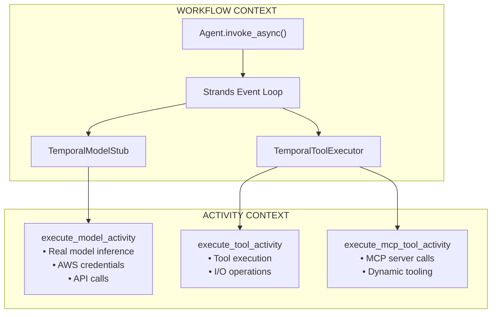

# Strands Temporal Plugin

An integration between [Strands Agents SDK](https://github.com/strands-agents/sdk-python) and [Temporal](https://temporal.io/) for durable AI agent execution.

## Features

- **Durable Agent Execution** - AI agent workflows survive crashes, restarts, and failures
- **Automatic Retries** - Model calls and tool execution automatically retry on failure
- **Multiple LLM Providers** - Support for Bedrock, OpenAI, Anthropic, and Ollama
- **Static Tools** - Use `@tool` decorated Python functions
- **MCP Tools** - Integrate [Model Context Protocol](https://modelcontextprotocol.io/) servers for dynamic tooling
- **Full Observability** - Every step visible in Temporal UI with complete history
- **Type-Safe** - Pydantic models for all configurations and data structures
- **Preserves Strands Features** - Use the real Strands Agent with hooks, callbacks, and conversation history

## Installation

```bash
pip install strands-temporal-plugin
```

Or with uv:

```bash
uv add strands-temporal-plugin
```

### Dependencies

- Python 3.10+
- [Temporal Server](https://docs.temporal.io/cli#start-dev)
- [strands-agents](https://github.com/strands-agents/sdk-python)

## Quick Start

### 1. Start Temporal Server

```bash
temporal server start-dev
```

### 2. Create a Workflow (Full Durability - RECOMMENDED)

```python
from temporalio import workflow
from strands import tool
from strands_temporal_plugin import (
    create_durable_agent,
    BedrockProviderConfig,
)


@tool
def get_weather(city: str) -> str:
    """Get current weather for a city."""
    # I/O is safe - this runs in a Temporal activity!
    return f"Weather in {city}: Sunny, 72°F"


@workflow.defn
class WeatherWorkflow:
    @workflow.run
    async def run(self, prompt: str) -> str:
        # Import Agent with sandbox passthrough
        with workflow.unsafe.imports_passed_through():
            agent = create_durable_agent(
                provider_config=BedrockProviderConfig(
                    model_id="us.anthropic.claude-sonnet-4-20250514-v1:0"
                ),
                tools=[get_weather],
                system_prompt="You are a weather assistant.",
            )

        result = await agent.invoke_async(prompt)
        return str(result)
```

### 3. Create a Worker

```python
import asyncio
from temporalio.client import Client
from temporalio.worker import Worker
from strands_temporal_plugin import StrandsTemporalPlugin
from workflows import WeatherWorkflow


async def main():
    client = await Client.connect(
        "localhost:7233",
        plugins=[StrandsTemporalPlugin()],
    )

    worker = Worker(
        client,
        task_queue="strands-agents",
        workflows=[WeatherWorkflow],
    )
    await worker.run()


if __name__ == "__main__":
    asyncio.run(main())
```

### 4. Execute the Workflow

```python
import asyncio
from temporalio.client import Client
from strands_temporal_plugin import StrandsTemporalPlugin
from workflows import WeatherWorkflow


async def main():
    client = await Client.connect(
        "localhost:7233",
        plugins=[StrandsTemporalPlugin()],
    )

    result = await client.execute_workflow(
        WeatherWorkflow.run,
        "What's the weather in Seattle?",
        id="weather-query-1",
        task_queue="strands-agents",
    )
    print(result)


if __name__ == "__main__":
    asyncio.run(main())
```

## Architecture

The plugin preserves the **full Strands Agent event loop** while routing model and tool calls to Temporal activities for durability:



**Key Principles:**

1. **Uses Real Strands Agent** - Full event loop with hooks, callbacks, and all features
2. **Workflows are deterministic** - Only orchestration logic, no I/O
3. **Activities handle side effects** - Model calls, tool execution, MCP connections
4. **All state is serializable** - Pydantic models ensure safe serialization
5. **Credentials in activities** - AWS/API keys accessed only in activity context

## Patterns

### Pattern 1: Full Durability (RECOMMENDED)

Use `create_durable_agent()` for both model AND tool durability. This is the recommended pattern for production use.

```python
from temporalio import workflow
from strands import tool
from strands_temporal_plugin import create_durable_agent, BedrockProviderConfig


@tool
def api_call(endpoint: str) -> str:
    """Make API call."""
    # I/O is safe - runs in Temporal activity!
    return requests.get(endpoint).text


@workflow.defn
class MyWorkflow:
    @workflow.run
    async def run(self, prompt: str) -> str:
        with workflow.unsafe.imports_passed_through():
            agent = create_durable_agent(
                provider_config=BedrockProviderConfig(
                    model_id="us.anthropic.claude-sonnet-4-20250514-v1:0"
                ),
                tools=[api_call],
                system_prompt="You are a helpful assistant.",
            )
        result = await agent.invoke_async(prompt)
        return str(result)
```

**Benefits:**
- Both model and tool calls are durable (survive restarts)
- Tools can do I/O safely (HTTP, file access, databases)
- Automatic retries on failures
- Full observability in Temporal UI

### Pattern 2: Model-Only Durability

Use just `TemporalModelStub` for pure function tools that don't do I/O.

```python
from temporalio import workflow
from strands import Agent, tool
from strands_temporal_plugin import TemporalModelStub, BedrockProviderConfig


@tool
def calculate(expression: str) -> str:
    """Calculate a math expression (no I/O)."""
    return str(eval(expression))


@workflow.defn
class CalcWorkflow:
    @workflow.run
    async def run(self, prompt: str) -> str:
        with workflow.unsafe.imports_passed_through():
            agent = Agent(
                model=TemporalModelStub(
                    BedrockProviderConfig(model_id="us.anthropic.claude-sonnet-4-20250514-v1:0")
                ),
                tools=[calculate],  # Pure function - OK in workflow context
                system_prompt="You are a calculator.",
            )
        result = await agent.invoke_async(prompt)
        return str(result)
```

**When to use:**
- Tools are pure functions (no I/O)
- Only need model durability
- Simpler setup (no tool_modules mapping)

### Pattern 3: MCP Tools

Use `TemporalToolExecutor` for MCP server integration with dynamic tool discovery.

```python
from temporalio import workflow
from strands import Agent
from strands_temporal_plugin import (
    TemporalModelStub,
    TemporalToolExecutor,
    BedrockProviderConfig,
    StdioMCPServerConfig,
)


@workflow.defn
class MCPWorkflow:
    @workflow.run
    async def run(self, prompt: str) -> str:
        with workflow.unsafe.imports_passed_through():
            # Configure MCP tool executor
            tool_executor = TemporalToolExecutor(
                mcp_servers=[
                    StdioMCPServerConfig(
                        server_id="time",
                        command="uvx",
                        args=["mcp-server-time"],
                    ),
                ],
            )

            # Discover MCP tools via activity
            await tool_executor.discover_mcp_tools()

            # Create agent with MCP tools
            agent = Agent(
                model=TemporalModelStub(
                    BedrockProviderConfig(model_id="us.anthropic.claude-sonnet-4-20250514-v1:0")
                ),
                tool_executor=tool_executor,
                tools=tool_executor.get_mcp_tools(),
                system_prompt="You are a helpful assistant.",
            )

        result = await agent.invoke_async(prompt)
        return str(result)
```

**Features:**
- Dynamic tool discovery from MCP servers
- Tools execute durably in activities
- Supports both STDIO and HTTP transports
- Tool filtering and prefixing

## Provider Configurations

### Amazon Bedrock

```python
from strands_temporal_plugin import BedrockProviderConfig

agent = create_durable_agent(
    provider_config=BedrockProviderConfig(
        model_id="us.anthropic.claude-sonnet-4-20250514-v1:0",
        region_name="us-east-1",  # Optional, uses AWS_REGION env var
        max_tokens=4096,
    ),
    tools=[...],
)
```

### OpenAI

```python
from strands_temporal_plugin import OpenAIProviderConfig

agent = create_durable_agent(
    provider_config=OpenAIProviderConfig(
        model_id="gpt-4o",
        api_key=None,  # Uses OPENAI_API_KEY env var
        max_tokens=4096,
    ),
    tools=[...],
)
```

### Anthropic

```python
from strands_temporal_plugin import AnthropicProviderConfig

agent = create_durable_agent(
    provider_config=AnthropicProviderConfig(
        model_id="claude-sonnet-4-20250514",
        api_key=None,  # Uses ANTHROPIC_API_KEY env var
        max_tokens=4096,
    ),
    tools=[...],
)
```

### Ollama (Local)

```python
from strands_temporal_plugin import OllamaProviderConfig

agent = create_durable_agent(
    provider_config=OllamaProviderConfig(
        model_id="llama3.2",
        host="http://localhost:11434",
    ),
    tools=[...],
)
```

## Static Tools

Define custom tools using the `@tool` decorator:

```python
from strands import tool


@tool
def get_weather(city: str) -> str:
    """Get current weather for a city.

    Args:
        city: Name of the city

    Returns:
        Weather description
    """
    # Your implementation - I/O is safe here!
    return fetch_weather_api(city)


# Use in workflow
agent = create_durable_agent(
    provider_config=BedrockProviderConfig(model_id="..."),
    tools=[get_weather],
)
```

## MCP Tools

Integrate [Model Context Protocol](https://modelcontextprotocol.io/) servers for dynamic tooling:

### STDIO Transport (Local Servers)

```python
from strands_temporal_plugin import TemporalToolExecutor, StdioMCPServerConfig

tool_executor = TemporalToolExecutor(
    mcp_servers=[
        StdioMCPServerConfig(
            server_id="docs",
            command="uvx",
            args=["awslabs.aws-documentation-mcp-server@latest"],
            tool_prefix="docs",  # Optional: prefix tool names
            startup_timeout=60.0,
        ),
    ],
)

# Discover tools
await tool_executor.discover_mcp_tools()

# Use with Agent
agent = Agent(
    model=TemporalModelStub(BedrockProviderConfig(...)),
    tool_executor=tool_executor,
    tools=tool_executor.get_mcp_tools(),
)
```

### HTTP Transport (Remote Servers)

```python
from strands_temporal_plugin import StreamableHTTPMCPServerConfig

tool_executor = TemporalToolExecutor(
    mcp_servers=[
        StreamableHTTPMCPServerConfig(
            server_id="api",
            url="https://mcp.example.com/v1",
            headers={"Authorization": "Bearer token"},
            tool_prefix="api",
        ),
    ],
)
```

### Tool Filtering

Filter which MCP tools are available to the agent:

```python
StdioMCPServerConfig(
    server_id="server",
    command="uvx",
    args=["my-mcp-server"],
    allowed_tools=["search_*", "get_*"],  # Whitelist patterns
    rejected_tools=["admin_*", "delete_*"],  # Blacklist patterns
)
```

## Configuration Reference

### create_durable_agent()

Factory function for creating a fully durable Strands Agent.

| Parameter         | Type                    | Default  | Description                                   |
| ----------------- | ----------------------- | -------- | --------------------------------------------- |
| `provider_config` | `ProviderConfig`        | Required | LLM provider configuration                    |
| `tools`           | `list[Any]`             | `None`   | List of `@tool` decorated functions           |
| `tool_modules`    | `dict[str, str]`        | `None`   | Tool name to module path mapping              |
| `system_prompt`   | `str \| None`           | `None`   | System prompt for the agent                   |
| `mcp_servers`     | `list[MCPServerConfig]` | `None`   | MCP server configurations                     |
| `model_timeout`   | `float`                 | `300.0`  | Model call timeout (seconds)                  |
| `tool_timeout`    | `float`                 | `60.0`   | Tool execution timeout                        |
| `**agent_kwargs`  | `Any`                   | -        | Additional kwargs passed to Agent constructor |

### TemporalToolExecutor

Custom tool executor that routes tool calls to Temporal activities.

| Parameter          | Type                    | Default | Description                      |
| ------------------ | ----------------------- | ------- | -------------------------------- |
| `tool_modules`     | `dict[str, str]`        | `{}`    | Tool name to module path mapping |
| `mcp_servers`      | `list[MCPServerConfig]` | `[]`    | MCP server configurations        |
| `activity_timeout` | `float`                 | `60.0`  | Tool activity timeout (seconds)  |
| `retry_policy`     | `RetryPolicy \| None`   | `None`  | Custom retry policy              |

**Methods:**
- `discover_mcp_tools()` - Discover tools from MCP servers
- `get_mcp_tools()` - Get MCP tools as proxy AgentTool instances
- `get_mcp_tool_specs()` - Get MCP tools as raw dict specifications

### TemporalModelStub

Model stub that routes `model.stream()` calls to Temporal activities.

| Parameter          | Type                  | Description                                    |
| ------------------ | --------------------- | ---------------------------------------------- |
| `config`           | `ProviderConfig`      | Provider configuration (Bedrock, OpenAI, etc.) |
| `activity_timeout` | `float`               | Model activity timeout (default: 300s)         |
| `retry_policy`     | `RetryPolicy \| None` | Custom retry policy                            |

## Examples

### Basic Weather Agent

A simple agent with a custom weather tool demonstrating full durability:

```bash
cd examples/basic_weather_agent
uv run python run_worker.py  # Terminal 1
uv run python run_client.py  # Terminal 2
```

See also:
- `mcp_workflow.py` - MCP tool discovery example with mcp-server-time

## Testing

```bash
# Run all tests
uv run pytest

# Run unit tests only
uv run pytest tests/unit

# Run integration tests
uv run pytest tests/integration

# Run with coverage
uv run pytest --cov=strands_temporal_plugin
```

## Development

```bash
# Clone the repository
git clone https://github.com/strands-agents/strands-temporal-plugin.git
cd strands-temporal-plugin

# Install dependencies
uv sync

# Run linting
uv run ruff check .
uv run ruff format .

# Run type checking
uv run pyright
```

## API Reference

### Main Exports

```python
from strands_temporal_plugin import (
    # Plugin
    StrandsTemporalPlugin,

    # Full Durability Pattern (RECOMMENDED)
    create_durable_agent,
    TemporalModelStub,
    TemporalToolExecutor,
    ToolExecutorConfig,

    # Provider Configurations
    BedrockProviderConfig,
    AnthropicProviderConfig,
    OpenAIProviderConfig,
    OllamaProviderConfig,
    BaseProviderConfig,
    ProviderConfig,

    # MCP Server Configurations
    StdioMCPServerConfig,
    StreamableHTTPMCPServerConfig,
    BaseMCPServerConfig,
    MCPServerConfig,

    # MCP Types
    MCPToolSpec,
    MCPListToolsInput,
    MCPListToolsResult,
    MCPToolExecutionInput,
    MCPToolExecutionResult,

    # Activity Types
    ModelExecutionInput,
    ModelExecutionResult,
    ToolExecutionInput,
    ToolExecutionResult,

    # Activities (for custom registration)
    execute_model_activity,
    execute_tool_activity,
    list_mcp_tools_activity,
    execute_mcp_tool_activity,

    # MCP Helpers
    mcp_tool_specs_to_strands,
    get_mcp_server_for_tool,

    # Serialization Helpers
    messages_to_serializable,
    tool_specs_to_serializable,
)
```

## License

Apache 2.0 - See [LICENSE](LICENSE) for details.

## Contributing

Contributions are welcome! Please read our contributing guidelines and submit pull requests to the main repository.
