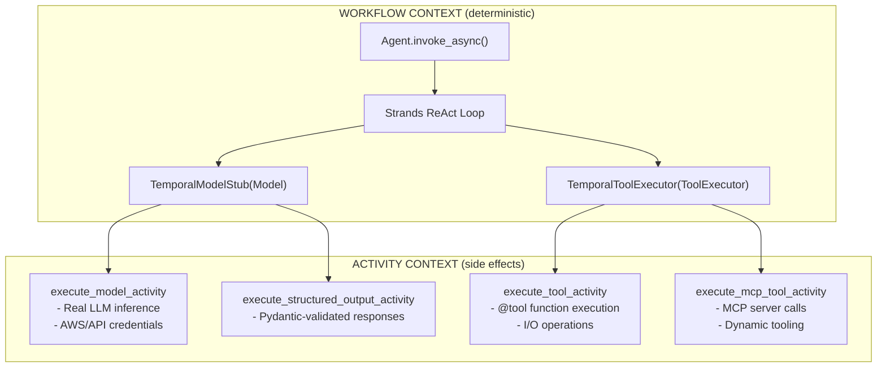

# Strands Temporal Plugin

Durable AI agent execution by integrating [Strands Agents SDK](https://github.com/strands-agents/sdk-python) with [Temporal](https://temporal.io/).

```bash
uv add strands-temporal-plugin
```

## How It Works

The Strands Agents SDK defines two abstract base classes for its ReAct loop: `Model` (for LLM inference) and `ToolExecutor` (for tool calls). The agent event loop calls `model.stream()` to get the next response, then `tool_executor._execute()` to run any requested tools, repeating until the model returns a final answer.

This plugin subclasses both ABCs. `TemporalModelStub(Model)` routes `model.stream()` to a Temporal activity where the real LLM call happens. `TemporalToolExecutor(ToolExecutor)` routes each tool call to a separate Temporal activity. The Strands ReAct loop runs unchanged in the workflow -- we only replace the I/O layer beneath it.

The result: every model call and tool call is a Temporal activity. They survive crashes, get automatic retries, have configurable timeouts and heartbeats, and appear as individual steps in the Temporal UI.

## Quick Start

### 1. Start Temporal

```bash
temporal server start-dev
```

### 2. Create a Workflow and Worker

```python
# workflow.py
from temporalio import workflow
from strands import tool
from strands_temporal_plugin import create_durable_agent, BedrockProviderConfig


@tool
def get_weather(city: str) -> str:
    """Get current weather for a city."""
    return f"Weather in {city}: Sunny, 72F"


@workflow.defn
class WeatherWorkflow:
    @workflow.run
    async def run(self, prompt: str) -> str:
        with workflow.unsafe.imports_passed_through():
            agent = create_durable_agent(
                provider_config=BedrockProviderConfig(
                    model_id="us.anthropic.claude-sonnet-4-20250514-v1:0"
                ),
                tools=[get_weather],
                system_prompt="You are a weather assistant.",
            )
        result = await agent.invoke_async(prompt)
        return str(result)
```

```python
# run_worker.py
import asyncio
from temporalio.client import Client
from temporalio.worker import Worker
from strands_temporal_plugin import StrandsTemporalPlugin
from workflow import WeatherWorkflow

async def main():
    client = await Client.connect("localhost:7233", plugins=[StrandsTemporalPlugin()])
    worker = Worker(client, task_queue="strands-agents", workflows=[WeatherWorkflow])
    await worker.run()

if __name__ == "__main__":
    asyncio.run(main())
```

### 3. Run the Client

```python
# run_client.py
import asyncio
from temporalio.client import Client
from strands_temporal_plugin import StrandsTemporalPlugin
from workflow import WeatherWorkflow

async def main():
    client = await Client.connect("localhost:7233", plugins=[StrandsTemporalPlugin()])
    result = await client.execute_workflow(
        WeatherWorkflow.run,
        "What's the weather in Seattle?",
        id="weather-1",
        task_queue="strands-agents",
    )
    print(result)

if __name__ == "__main__":
    asyncio.run(main())
```

## Architecture



## Patterns

### Pattern 1: Full Durability (RECOMMENDED)

`create_durable_agent()` wires both `TemporalModelStub` and `TemporalToolExecutor` for you. Both model calls and tool calls run as Temporal activities.

```python
from temporalio import workflow
from strands import tool
from strands_temporal_plugin import create_durable_agent, BedrockProviderConfig

@tool
def api_call(endpoint: str) -> str:
    """Call an external API."""
    import requests
    return requests.get(endpoint).text  # I/O is safe - runs in activity

@workflow.defn
class MyWorkflow:
    @workflow.run
    async def run(self, prompt: str) -> str:
        with workflow.unsafe.imports_passed_through():
            agent = create_durable_agent(
                provider_config=BedrockProviderConfig(
                    model_id="us.anthropic.claude-sonnet-4-20250514-v1:0"
                ),
                tools=[api_call],
                system_prompt="You are a helpful assistant.",
            )
        result = await agent.invoke_async(prompt)
        return str(result)
```

### Pattern 2: Model-Only Durability

Use `TemporalModelStub` alone when your tools are pure functions (no I/O). Tools run directly in the workflow context.

```python
from temporalio import workflow
from strands import Agent, tool
from strands_temporal_plugin import TemporalModelStub, BedrockProviderConfig

@tool
def calculate(expression: str) -> str:
    """Evaluate a math expression (no I/O)."""
    return str(eval(expression))

@workflow.defn
class CalcWorkflow:
    @workflow.run
    async def run(self, prompt: str) -> str:
        with workflow.unsafe.imports_passed_through():
            agent = Agent(
                model=TemporalModelStub(
                    BedrockProviderConfig(model_id="us.anthropic.claude-sonnet-4-20250514-v1:0")
                ),
                tools=[calculate],
                system_prompt="You are a calculator.",
            )
        result = await agent.invoke_async(prompt)
        return str(result)
```

### Pattern 3: MCP Tools

Discover and call tools from [MCP](https://modelcontextprotocol.io/) servers, routed through Temporal activities.

```python
from temporalio import workflow
from strands import Agent
from strands_temporal_plugin import (
    TemporalModelStub, TemporalToolExecutor,
    BedrockProviderConfig, StdioMCPServerConfig,
)

@workflow.defn
class MCPWorkflow:
    @workflow.run
    async def run(self, prompt: str) -> str:
        with workflow.unsafe.imports_passed_through():
            tool_executor = TemporalToolExecutor(
                mcp_servers=[
                    StdioMCPServerConfig(
                        server_id="time",
                        command="uvx",
                        args=["mcp-server-time"],
                    ),
                ],
            )
            await tool_executor.discover_mcp_tools()

            agent = Agent(
                model=TemporalModelStub(
                    BedrockProviderConfig(model_id="us.anthropic.claude-sonnet-4-20250514-v1:0")
                ),
                tool_executor=tool_executor,
                tools=tool_executor.get_mcp_tools(),
                system_prompt="You are a helpful assistant.",
            )
        result = await agent.invoke_async(prompt)
        return str(result)
```

### Pattern 4: Structured Output

Get validated Pydantic responses via `model.structured_output()`, routed to an activity.

```python
from pydantic import BaseModel
from temporalio import workflow
from strands_temporal_plugin import TemporalModelStub, BedrockProviderConfig

class WeatherAnalysis(BaseModel):
    city: str
    temperature_f: float
    summary: str

@workflow.defn
class AnalysisWorkflow:
    @workflow.run
    async def run(self, prompt: str) -> dict:
        with workflow.unsafe.imports_passed_through():
            model = TemporalModelStub(
                BedrockProviderConfig(model_id="us.anthropic.claude-sonnet-4-20250514-v1:0")
            )
        messages = [{"role": "user", "content": [{"text": prompt}]}]
        async for event in model.structured_output(WeatherAnalysis, messages):
            result_event = event
        return result_event["output"].model_dump()
```

### Pattern 5: Session Management

Persist conversation state across workflow executions with S3-backed sessions.

```python
from temporalio import workflow
from strands_temporal_plugin import (
    create_durable_agent, BedrockProviderConfig,
    TemporalSessionManager, SessionConfig,
)

@workflow.defn
class ChatWorkflow:
    @workflow.run
    async def run(self, prompt: str) -> str:
        with workflow.unsafe.imports_passed_through():
            session = TemporalSessionManager(SessionConfig(
                session_id="user-456",
                bucket="my-agent-sessions",
            ))
            await session.load()

            agent = create_durable_agent(
                provider_config=BedrockProviderConfig(
                    model_id="us.anthropic.claude-sonnet-4-20250514-v1:0"
                ),
                system_prompt="You are a helpful assistant.",
            )
            agent.messages.extend(session.messages)

        result = await agent.invoke_async(prompt)
        await session.save(agent)
        return str(result)
```

## v0.2.0 Features

| Feature | Description | Example |
|---------|-------------|---------|
| Parallel tool execution | Multiple tool calls run concurrently via `asyncio.gather()` | [03_multi_tool_agent](examples/03_multi_tool_agent/) |
| Per-tool configuration | Override timeout, heartbeat, retry per tool with `TemporalToolConfig` | [03_multi_tool_agent](examples/03_multi_tool_agent/) |
| Structured output | Validated Pydantic responses via `model.structured_output()` activity | [06_structured_output](examples/06_structured_output/) |
| Session management | S3-backed conversation persistence with `TemporalSessionManager` | [07_session_management](examples/07_session_management/) |
| Custom providers | Any model via `CustomProviderConfig` with import-path resolution | [08_custom_provider](examples/08_custom_provider/) |
| MCP client caching | Reuse MCP server connections across tool calls with `close_mcp_clients()` cleanup | [04_mcp_stdio](examples/04_mcp_stdio/) |
| Heartbeating | Activities send heartbeats; default 30s model, 25s tools | All examples |
| Versioning gates | `workflow.patched()` for safe workflow evolution | All examples |
| Before/after tool hooks | Strands hook system fires through `TemporalToolExecutor` | All examples |
| LLM retry disabled | Temporal handles retries; provider-level retries are turned off | All examples |

## Provider Configurations

### Amazon Bedrock

```python
from strands_temporal_plugin import BedrockProviderConfig

BedrockProviderConfig(
    model_id="us.anthropic.claude-sonnet-4-20250514-v1:0",
    region_name="us-east-1",  # Optional, uses AWS_REGION env var
    max_tokens=4096,
)
```

### Anthropic

```python
from strands_temporal_plugin import AnthropicProviderConfig

AnthropicProviderConfig(
    model_id="claude-sonnet-4-20250514",
    api_key=None,  # Uses ANTHROPIC_API_KEY env var
    max_tokens=4096,
)
```

### OpenAI

```python
from strands_temporal_plugin import OpenAIProviderConfig

OpenAIProviderConfig(
    model_id="gpt-4o",
    api_key=None,  # Uses OPENAI_API_KEY env var
    max_tokens=4096,
)
```

### Ollama (Local)

```python
from strands_temporal_plugin import OllamaProviderConfig

OllamaProviderConfig(
    model_id="llama3.2",
    host="http://localhost:11434",
)
```

### Custom Provider

```python
from strands_temporal_plugin import CustomProviderConfig

CustomProviderConfig(
    model_id="my-model",
    provider_class_path="myapp.models.MyModel",  # Resolved via importlib
    provider_kwargs={"custom_param": "value"},
)
```

## Per-Tool Configuration

Override timeout, heartbeat, and retry settings for individual tools using `TemporalToolConfig`:

```python
from strands_temporal_plugin import create_durable_agent, BedrockProviderConfig, TemporalToolConfig

agent = create_durable_agent(
    provider_config=BedrockProviderConfig(model_id="us.anthropic.claude-sonnet-4-20250514-v1:0"),
    tools=[fast_tool, slow_search, flaky_api],
    tool_configs={
        "slow_search": TemporalToolConfig(
            start_to_close_timeout=300.0,
            heartbeat_timeout=30.0,
        ),
        "flaky_api": TemporalToolConfig(
            retry_max_attempts=5,
            retry_initial_interval=2.0,
        ),
    },
)
```

Tools without an entry in `tool_configs` use the default `tool_timeout` (60s).

## Examples

| Example | Description | Complexity |
|---------|-------------|------------|
| [01_quickstart](examples/01_quickstart/) | Simplest agent, no tools | Beginner |
| [02_weather_agent](examples/02_weather_agent/) | First agent with a tool | Beginner |
| [03_multi_tool_agent](examples/03_multi_tool_agent/) | Multiple tools, per-tool config, parallel execution | Intermediate |
| [04_mcp_stdio](examples/04_mcp_stdio/) | MCP with local stdio servers | Advanced |
| [05_mcp_http](examples/05_mcp_http/) | MCP with remote HTTP servers | Advanced |
| [06_structured_output](examples/06_structured_output/) | Validated Pydantic model responses | Intermediate |
| [07_session_management](examples/07_session_management/) | S3-backed conversation persistence | Advanced |
| [08_custom_provider](examples/08_custom_provider/) | Custom model provider via import path | Intermediate |
| [09_failure_resilience](examples/09_failure_resilience/) | Retry, timeout, and graceful degradation | Intermediate |

Each example follows the same pattern:

```bash
cd examples/<name>
uv run python run_worker.py  # Terminal 1
uv run python run_client.py  # Terminal 2
open http://localhost:8233    # Temporal UI
```

## Configuration Reference

### `create_durable_agent()`

| Parameter | Type | Default | Description |
|-----------|------|---------|-------------|
| `provider_config` | `ProviderConfig` | Required | LLM provider configuration |
| `tools` | `list[Any]` | `None` | List of `@tool` decorated functions |
| `tool_modules` | `dict[str, str]` | `None` | Tool name to module path mapping (auto-discovered if omitted) |
| `system_prompt` | `str \| None` | `None` | System prompt for the agent |
| `mcp_servers` | `list[MCPServerConfig]` | `None` | MCP server configurations |
| `model_timeout` | `float` | `300.0` | Model call timeout (seconds) |
| `tool_timeout` | `float` | `60.0` | Tool execution timeout (seconds) |
| `conversation_manager` | `Any` | `None` | Strands conversation manager |
| `tool_configs` | `dict[str, TemporalToolConfig]` | `None` | Per-tool configuration overrides |
| `**agent_kwargs` | `Any` | -- | Additional kwargs passed to `Agent()` |

### `TemporalModelStub`

| Parameter | Type | Default | Description |
|-----------|------|---------|-------------|
| `provider_config` | `ProviderConfig \| str` | Required | Provider config or model ID string (defaults to Bedrock) |
| `activity_timeout` | `float` | `300.0` | Model activity timeout (seconds) |
| `retry_policy` | `RetryPolicy \| None` | `None` | Custom retry policy |

### `TemporalToolExecutor`

| Parameter | Type | Default | Description |
|-----------|------|---------|-------------|
| `tool_modules` | `dict[str, str]` | `{}` | Tool name to module path mapping |
| `mcp_servers` | `list[MCPServerConfig]` | `[]` | MCP server configurations |
| `activity_timeout` | `float` | `60.0` | Default tool activity timeout (seconds) |
| `retry_policy` | `RetryPolicy \| None` | `None` | Default retry policy |
| `tool_configs` | `dict[str, TemporalToolConfig]` | `None` | Per-tool configuration overrides |

## API Reference

```python
from strands_temporal_plugin import (
    # Plugin
    StrandsTemporalPlugin,

    # Agent factory (RECOMMENDED)
    create_durable_agent,

    # SDK subclasses
    TemporalModelStub,
    TemporalToolExecutor,
    ToolExecutorConfig,

    # Provider configurations
    BedrockProviderConfig,
    AnthropicProviderConfig,
    OpenAIProviderConfig,
    OllamaProviderConfig,
    CustomProviderConfig,
    BaseProviderConfig,
    ProviderConfig,

    # Per-tool configuration
    TemporalToolConfig,

    # Session management
    TemporalSessionManager,
    SessionConfig,
    SessionData,

    # MCP server configurations
    StdioMCPServerConfig,
    StreamableHTTPMCPServerConfig,
    BaseMCPServerConfig,
    MCPServerConfig,

    # MCP types
    MCPToolSpec,
    MCPListToolsInput,
    MCPListToolsResult,
    MCPToolExecutionInput,
    MCPToolExecutionResult,

    # Activity types
    ModelExecutionInput,
    ModelExecutionResult,
    ToolExecutionInput,
    ToolExecutionResult,
    StructuredOutputInput,
    StructuredOutputResult,
    SessionLoadInput,
    SessionSaveInput,

    # Activities (for custom registration)
    execute_model_activity,
    execute_tool_activity,
    execute_structured_output_activity,
    list_mcp_tools_activity,
    execute_mcp_tool_activity,
    load_session_activity,
    save_session_activity,

    # MCP helpers
    mcp_tool_specs_to_strands,
    get_mcp_server_for_tool,
    close_mcp_clients,

    # Serialization helpers
    messages_to_serializable,
    tool_specs_to_serializable,
)
```

## Testing

```bash
# Unit tests
uv run pytest tests/unit/ -x

# Integration tests
uv run pytest tests/integration/

# Coverage
uv run pytest tests/unit/ --cov=strands_temporal_plugin

# Lint
uv run ruff check src/ tests/
uv run ruff format --check src/ tests/
```

## Development

```bash
git clone https://github.com/strands-agents/strands-temporal-plugin.git
cd strands-temporal-plugin
uv sync
```

## License

Apache 2.0 -- See [LICENSE](LICENSE) for details.
