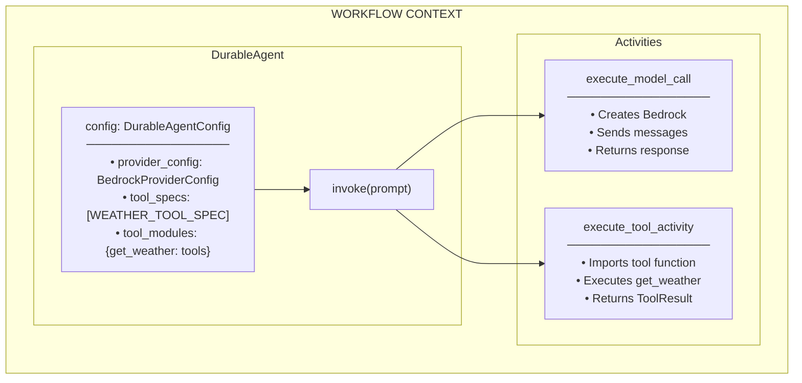

# Weather Agent Example

This example demonstrates how to build a durable AI agent workflow using the Strands Temporal Plugin with static tools.

## Overview

The weather agent uses:
- **DurableAgent** - For durable agent execution within Temporal workflows
- **Static Tools** - Custom Python functions as tools (get_weather)
- **BedrockProviderConfig** - Amazon Bedrock as the LLM provider

## Architecture



## Prerequisites

1. **Temporal Server**: Start the development server
   ```bash
   temporal server start-dev
   ```

2. **AWS Credentials**: Configure for Bedrock access
   ```bash
   export AWS_REGION=us-east-1
   # Or use AWS SSO/credentials file
   ```

## Running the Example

### 1. Start the Worker

```bash
cd examples/basic_weather_agent
uv run python run_worker.py
```

### 2. Run the Client

```bash
# Default prompt
uv run python run_client.py

# Custom prompt
uv run python run_client.py "What's the weather like in Seattle?"
```

### 3. View in Temporal UI

Open http://localhost:8233 to see the workflow execution.

## Files

| File | Description |
|------|-------------|
| `workflows.py` | WeatherAgentWorkflow and SimpleAgentWorkflow definitions |
| `tools.py` | get_weather tool implementation |
| `run_worker.py` | Starts the Temporal worker |
| `run_client.py` | Executes workflows via Temporal client |

## How It Works

1. **Workflow receives prompt** - User asks about weather
2. **DurableAgent initializes** - Creates agent with config
3. **Model activity executes** - Bedrock processes the prompt
4. **Model requests tool use** - Returns get_weather tool call
5. **Tool activity executes** - Runs get_weather function
6. **Model receives tool result** - Processes weather data
7. **Final response returned** - Agent provides weather information

## Durability Benefits

- **Retries**: Failed model/tool calls automatically retry
- **Timeouts**: Configurable per-activity timeouts
- **Replay**: Workflow state survives worker restarts
- **Visibility**: All steps visible in Temporal UI
