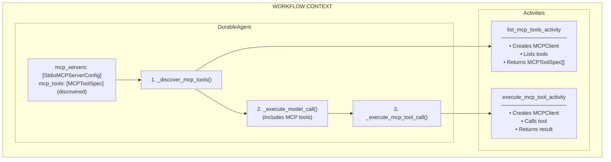

# MCP Agent Example

This example demonstrates how to use MCP (Model Context Protocol) servers with the Strands Temporal Plugin for durable AI agent execution.

## Overview

MCP allows AI agents to access external tools and resources through a standardized protocol. This example shows how to:

1. Configure MCP servers in a `DurableAgentConfig`
2. Discover tools from MCP servers at runtime
3. Execute MCP tool calls as Temporal activities
4. Build a durable agent workflow that uses MCP tools

## Architecture



## Prerequisites

1. **Temporal Server**: Start the development server
   ```bash
   temporal server start-dev
   ```

2. **AWS Credentials**: Configure for Bedrock access
   ```bash
   export AWS_REGION=us-east-1
   # Or use AWS SSO/credentials file
   ```

3. **uvx**: Required for running MCP servers
   ```bash
   # uvx comes with uv
   uv tool install uvx
   ```

## Running the Example

### 1. Start the Worker

```bash
cd examples/mcp_agent
uv run python run_worker.py
```

### 2. Run the Client

```bash
# Default prompt
uv run python run_client.py

# Custom prompt
uv run python run_client.py "What is Amazon S3?"
```

### 3. View in Temporal UI

Open http://localhost:8233 to see the workflow execution.

## MCP Server Configuration

The example uses the AWS Documentation MCP Server:

```python
mcp_servers=[
    StdioMCPServerConfig(
        server_id="aws-docs",
        command="uvx",
        args=["awslabs.aws-documentation-mcp-server@latest"],
        tool_prefix="docs",  # Tools become: docs_search, etc.
        startup_timeout=60.0,
    ),
]
```

### Supported Transport Types

1. **StdioMCPServerConfig**: For local MCP servers via stdin/stdout
   ```python
   StdioMCPServerConfig(
       server_id="local-server",
       command="uvx",
       args=["my-mcp-server@latest"],
       env={"MY_VAR": "value"},  # Optional environment
       cwd="/path/to/workdir",   # Optional working directory
   )
   ```

2. **StreamableHTTPMCPServerConfig**: For remote MCP servers via HTTP
   ```python
   StreamableHTTPMCPServerConfig(
       server_id="remote-server",
       url="https://example.com/mcp",
       headers={"Authorization": "Bearer token"},
       timeout=30.0,
   )
   ```

### Tool Filtering

You can filter which tools are exposed:

```python
StdioMCPServerConfig(
    server_id="filtered-server",
    command="uvx",
    args=["my-server"],
    allowed_tools=["search_*", "get_*"],  # Only allow these patterns
    rejected_tools=["admin_*"],           # Reject these patterns
)
```

## Multiple MCP Servers

You can configure multiple MCP servers:

```python
mcp_servers=[
    StdioMCPServerConfig(
        server_id="docs",
        command="uvx",
        args=["docs-server"],
        tool_prefix="docs",
    ),
    StreamableHTTPMCPServerConfig(
        server_id="api",
        url="https://api.example.com/mcp",
        tool_prefix="api",
    ),
]
```

Each server's tools will be prefixed to avoid naming conflicts.

## Durability Benefits

Using MCP tools through Temporal activities provides:

1. **Retries**: Failed MCP connections are automatically retried
2. **Timeouts**: Configurable timeouts prevent hanging
3. **Replay**: Workflow state is preserved on worker restarts
4. **Visibility**: All tool calls are visible in Temporal UI
5. **Debugging**: Activity history shows exactly what happened

## Error Handling

MCP activities handle errors gracefully:

- Connection failures: Retried based on retry policy
- Tool not found: Returns error result
- Timeout: Activity fails and can be retried

Configure retry behavior in `DurableAgentConfig`:

```python
config = DurableAgentConfig(
    # ... other config
    mcp_activity_timeout=120.0,
    max_retries=3,
    initial_retry_interval_seconds=1.0,
    backoff_coefficient=2.0,
)
```
